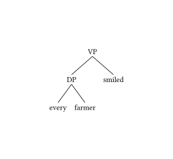
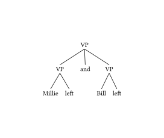
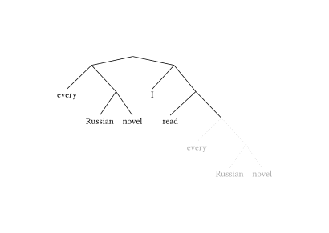
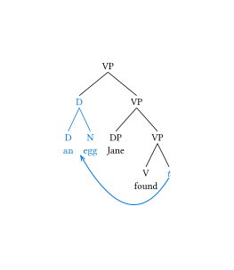

# Lingotree

## Installation

See [here](https://github.com/typst/packages?tab=readme-ov-file#local-packages) how to install this package locally. Essentially:

 - download this repository
 - rename it as: `{data-dir}/typst/packages/local/lingotree/1.0.0` where `{data-dir}` is:
    - Linux: `$XDG_DATA_HOME` or, if not set, `~/.local/share` 
    - Mac: `~/Library/Application Support`
    - Windows: `%APPDATA%`


## Usage

Below are a couple of illustrations of the package. Cf [manual](manual.pdf) for a full reference of the functions.

### Basic


```typst
#import "@preview/lingotree:1.0.0": *

#render(
tree(
  tag: [VP],
  tree(
    tag: [DP],
    [every],
    [farmer],
  ),
  [smiled]
)
)
```



#### Non-binary trees

```typst
#import "@preview/lingotree:1.0.0": *

#render(
tree(
  tag: [VP],
  tree(
    tag: [VP],
    [Millie],
    [left],
  ),
  [and],
  tree(
    tag: [VP],
    [Bill],
    [left],
  ),
)
)
```



### Adjusting spacing and color

There are several parameters that tweak the appearance of the tree:

 - `layer-spacing`: distance between root of a subtree and its children.
 - `child-spacing`: distance between two siblings.
 - `branch-stroke`: stoke used to draw the branch.
 - `color`: sets the color of both branches and nodes (is overriden by any color you set in `branch-stroke`).
 - `align`: alignment of the tafs and leaf nodes.

These parameters may be passed:

 - as optional arguments of `render`: in this case, they affect all the tree.
 - as optional arguments of `tree`: in this case they affect only the root of the subtree to which they're applied and its immediate children
 - as an optional dictionary argument `defaults` to `tree`: in this case, they apply recursively to a tree and all its descendants


```typst
#import "@preview/lingotree:1.0.0": *


#render(
  tree(
    tree(
      [every],
      tree(
        [Russian],
        [novel],
      )
    ),
    tree(
      [I],
      tree(
        [read],
        tree(
          [every],
          tree(
            [Russian],
            [novel],
          ),
          // Here we set default parameters for "every Russian novel"
          defaults: (
            // Note: the color parameter affects the color of branches and also the color of nodes
            color: gray, 
            branch-stroke: stroke(dash: "dotted", thickness: 0.5pt)
          )
        ),
      )
    ),
    layer-spacing: 1em,
  )
)
```



### Movement arrow

In the spirit of modularity, `lingotree` intentionally does not provide movement arrows and other tree annotations. This is something you can implement, using `cetz` (draw tools) and `mannot` (to record positions in a document).


```typst
#import "@preview/lingotree:1.0.0": *
#import "@preview/mannot:0.3.0": mark, annot-cetz
#import "@preview/cetz:0.4.2"


// Renders a tree structure with specific marks indicating the start and end points of movement


#render(
  defaults: (align: center),
  tree(
    tag: [VP],
    tree(
      defaults: (color: blue),
      tag: [D],
      [D\ #mark(tag: <endqr>)[an]],
      [N\ egg],
    ),
    tree(
      tag: [VP], 
      [DP\ Jane],
      tree(
        tag: [VP],
        [V\ found],
        mark(tag: <begqr>, text(blue)[$t$])
      ),
    ),
  ),
)

// Integrate mannot and cetz functionalities
// Creates a canvas to track the positions of the marks in the tree and draws a Bezier arrow between them

#annot-cetz(
  (<begqr>, <endqr>),
  cetz,
  {
    cetz.draw.bezier-through(
      "begqr.south", 
      (rel: (x: -1, y: -1)), 

      // Adjusts the arrow's endpoint position to fall between "an" and "egg"
      (rel: (x: 0.3), to: "endqr.south"), 

      stroke: blue,
      mark: (end: "straight"),
    )
  },
)
```

If you rarely need to be more fancy than an arrow, it may be useful to encapsulate the arrow drawing in a single command. Here is how I do it:

```typst
#let arrow(beg, end, control: (x: -1, y: -.5), stroke: black) = annot-cetz(
  (beg, end),
  cetz,
  {
    cetz.draw.bezier-through(
      str(beg) + ".south", 
      (rel: control), 
      str(end) + ".south", 
      stroke: stroke, 
      mark: (end: "straight"),
    )
  },
)
```




## See also

 - [typst-syntree](https://github.com/lynn/typst-syntree) : a package to typeset tree using a bracket syntax ; more convenient, less powerful