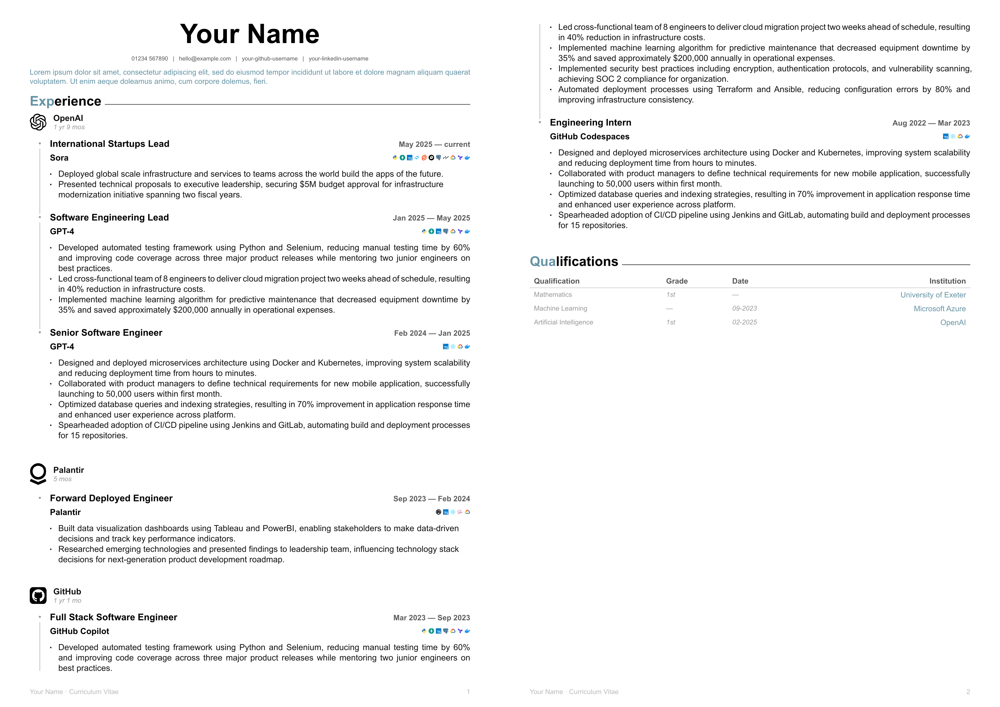

# linkedin-cv

A beautiful, modern CV template for Typst that emulates the LinkedIn UI aesthetic. Features timeline-based experience sections, tech stack icons, and customizable colors and fonts.



## Features

- **LinkedIn-inspired design** with clean, professional layout
- **Timeline visualization** for multiple roles at the same company
- **Tech stack icons** with 100+ built-in technology logos
- **Customizable colors and fonts** to match your personal brand
- **Responsive layout** optimized for A4 paper
- **Easy to use** with simple, intuitive component API

## Installation

Import the package using the Typst package manager:

```typ
#import "@preview/linked-cv:0.1.0": *
```

## Quick Start

```typ
#import "@preview/linked-cv:0.1.0": *

#show: linked-cv.with(
  firstname: "Your",
  lastname: "Name",
  socials: (
    email: "hello@example.com",
    mobile: "01234 567890",
    github: "your-github-username",
    linkedin: "your-linkedin-username",
  ),
  accent-colour: colours.accent,
  fonts: (
    headings: "Roboto",
    body: "Source Sans Pro",
  ),
)

// Add a summary
#typography.summary[
  Experienced software engineer who values learning and growing with people, teams, and technologies...
]

// Add sections and experience
#components.section("Experience")

#components.employer-info(
  name: "Company Name",
  duration: ("01-2023", "current"),
)

#frame.connected-frames(
  "company-id",
  (
    title: [Software Engineer],
    duration: ("01-2023", "current"),
    body: [
      #components.workstream(
        title: "Project Name",
        tech-stack: ("python", "typescript", "react", "postgresql")
      )
      - Achievement or responsibility
      - Another achievement
    ]
  ),
)
```

## Components

### Header & Personal Info

The `linked-cv` template automatically generates a header with your name and contact information:

```typ
#show: linked-cv.with(
  firstname: "First",
  lastname: "Last",
  socials: (
    email: "email@example.com",
    mobile: "+1234567890",
    github: "username",
    linkedin: "username",
  ),
)
```

### Sections

Create section headers for different parts of your CV:

```typ
#components.section("Experience")
#components.section("Education")
#components.section("Skills")
```

### Employer Information

Display company information with logo and duration:

```typ
#components.employer-info(
  name: "Company Name",
  duration: ("01-2020", "12-2023"),
  image("path/to/logo.svg"),  // content placeholder available
)
```

### Timeline Frames

Create connected timeline entries for multiple roles at the same company:

```typ
#frame.connected-frames(
  "unique-company-id",
  (
    title: [Senior Engineer],
    duration: ("01-2022", "current"),
    body: [
      #components.workstream(
        title: "Project Name",
        tech-stack: ("python", "docker", "kubernetes")
      )
      - Key achievement
      - Another achievement
    ]
  ),
  (
    title: [Engineer],
    duration: ("01-2020", "12-2021"),
    body: [
      - Earlier role achievements
    ]
  ),
)
```

### Tech Stack Icons

Display technology icons inline with your projects:

```typ
#components.workstream(
  title: "Project Name",
  tech-stack: ("python", "typescript", "react", "postgresql", "docker")
)
```

Supports 100+ technologies including: Python, JavaScript, TypeScript, React, Vue, Angular, Node.js, Docker, Kubernetes, AWS, GCP, Azure, PostgreSQL, MongoDB, and many more.

**Custom Icons:** You can mix built-in icon names with custom images:

```typ
#components.workstream(
  title: "Project Name",
  tech-stack: ("python", image("path/to/custom-logo.svg"), "docker")
)
```

You can also use tech icons standalone:

```typ
#tech-icon("python")
#tech-icon("docker", size: 1em)
#tech-icons(("python", "typescript", image("custom.svg")))
```

### Qualifications

Add education and certifications:

```typ
#components.qualification(
  "Degree Name",
  "Grade",
  "Year",
  "Institution"
)
```

## Customization

### Colours

Choose from predefined accent colours or define your own:

```typ
#show: linked-cv.with(
  // linked-cv provided
  accent-colour: colours.accent,
  // typst defaults
  accent-colour: blue,
  // custom colour
  accent-colour: rgb("#1a73e8").lighten(20%),
)
```

### Fonts

Customise the fonts used throughout your CV:

```typ
#show: linked-cv.with(
  fonts: (
    headings: "Roboto",
    body: "Source Sans Pro",
  ),
)
```

### Text Formatting

Override default text settings for fine-tuned control:

```typ
#set text(size: 8pt, hyphenate: false)
#set par(justify: true, leading: 0.52em)
```

## Example

See [example/cv.typ](example/cv.typ) for a complete working example with multiple companies, roles, and sections.

## License

This project is licensed under the MIT License - see the [LICENCE](LICENCE) file for details.

## Contributing

Contributions are welcome! Feel free to open issues or submit pull requests.
