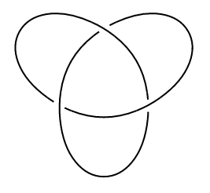
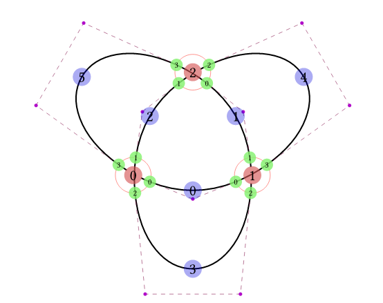
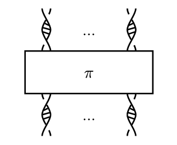

# Linkst

## Status 🚧  

This package is in early development (`v0.x.x`) and may change frequently.

## Introduction  

**Linkst** is a Typst package for drawing knots in knot theory.  
Since the package is new, formal documentation is limited.  
For examples of all available features, check the test file:  
📄 `tests/test.typ`

```typst
#import "@preview/linkst:0.1.0"


// Example of drawing a trefoil knot:

#let trefoil = knot(
  node((0, 0), connect: ((1, 2), (0, 3, true))),
  node((2, 0), connect: ((1, 2, true), (0, 3))),
  node((1, calc.sqrt(3)*1), connect: ((1, 2, true), (0, 3))),
  edge(0, 1, bezier: ((0.2, 0),)),
  edge(1, 2, bezier: ((0.2, 0),)),
  edge(2, 0, bezier: ((0.2, 0),)),
  edge(0, 1, bezier: ((1, -0.8), (1, 0.8))),
  edge(1, 2, bezier: ((1, -0.8), (1, 0.8))),
  edge(2, 0, bezier: ((1, -0.8), (1, 0.8))),
)

#draw-knot(
  trefoil,
)
```

## Gallery 🖼️




