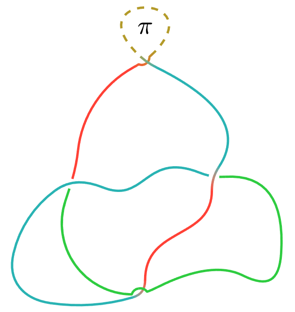
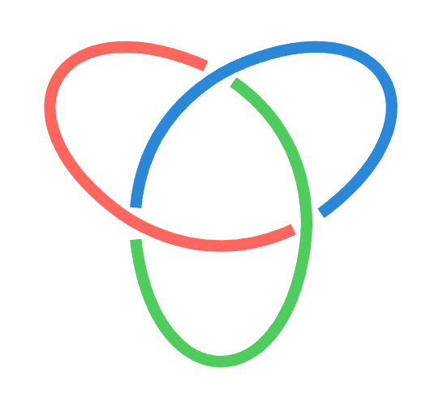
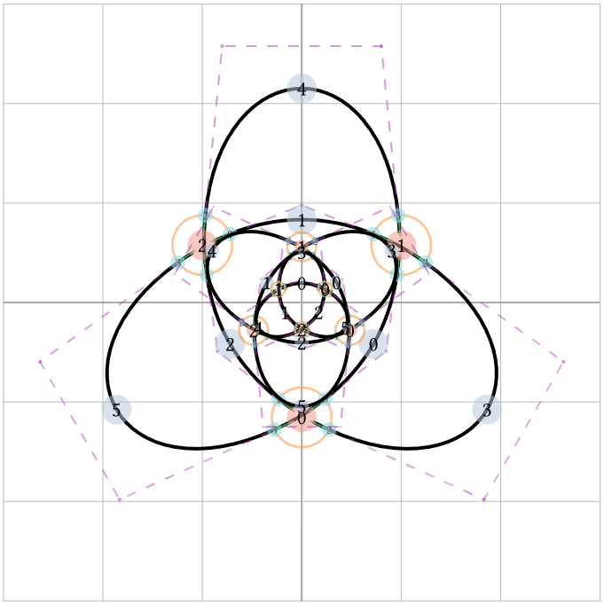
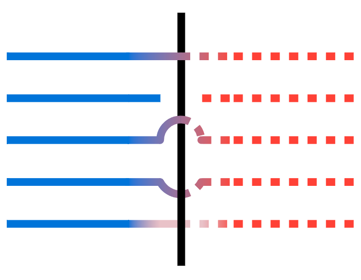
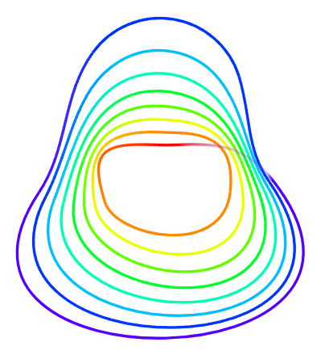

# Linkst

## Status 🚧  

This package is in early development (`v0.2.x`) and may change frequently.

## Introduction  

**Linkst** is a Typst package for drawing knots in knot theory.  
Since the package is new, formal documentation is limited.  
For examples of all available features, check the test files:  
📄 `tests/node.typ`, `tests/edge.typ` and `tests/knot.typ`

```typst
#import "@preview/linkst:0.2.1": *

// Example of drawing a trefoil knot:

#let trefoil = knot(
  node(0, 0, connect: ((0, 3), (1, 2, true))),
  node(2, 0, connect: ((0, 3, true), (1, 2))),
  node(1, calc.sqrt(3), connect: ((0, 3, true), (1, 2))),
  
  edge(0, 1, bend: -30deg, stroke: red),
  edge(1, 2, bend: -30deg, stroke: green),
  edge(2, 0, bend: -30deg, stroke: blue),
  edge(0, 1, bend: -100deg, stroke: green),
  edge(1, 2, bend: -100deg, stroke: blue),
  edge(2, 0, bend: -100deg, stroke: red),
)

#draw(
  trefoil,
)

#draw(
  trefoil,
  style: (debug: true),
)
```

## Gallery 🖼️

| [](gallery/random.png) | [](gallery/trefoil.png) | [](gallery/layers.png) |
|:---:|:---:|:---:|
| Random Knot | Trefoil Knot | Layer Function |

| [](gallery/wild-trefoils.png) | [](gallery/bridges.png) | [](gallery/avocado.png) |
|:---:|:---:|:---:|
| Wild Trefoils | Bridge Types | Avocado |
