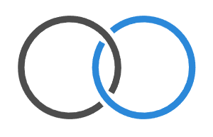
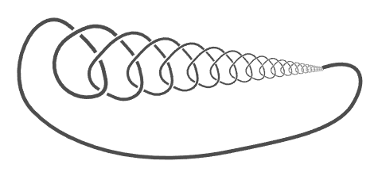
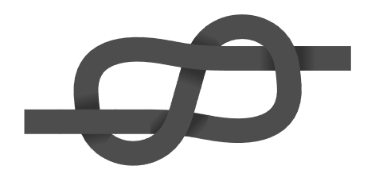

# Linkst

## Status 🚧  

This package is in early development (`v0.2.x`) and may change frequently.

## Introduction  

**Linkst** is a Typst package for drawing knots in knot theory.  
Since the package is new, formal documentation is limited.  
For examples of all available features, check the example files:  
[`examples/node.typ`](examples/node.typ), [`examples/edge.typ`](examples/edge.typ), and [`examples/knot.typ`](examples/knot.typ)

```typ
#import "@preview/linkst:0.2.1": *

// Example of drawing a trefoil knot:

#let trefoil = knot(
  node(0, 0, connect: ((0, 1), (2, 3, true))),
  node(2, 0, connect: ((0, 1, true), (2, 3))),
  node(1, calc.sqrt(3), connect: ((0, 3, true), (1, 2))),
  
  edge(0, 1, bezier-rel: (0, 0.2), stroke: red),
  edge(2, 0, bezier-rel: ((-0.7, 1), (0.7, 1),), stroke: red),
  edge(2, 0, bezier-rel: (0, 0.2), stroke: blue),
  edge(1, 2, bezier-rel: ((-0.7, 1), (0.7, 1),), stroke: blue),
  edge(1, 2, bezier-rel: (0, 0.2), stroke: green),
  edge(0, 1, bezier-rel: ((-0.7, 1), (0.7, 1),), stroke: green),

  style: (
    stroke: 3pt,
    scale: 0.8,
    bridge-space: 0.6,
    transform: ((-1, -calc.sqrt(3) / 3),),
  )
)

#draw(trefoil)
```

## Gallery 🖼️

|  |  |  |
|:---:|:---:|:---:|
| Random Knot | Trefoil Knot | Layer Function |

|  |  |  |
|:---:|:---:|:---:|
| Wild Trefoils | Bridge Types | Avocado |

|  |  |  |
|:---:|:---:|:---:|
| Hopf Link | Wild Knot | Figure Eight |
