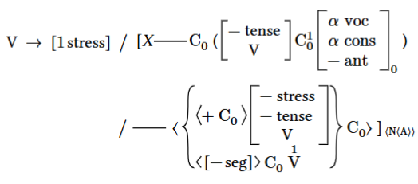
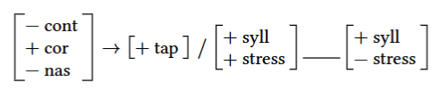

# The `linphon` Package
<div align="center">
Version 0.1.0

***Set phonological feature matrices, linear rewrite rules, and more.***


</div>

## Getting started

Here's a quick example of importing `linphon` from the Typst Universe and using
it to set a phonological rule, namely a tapping rule as it may be found for
instance in General American English.

```typ
#import "@preview/linphon:0.1.0" as lp

#lp.rule(
  lp.fmat(
    ("-", "cont"),
    ("+", "cor"),
    ("-", "nas"),
  ),
  lp.fmat(
    ("+", "tap"),
  ),
  [
    #lp.fmat(
      ("+", "syll"),
      ("+", "stress"),
    )
    #lp.dash()
    #lp.fmat(
      ("+", "syll"),
      ("-", "stress"),
    )
  ]
)
```

The above will produce the following output:



## Usage

The core functions of the `linphon` package are:

- `linphon.fmat(..features: array | str)` to set block-style feature matrices. The
  passed arguments may be valued feature pairs (passed as an array
  `(value, feature)`, e.g. `("+", "syllabic)`), privative features (passed as a
  valueless array, e.g. `("nasal",)`), general categorial labels (passed as a
  string, e.g. `"V"`) as well as conditional sub-matrices which will be set
  in angled brackets within the feature matrix (passed as an array
  of arrays, e.g. `(("+", "back"), ("+", "round"))`).
  - `linphon.fmat-inline(..features: array | str)` to set the feature matrix inline
    with the text.
- `linphon.rule(input: content, output: content[, context: content])` to set
  phonological rules, with an optionally specified context/environment.
- `linphon.constraint(body: content)` to set a phonological constraint preceded
  by an *asterisk.
- `linphon.dash()` to set a long dash/underscore, e.g. for the phonological
  context/environment specification of a rule or constraint.
  - `lindphon.dash-horizon()` to set the dash aligned horizontally to the text.
- `linphon.cases(..cases: content)` to set different cases/options in a
  phonological rule or constraint.
  - `linphon.cases-left(..cases: content)` to set the cases with only a
    left-hand brace.
  - `linphon.cases-right(..cases: content)` to set the cases with only a
    right-hand brace.

For an overview including different variants of the above functions and various usage examples,
consult [The `linphon` Reference](reference/reference.pdf).

## Other useful packages

If you want to set phonological features and rules, you probably also have a need for IPA symbols/transcription and numbered examples.

For IPA symbols/transcriptions, why not try [*TyIPA*](https://typst.app/universe/package/tyipa) or [ascii-ipa](https://typst.app/universe/package/ascii-ipa).

For numbered example environments, combine `linphon` with [eggs](https://typst.app/universe/package/eggs) (or the slightly older [leipzig-glossing](https://typst.app/universe/package/leipzig-glossing)).

## License

The `linphon` package is free and open-source software, licensed under the MIT License.

See the [LICENSE file](LICENSE) for more information.
