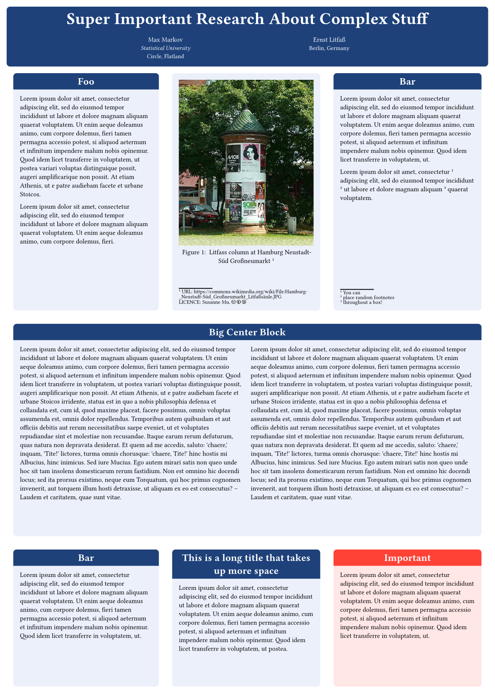
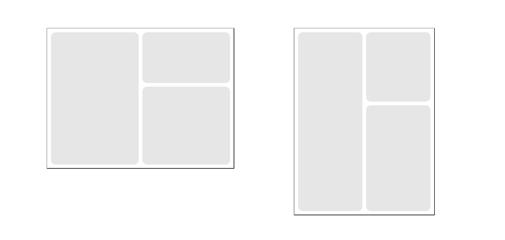
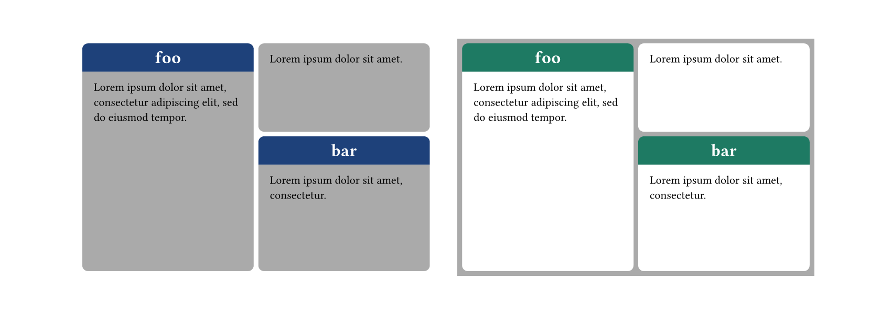
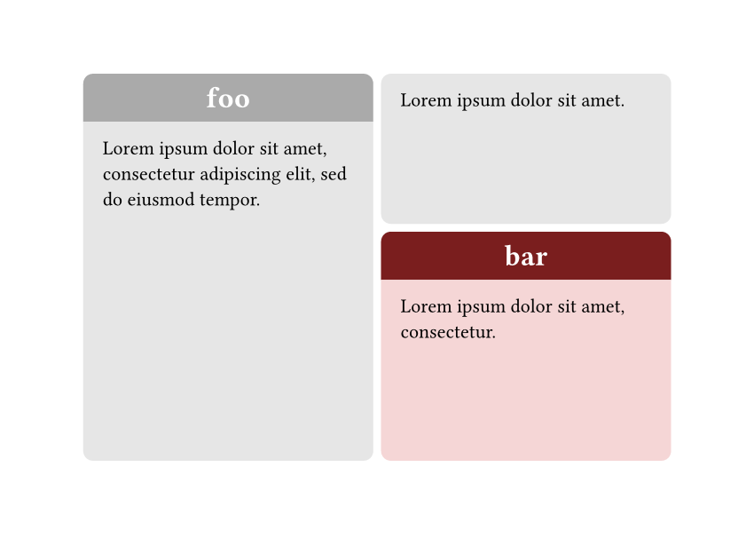
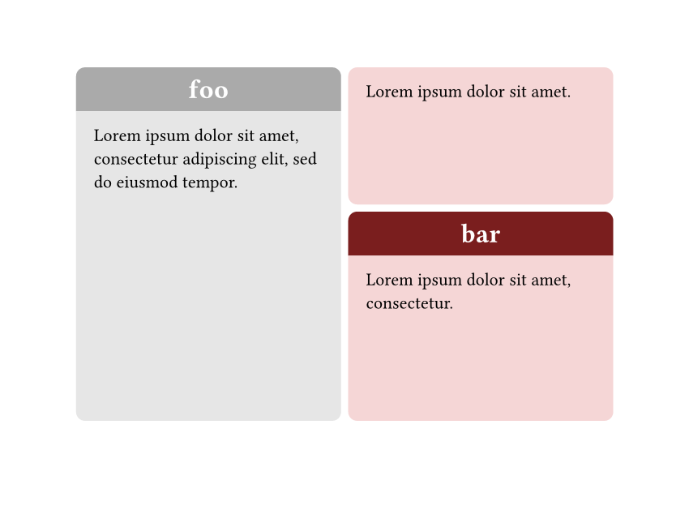
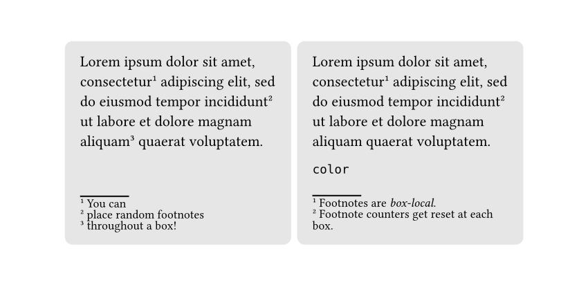

# Liftass

Litfass, named after printer and publisher [Ernst Litfaß](https://en.wikipedia.org/wiki/Ernst_Litfa%C3%9F)
who invented free-standing [advertising columns](https://en.wikipedia.org/wiki/Advertising_column)
(commonly known as Litfaßsäulen), is a library to create tiling layouts which 
can be applied and rendered to arbitrary bounding boxes. The most interesting
use case, which Litfass also originally was developed for, are (scientific) posters. 

## Usage

Litfass contains 3 modules: 
- `tiling` contains the fundamental generator functions like `vs` (vertical split),
   `hs` (horizontal split) and `cbx` (content box) to create tiling actions.
- `render` provides functionality to apply and render tilings to concrete 
   bounding boxes in the document.
- `themes` provides default themes (currently just one base theme)

Importing Liftass modules could look as follows:

```typ
#import "@preview/litfass:0.1.1"
#import litfass.tiling: *

#let poster = litfass.render.poster.with(theme: litfass.themes.basic)
```

The [manual](doc/manual.pdf) contains more detailed instructions on how to use Litfass.

## Examples

The examples listed below demonstrate the features and usage of Litfass. Click on the images
to get to the corresponding `.typ` file.

### Poster

Scientific posters are what Litfass was originally developed for. By using a 
tiling mechanism the posters content boxes can be neatly laid out ensuring for
clear visual edges and level box alignments.

<a href="examples/example-poster.typ">

</a>

### Tiling 
Once defined, a tiling can be applied to different bounding boxes, also inline boxes usable in standard typst documents.
```typ
#let tiling = vs(
  cut: 50%,
  cbx([]),
  hs(cut: 40%, cbx([]), cbx([]))
)
#grid(
  columns: (1fr, 1fr),
  gutter: 4em,
  [
    #let bbox = (width: 20em, height: 15em)
    #inline-box(tiling, ..bbox, stroke: (paint: black, dash: "dashed"))
  ],
  [
    #let bbox = (width: 15em, height: 20em)
    #inline-box(tiling, ..bbox, stroke: (paint: black, dash: "dashed"))
  ],
)
```

<a href="examples/inline-tiling.typ">

</a>


### Themes

Litfass also supports the use of themes. As for now, one default theme is provided in `litfass.themes.basic`. 
More default themes are planned to be added in the future. In fact, feel free to contribute!

<a href="examples/themes.typ">

</a>


Certain attributes can also be overriden at any point in the tiling hirarcy. The updated theme
gets further passed down.


```typ
#let highlight-box-style = (
  title: (
    background: rgb("7a1e1e")
  )
)
```

<table>
<tr>
<td>

```typ
    #let tiling = vs(
      cbx(lorem(12), title: [foo]),
      hs(
        cut: 40%,
        cbx(
          lorem(5)),
          cbx(
            lorem(6), 
            title: [bar],
            theme: (box: highlight-box-style)
          ),
      )
    )
```

</td>
<td>
    <a href="examples/themes-highlight.typ">
    
    </a>
</td>
</tr>
<tr>
<td>

```typ
    #let tiling = vs(
      cut: 50%,
      cbx(lorem(12), title: [foo]),
      hs(
        cut: 40%,
        cbx(
          lorem(5)),
          cbx(
            lorem(6), 
            title: [bar],
            theme: (box: highlight-box-style)
          ),
      )
    )
```

</td>
</td>
<td>
    <a href="examples/themes-override.typ">
    
    </a>
</td>
</tr>
</table>


### Box Footnotes

Footnotes can be added to content boxes using `box-footnote`.

<a href="examples/footnotes.typ">

</a>


## Changelog
The version changes are listed in the [changelog]("doc/changelog.pdf").


