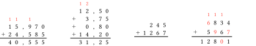
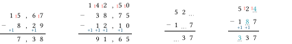
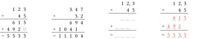
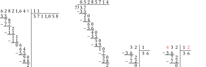
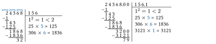
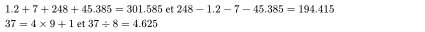
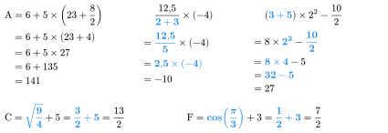
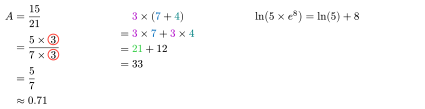
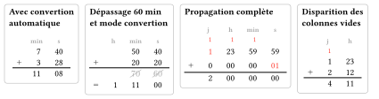
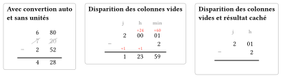

# longops

Package to present long operations (addition, substraction multiplication, square root) and detailed calculations (automatic with etapes-calcul or manually with detail). Inspired by the LaTeX package xlop. Presenting addition and subtraction of durations is also possible.

[](https://github.com/Akilon27/longops/0.1.1/LICENSE)

## Installing

Install longops by cloning it or importing like this:

```typ
#import "@preview/longops:0.1.1": addition

// Cas simple
#addition(15.97, 24.585)
// Plusieurs termes
#addition(12.5, 3.75, 0.8, 14.2)
// Avec résultat caché
#addition(245, 1267,hide-result:true, )
// Liste et solution:true
#addition(6834,5967,liste:(2,9,11,16),solution:true)
```

<div align="center">
  
</div>

```typ
#import "@preview/longops:0.1.1": soustraction

// Soustraction standard à 2 décimaux
#soustraction(15.67, 8.29)
// Soustraction décimale à plusieurs termes
#soustraction(142.5, 38.75, 12.1,)
// Mode correction d'un exercice à trous (avec solution: false puis true)
#soustraction(524, 187, liste: (3, 6, 9), show-borrow:true,type-mask:"",)
#soustraction(524, 187, liste: (3, 6, 9), solution: true,show-borrow:true,type-mask:"",couleur-solution:eastern)
```

<div align="center">
  
</div>

```typ
#import "@preview/longops:0.1.1": multiplication

// Multiplication classique à 2 chiffres au multiplicateur
#multiplication(123, 45)
// Multiplication sans mode fr
#multiplication(3.47,3.2,fr:false,mode:"")
// Mode exercice : cache à la fois les lignes intermédiaires ET le résultat
#multiplication(12.3, 45, type-mask: "line", hide-result: true)
// Mode correction de l'exercice ci-dessus
#multiplication(12.3, 45, type-mask: "line", hide-result: true, solution: true)
```

<div align="center">
  
</div>

```typ
#import "@preview/longops:0.1.1": division

// Un chiffre en plus que dans a
#division(62821.64,11,extradigits:1,)
// Cycle entre parenthèses, mode anglais
#division(3.7,7,cycle:true,mode:"",fr:false)
// Liste de cases masquées
#division(432, 12, liste: (0, 4))
// Afficher la solution pour les cases masquées ci-dessus
#division(432, 12, liste: (0, 4), solution: true)
```

<div align="center">
  
</div>

```typ
#import "@preview/longops:0.1.1": racine

#racine(24368,groupes: true)
#racine(24368,fr:false,extradigits: 1)
```

<div align="center">
  
</div>

```typ
#import "@preview/longops:0.1.1": egalite-euclidienne, egalite-decimale, add-en-ligne, sous-en-ligne

$#add-en-ligne(1.2,7,248,45.385)$ et $#sous-en-ligne(248,1.2,7,45.385,digits: 3)$\
#egalite-euclidienne(37,9) et #egalite-decimale(37,8)
```

<div align="center">
  
</div>

```typ
#import "@preview/longops:0.1.1": etapes-calcul

// Exemple 1
#etapes-calcul("6 + 5*(23+8/2)",vertical: true,name:"A",highlight: none)
// Exemple 2 : Avec des nombres négatifs et décimaux
#etapes-calcul("12.5 / (2 + 3) * -4 ",vertical: true,fraction: false)
// Exemple 3 : Opérations imbriquées complexes
#etapes-calcul("(3 + 5) * 2^2 - 10 / 2",vertical: true,concomitant: true,)
// Avec des racines et fonctions
#etapes-calcul("sqrt(9/4) + 5", fraction: true, name: "C") 
#etapes-calcul("cos(pi/3) + 3", fraction: true, name: "F")
```

<div align="center">
  
</div>

```typ
#import "@preview/longops:0.1.1": detail

#detail("A=15/21=(5*r3)/(7*r3)=5/7", arrondi: true, vertical: true, c: "circle")
#detail(
  "p3*(n7+t4)=p3*n7+p3*t4=g21+12",
  c: "color",
  appro: 0,
  vertical: true,
  arrondi: "",
)
#detail("ln(5*e^8)=ln(5)+8")
```

<div align="center">
  
</div>

```typ
#import "@preview/longops:0.1.1": addition-durees

#test(
  [Avec convertion\ automatique],
  addition-durees((7, 40), (2.3, 70), show-carry: false)
)
#test(
  [Dépassage 60 min\ et mode convertion],
  addition-durees((50, 40), (20, 20),convertion: true)
)
#test(
  [Propagation complète],
  addition-durees((1, 23, 59, 59), (0, 0, 0, 1), liste:(1,9,),solution: true)
)
#test(
  [Disparition des\ colonnes vides],
  addition-durees((1, 23, 0, 0), (2, 12, 0, 0))
)
```

<div align="center">
  
</div>

```typ
#import "@preview/longops:0.1.1": soustraction-durees

#test(
  [Avec convertion auto\ et sans unités],
  soustraction-durees((7, 20), (2.2, 40), convertion: true, zero-pad: false, show-units: false)
)
#test(
  [Disparition des colonnes vides],
  soustraction-durees((2,0, 1, 0), (2, 0))
)
#test(
  [Disparition des colonnes\ vides et résultat caché],
  soustraction-durees((2, 1, 0, 0), (2, 0, 0), convertion: true, hide-result: true)
)
```

<div align="center">
  
</div>

More on these functions in the [french manual](Exemples/manuel-longops.pdf) or the [english manual](Exemples/manual-longops-en.pdf).

## Contributing

Any contributions are welcome! Just fork the repository and make a pull request.
Thanks to ObaulG for the idea and most of the work on the durations functions.

## Changelog
*0.1.1* 
- Added addition-durees and soustractions-durees to work with durations
- correction of an inconsistency in functions names
- A few fixes/improvements