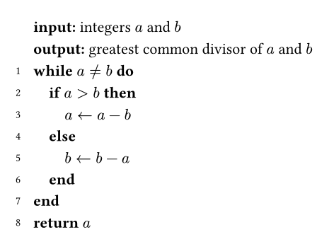
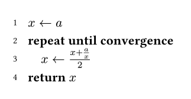
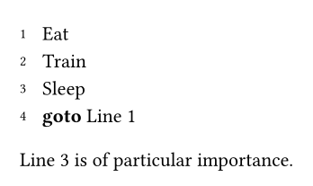
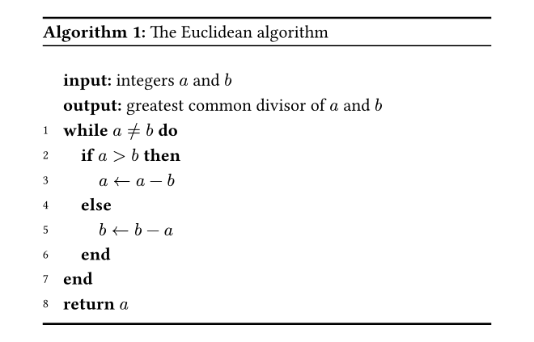
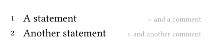
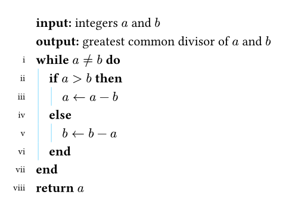
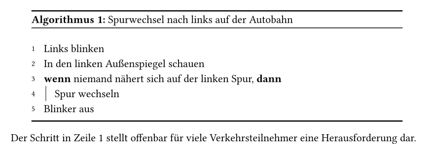

# Lovelace
This is a package for writing pseudocode in [Typst](https://typst.app/).
It is named after the computer science pioneer
[Ada Lovelace](https://en.wikipedia.org/wiki/Ada_Lovelace) and inspired by the
[pseudo package](https://ctan.org/pkg/pseudo) for LaTeX.


## Usage
Import the package using
```typ
#import "@preview/lovelace:0.1.0": *
```
You should then call the setup function in a show rule _at the top of your
document_:
```typ
#show: setup-lovelace
```
You are then ready to go to typeset some pseudocode:
```typ
#pseudocode(
  no-number,
  [*input:* integers $a$ and $b$],
  no-number,
  [*output:* greatest common divisor of $a$ and $b$],
  [*while* $a != b$ *do*], ind,
    [*if* $a > b$ *then*], ind,
      $a <- a - b$, ded,
    [*else*], ind,
      $b <- b - a$, ded,
    [*end*], ded,
  [*end*],
  [*return* $a$]
)
```
resulting in:



As you can see, every line of your pseudocode is represented by a single content
argument.
Additionally, we use `ind` and `ded` to control the indentation level:
`ind` (indent) to go one level deeper, `ded` (dedent) to go one level back.
Don't forget to put all the commas in between!
The content of your pseudocode is up to you.
This package does not assume any specific set of keywords or language constructs.
For example, you might want to write something like
```typ
#pseudocode(
  $x <- a$,
  [*repeat until convergence*], ind,
    $x <- (x + a/x) / 2$, ded,
  [*return* $x$]
)
```


for some more abstract, less implementation concerned pseudocode that follows
your own convention, most suitable to you.

There are two other elements you can use as positional arguments to `#pseudocode`:
`no-number` makes the next line have no line number (and also not being counted).
This is useful for things like input and output (as seen above) or to introduce
an empty line (i.e, you add `no-number, []` to the arguments).

### Referencing lines
Finally, you can put labels there.
They will be attached to the line number of the following line and can be used
to reference that line later:
```typ
#pseudocode(
  <line:eat>,
  [Eat],
  [Train],
  <line:sleep>,
  [Sleep],
  [*goto* @line:eat]
)

@line:sleep is of particular importance.
```



### Algorithm as figure
`#pseudocode` is great if you just want to show some lines of code.
If you want to display a full algorithm with bells and whistles, you can use
`#algorithm`:
```typ
#algorithm(
  caption: [The Euclidean algorithm],
  pseudocode(
    no-number,
    [*input:* integers $a$ and $b$],
    no-number,
    [*output:* greatest common divisor of $a$ and $b$],
    [*while* $a != b$ *do*], ind,
      [*if* $a > b$ *then*], ind,
        $a <- a - b$, ded,
      [*else*], ind,
        $b <- b - a$, ded,
      [*end*], ded,
    [*end*],
    [*return* $a$]
  )
)
```
resulting in:



`#algorithm` creates a figure with `kind: "lovelace"` so it gets its own counter
and display.
You can use optional arguments such as `placement` or `caption`, see
[figure in the Typst docs](https://typst.app/docs/reference/meta/figure/#parameters).
Note that such figures are only displayed correctly when you used the setup
function mentioned above!

### Comments
Again, the content of your pseudocode is completely up to you, and that includes
comments.
However, Lovelace provides a sensible `#comment` function you can use:
```typ
#pseudocode(
  [A statement #comment[and a comment]],
  [Another statement #comment[and another comment]],
)
```



### Customisation
Lovelace provides a couple of customisation options.

First, the `pseudocode` function accepts optional keyword arguments:
- `line-numbering`: `true` or `false`, whether to display line numbers, default
  `true`
- `line-number-transform`: a function that takes in the line number as an integer
  and returns an arbitrary value that will be displayed instead of the line
  number, default `num => num` (identity function)
- `indentation-guide-stroke`: a
  [stroke](https://typst.app/docs/reference/visualize/line/#parameters-stroke),
  defining how the indentation guides are displayed, default `none` (no lines)

For example, let's use thin blue indentation guides and roman line numbering:
```typ
#pseudocode(
  line-number-transform: num => numbering("i", num),
  indentation-guide-stroke: .5pt + aqua,
  no-number,
  [*input:* integers $a$ and $b$],
  no-number,
  [*output:* greatest common divisor of $a$ and $b$],
  [*while* $a != b$ *do*], ind,
    [*if* $a > b$ *then*], ind,
      $a <- a - b$, ded,
    [*else*], ind,
      $b <- b - a$, ded,
    [*end*], ded,
  [*end*],
  [*return* $a$]
)
```
resulting in:



Also, there are some optional arguments to `lovelace-setup`:
- `line-number-style`: a function that takes content and returns content, used
  to display the line numbers in the pseudocode, default `text.with(size: .7em)`,
  note that this is different from the `line-number-transform` argument to
  `#pseudocode` as the latter has an effect on line numbers in references as well.
- `line-number-supplement`: some content that is placed before the line number
  when referencing it, default `"Line"`

If you want to avoid having to repeat all those configurations, here is what
you can do.
Suppose, we always want German supplements (Zeile and Algorithmus instead of
Line and Algorithm) and thin indentation guides.
```typ
#show: setup-lovelace.with(line-number-supplement: "Zeile")
#let pseudocode = pseudocode.with(indentation-guide-stroke: .5pt)
#let algorithm = algorithm.with(supplement: "Algorithmus")

#algorithm(
  caption: [Spurwechsel nach links auf der Autobahn],
  pseudocode(
    <line:blinken>,
    [Links blinken],
    [In den linken Außenspiegel schauen],
    [*wenn* niemand nähert sich auf der linken Spur, *dann*], ind,
      [Spur wechseln], ded,
    [Blinker aus],
  )
)

Der Schritt in @line:blinken stellt offenbar für viele Verkehrsteilnehmer eine
Herausforderung dar.
```

