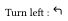

# Typst lucide

[Lucide](https://lucide.dev/) icons (version 0.552) for [typst](https://typst.app).

## Usage

```typst
#import "@preview/lucide:0.1.0": *

Turn left : #lucide-inline("corner-up-left")
```


