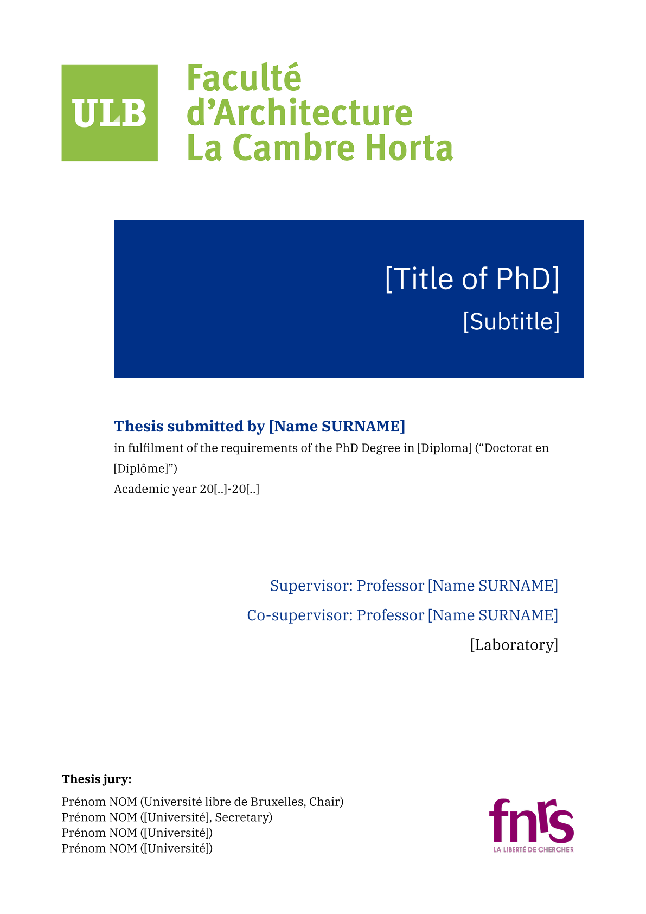

<!--
SPDX-FileCopyrightText: 2025 Julien Rippinger <https://julienrippinger.eu>

SPDX-License-Identifier: MIT-0
-->

_Scientia vincere tenebras_

## LUMEN: ULB PhD Thesis Front Cover

This is an unofficial standard front cover for a doctoral thesis submitted at the Université libre de Bruxelles.
This template is intended for creating a personalized cover in the form of a single-page PDF file.

## Usage

+ It appears that the official template uses the Times New Roman font. The Libertinus Serif/Sans and IBM Plex Serif/Sans fonts are elegant, free alternatives.
+ Replace the images by uploading your faculty and fund logos, then modify the paths for the `logo` and `fund-logo` parameters of the `#show` function.
+ The following parameters can be disabled by replacing the parameter value with `none`: `subtitle`, `co-supervisor`, `lab`, `jury1` (removes all jury fields) and `fund-logo`.

<table>
<tr>
<td>English</td>
<td>Français</td>
</tr>
<tr>
<td></td>
<td></td>
</tr>
<tr>
<td>

```typst
#set text(lang: "en")
#show: cover(
  logo: "template/logos/archi.png",
  title-font: "IBM Plex Sans",
  body-font: "IBM Plex Serif",
  title: "[Title of PhD]",
  subtitle: "[Subtitle]",
  name: "[Name SURNAME]",
  field-en: "[Diploma]",
  field-fr: "[Diplôme]",
  aca-year: "20[..]-20[..]",
  supervisor: "[Name SURNAME]",
  co-supervisor: "[Name SURNAME]",
  lab: "[Laboratory]",
  jury1: "Name SURNAME (Université libre de Bruxelles, Chair)",
  jury2: "Name SURNAME ([University], Secretary)",
  jury3: "Name SURNAME ([University])",
  jury4: "Name SURNAME ([University])",
  jury5: none, // "Name SURNAME ([University])"
  jury6: none, // "Name SURNAME ([University])"
  jury7: none, // "Name SURNAME ([University])"
  fund-logo: "template/logos/FNRS-en.png",
  fund-logo-width: 90%,
  )
```

</td>

<td>

```typst
#set text(lang: "fr")
#show: cover(
  logo: "template/logos/archi.png",
  title-font: "IBM Plex Sans",
  body-font: "IBM Plex Serif",
  title: "[Titre de la thèse]",
  subtitle: "[Facultatif: sous-titre de la thèse]",
  name: "[Prénom NOM]",
  field-fr: "[Diplôme]",
  aca-year: "20[..]-20[..]",
  supervisor: "[du/de la] Professeur[e] [Prénom NOM]",
  supervisor-role: "[promoteur/promotrice]",
  co-supervisor: "[du/de la] Professeur[e] [Prénom NOM]",
  co-supervisor-role: "[co-promoteur/promotrice]",
  lab: "[facultatif: unité de recherche]",
  jury1: "Prénom NOM (Université libre de Bruxelles, Président)",
  jury2: "Prénom NOM ([Université], Secrétaire)",
  jury3: "Prénom NOM ([Université])",
  jury4: "Prénom NOM ([Université])",
  jury5: none, // "Prénom NOM ([Université])"
  jury6: none, // "Prénom NOM ([Université])"
  jury7: none, // "Prénom NOM ([Université])"
  fund-logo: "template/logos/FNRS-fr.png",
  fund-logo-width: 90%,
)
```

</td>
</tr>
</table>

## Licenses

+ All original code is licensed under the MIT-0 license.
+ Thumbnails are licensed under the CC0 1.0 Universal license.
+ The images in `./template/logos/*.png` are provided by the following institutions:
   + [Université libre de Bruxelles (ULB)](https://portail.ulb.be/fr/communication-et-ressources-documentaires/editer-et-imprimer/graphisme-et-mise-en-page) (institutional link)
   + [Le Fonds de la Recherche Scientifique (FNRS)](https://www.frs-fnrs.be/fr/communication/logos-fnrs)
   + [The Luxembourg National Research Fund (FNR)](https://www.fnr.lu/logo/)

## Contribution

[](https://codeberg.org/mononym/typst-ulb-phd-cover)

+ Feel free to improve the template by providing feedback or making a direct contribution to this repository.
+ We also welcome help in the form of uploaded logos to adapt this template for other faculties.
