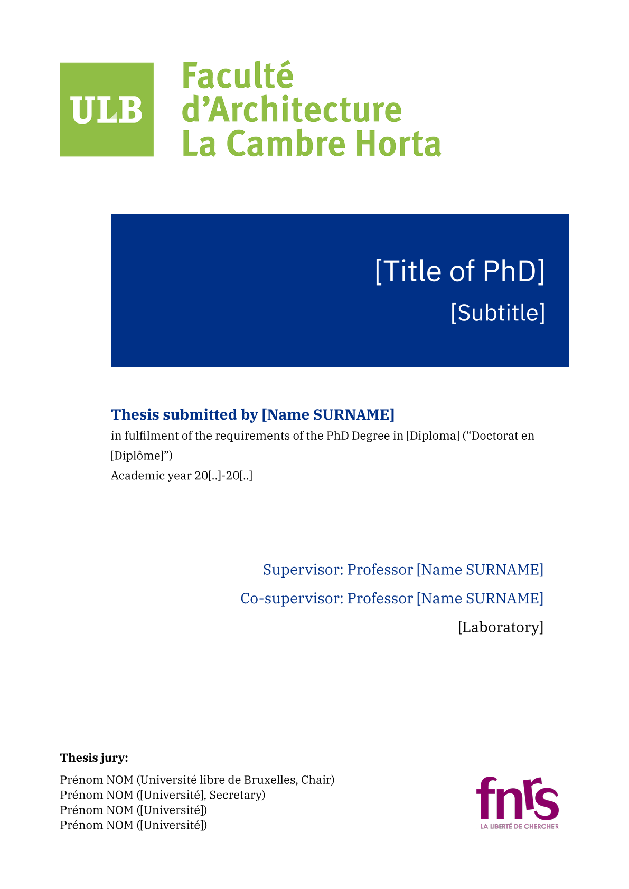
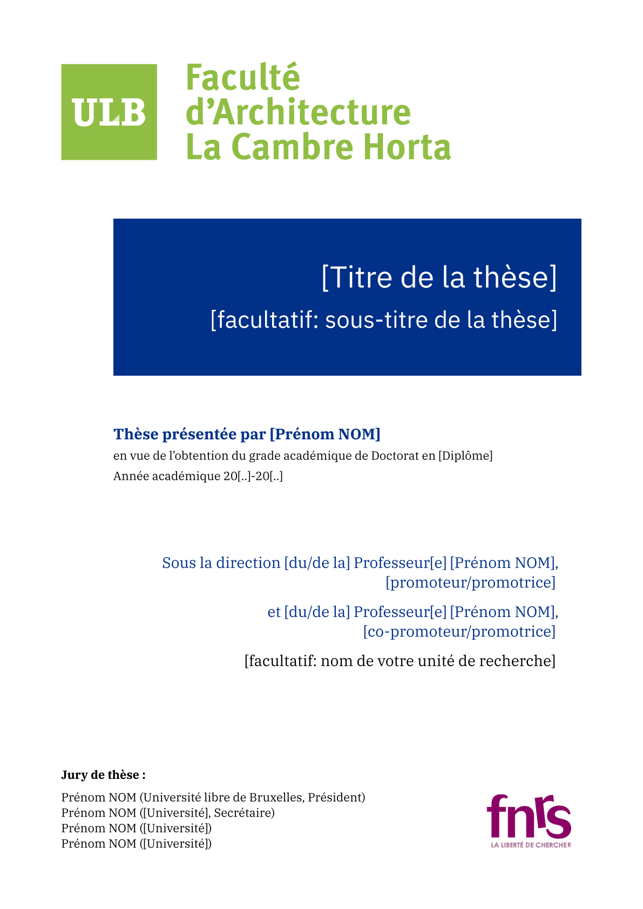

<!--
SPDX-FileCopyrightText: 2025 Julien Rippinger <https://julienrippinger.eu>

SPDX-License-Identifier: MIT-0
-->

_Scientia vincere tenebras_

## LUMEN: ULB PhD Thesis Front Cover

This is an unofficial standard front cover for a doctoral thesis submitted at the Université libre de Bruxelles.
You can use this template to create a personalized cover that you can insert anywhere in your document.

## Usage

+ It appears that the official template uses the Times New Roman font. The IBM Plex Serif/Sans and Libertinus Serif/Sans fonts are elegant, free alternatives.
+ Replace the images by uploading your faculty and fund logos, then modify the paths for the `logo` and `fund-logo` parameters of the `#show` function.
+ The following parameters can be disabled by replacing the parameter value with `none`: `subtitle`, `co-supervisor`, `lab`, `jury1` (removes all jury fields) and `fund-logo`.

<table>
<tr>
<td>English</td>
<td>Français</td>
</tr>
<tr>
<td></td>
<td></td>
</tr>
<tr>
<td>

```typst
#set page(paper:"a4")
#set text(lang: "en")
#cover(
  logo: image("logos/archi.png"),
  logo-width: 75%,
  title: "[Title of PhD]",
  subtitle: "[Subtitle]",
  name: "[Name SURNAME]",
  field-en: "[Diploma]",
  field-fr: "[Diplôme]",
  aca-year: "20[..]-20[..]",
  supervisor: "[Name SURNAME]",
  co-supervisor: "[Name SURNAME]",
  lab: "[Laboratory]",
  jury1: "Name SURNAME (Université libre de Bruxelles, Chair)",
  jury2: "Name SURNAME ([University], Secretary)",
  jury3: "Name SURNAME ([University])",
  jury4: "Name SURNAME ([University])",
  fund-logo: image("logos/FNRS-en.png"),
  fund-logo-width: 90%,
  )
```

</td>

<td>

```typst
#set page(paper:"a4")
#set text(lang: "fr")
#cover(
  logo: image("logos/archi.png"),
  logo-width: 75%,
  title: "[Titre de la thèse]",
  subtitle: "[Facultatif: sous-titre de la thèse]",
  name: "[Prénom NOM]",
  field-fr: "[Diplôme]",
  aca-year: "20[..]-20[..]",
  supervisor: "[du/de la] Professeur[e] [Prénom NOM]",
  supervisor-role: "[promoteur/promotrice]",
  co-supervisor: "[du/de la] Professeur[e] [Prénom NOM]",
  co-supervisor-role: "[co-promoteur/promotrice]",
  lab: "[facultatif: unité de recherche]",
  jury1: "Prénom NOM (Université libre de Bruxelles, Président)",
  jury2: "Prénom NOM ([Université], Secrétaire)",
  jury3: "Prénom NOM ([Université])",
  jury4: "Prénom NOM ([Université])",
  fund-logo: image("logos/FNRS-fr.png"),
  fund-logo-width: 90%,
)
```

</td>
</tr>
</table>

## Configuration

This template exports the `cover` function with the following named arguments:

| Argument | Description |
| --- | --- |
| `faculty-logo` | The logo of your faculty |
| `faculty-logo-width` |  Faculty logo resize percentage |
| `title-font` | Font of the title and subtitle |
| `title` | Title of the thesis |
| `subtitle` | Subtitle of the thesis |
| `body-font` | Font of the remaining cover page |
| `name` | Name and Surname of the PhD candidate |
| `field-fr` | Academic field in French |
| `field-en` | Academic field in English |
| `aca-year` | Academic year |
| `supervisor` | Name and Surname of the supervisor |
| `supervisor-role` | Supervisor role |
| `co-supervisor` | Name and Surname of the co-supervisor |
| `co-supervisor-role` | Co-supervisor role |
| `lab` | Name of the laboratory |
| `jury1` | Jury member (chair) |
| `jury2` | Jury member (secretary) |
| `jury3` | Jury member |
| `jury4` | Jury member |
| `jury5` | Jury member |
| `jury6` | Jury member |
| `jury7` | Jury member |
| `fund-logo` | Logo of the research fund |
| `fund-logo-width` | Research fund logo resize percentage |
| `font-scale` | Font size scale factor |

## Licenses

+ All original code is licensed under the MIT-0 license.
+ Thumbnails are licensed under the CC0 1.0 Universal license.
+ The images in `logos/` are provided by the following institutions:
   + [Université libre de Bruxelles (ULB)](https://portail.ulb.be/fr/communication-et-ressources-documentaires/editer-et-imprimer/graphisme-et-mise-en-page) (institutional link)
   + [Le Fonds de la Recherche Scientifique (FNRS)](https://www.frs-fnrs.be/fr/communication/logos-fnrs)
   + [The Luxembourg National Research Fund (FNR)](https://www.fnr.lu/logo/)

## Contribution

[](https://codeberg.org/mononym/typst-ulb-phd-cover)

+ Feel free to improve the template by providing feedback or making a direct contribution to this repository.
+ We also welcome help in the form of uploaded logos to adapt this template for other faculties.
