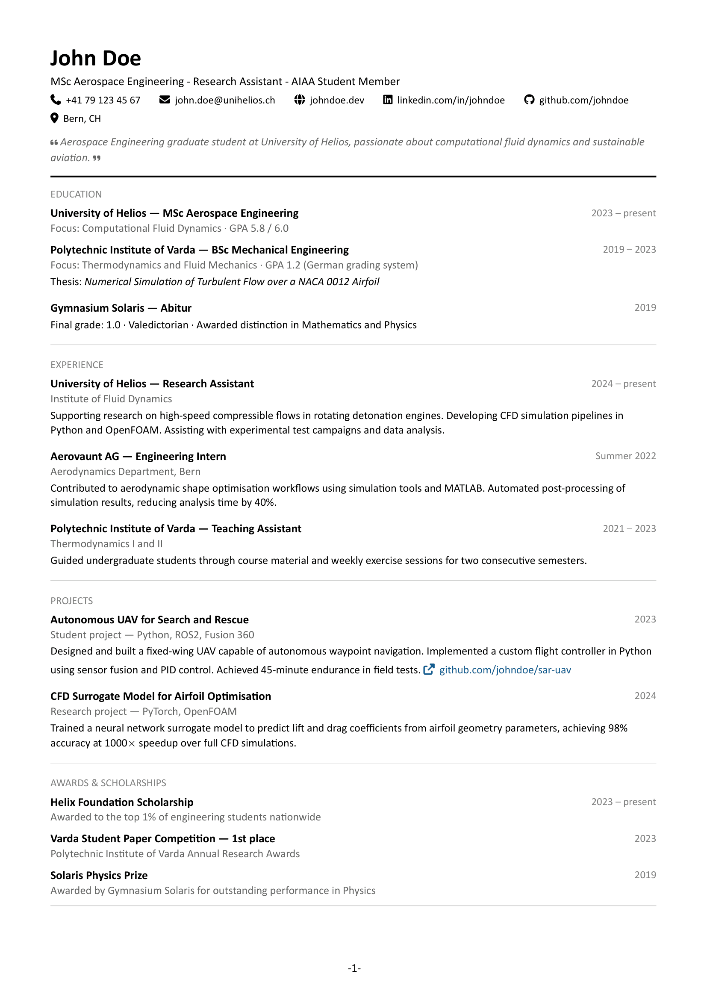

# luminar-cv

A clean, modular CV template for Typst with FontAwesome icons, customizable accent colors, and support for academic publications.



## Features

- Clean, professional design with a clear visual hierarchy
- FontAwesome icons for contact information
- Customizable accent colors for skill highlights and links
- Optional bio section with quote styling
- Support for academic publications with DOI links
- Automatic page numbering
- Modular structure — separate template and content files

## Example

See [cv.pdf](example/cv.pdf).

## Requirements

This template requires the FontAwesome desktop fonts to render icons correctly. Please refer to the [`fontawesome` package documentation](https://typst.app/universe/package/fontawesome) for installation instructions.

## Usage

### Import

```typst
#import "@preview/luminar-cv:0.1.0": *

#show: cv.with(
  name: [Your Name],
  positions: (
    [Your Position],
    [Your Institution],
  ),
  contact: (
    email: "you@email.com",
    website: "yourwebsite.com",
    linkedin: "yourlinkedin",
    github: "yourgithub",
    location: "City, Country",
  ),
  bio: [A short personal statement about yourself.],
  skill-highlight-color: rgb("#135b8f"),
  link-color: rgb("#135b8f"),
  page-numbering: true,
)
```

### Functions

#### `cv`

The main template function. Pass all document content through it via `#show: cv.with(...)`.

| Parameter | Type | Default | Description |
|---|---|---|---|
| `name` | content | `none` | Your full name |
| `positions` | array | `()` | List of titles or positions displayed below your name |
| `contact` | dictionary | `(:)` | Contact information — see contact fields below |
| `bio` | content | `none` | Optional personal statement displayed below contact info |
| `skill-highlight-color` | color | `rgb("#135b8f")` | Accent color for highlighted skills and links |
| `link-color` | color | `rgb("#135b8f")` | Color for body links |
| `page-numbering` | bool | `true` | Show page numbers in `- 1 -` format |

**Contact fields:**

| Field | Description |
|---|---|
| `phone` | Phone number (include country code) |
| `email` | Email address |
| `website` | Personal website (without `https://`) |
| `linkedin` | LinkedIn username |
| `github` | GitHub username |
| `location` | City and country |

All contact fields are optional — omit any you don't want displayed.

---

#### `section`

Creates a labeled section with a dividing rule.

```typst
#section(title: [Education])[
  // section content
]
```

---

#### `entry`

The core repeating unit for experience, education, projects, and awards. Title and date sit on the same line, subtitle and body below.

```typst
#entry(
  title: [Company — Role],
  subtitle: [Optional subtitle],
  date: [2023 -- present],
)[
  Description of the entry.
]
```

All parameters except `body` are optional. Pass an empty body `[]` for entries without a description.

---

#### `skill`

Renders a skill as a rounded pill. Set `highlight: true` for skills you want to emphasize — these use the `skill-highlight-color`.

```typst
#skill([Python], highlight: true)
#skill([LaTeX])
```

---

#### `languages`

Displays a list of languages in a three-column grid.

```typst
#languages((
  (name: [English], level: [native]),
  (name: [German], level: [C1]),
  (name: [French], level: [B2]),
))
```

---

#### `publication`

Formats an academic publication entry with optional DOI link.

```typst
#publication(
  title: [Title of the Paper],
  authors: [A. Author, B. Author],
  journal: [Journal of Something],
  year: [2024],
  doi: [10.0000/example],
  note: [peer-reviewed],
)
```

All fields except `title` are optional.

---

#### `body_link`

Renders a hyperlink with an external link icon and the configured `link-color`. Use this for links inside entry bodies.

```typst
#body_link("https://github.com/you/project", "github.com/you/project")
```

---

## Customization

### Accent color

Change the accent color for both skill highlights and links:

```typst
#show: cv.with(
  skill-highlight-color: rgb("#8b0000"),
  link-color: rgb("#8b0000"),
)
```

### Font

The template uses Calibri by default. To change it, modify the `set text` call in `template.typ`:

```typst
set text(font: "Your Font", size: 10pt)
```

### Margins

Adjust page margins in the `set page` call in `template.typ`:

```typst
set page(margin: (x: 2cm, y: 2cm))
```

## License

MIT — see [LICENSE](LICENSE) for details.
