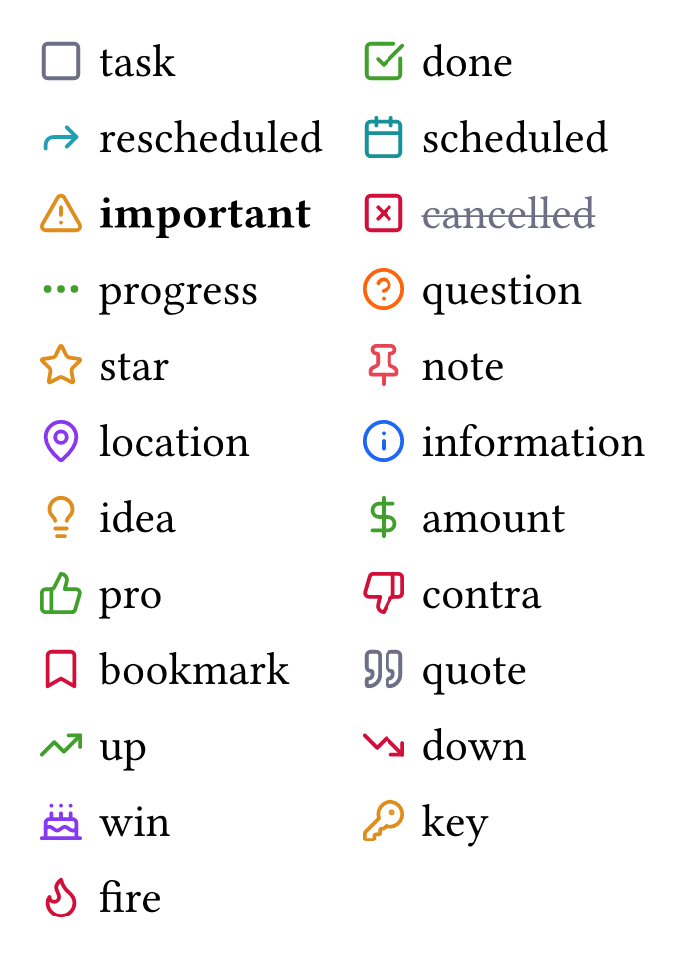
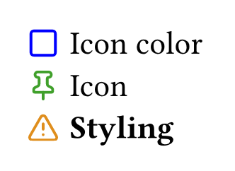

Write checklists in a markdown syntax and use icons like many Obsidian themes.

# Usage

Take native bullet lists to the next level with checkboxes to keep track of tasks and other bullet points.
This can be achieved by using the Markdown syntax and [its extension from the Obisidan theme _Minimal_](https://minimal.guide/checklists#Checkbox+icons).

## Example

```typst
#import "@preview/luzid-checkbox:0.1.0": luzid

#show: luzid

- [ ] task
- [x] done
- [>] rescheduled
- [<] scheduled
- [!] important
- [-] cancelled
- [/] progress
- [?] question
- [\*] star
- [n] note
- [l] location
- [i] information
- [I] idea
- [S] amount
- [p] pro
- [c] contra
- [b] bookmark
- [\"] quote
- [u] up
- [d] down
- [w] win
- [k] key
- [f] fire
```



# Defaults

The default icons are from [Lucide Icons](https://lucide.dev) and the colors from the latte palette of the [catppuccin theme](https://typst.app/universe/package/catppuccin/).

# Configuration

The color, icon and styling for each type of box can be overwritten.
Only the boxes specified get overwritten, the rest stays at the default values:

```typst
#import "@preview/luzid-checkbox:0.1.0": luzid

#show: luzid.with(
	color-map: (
		task: rgb("#0000ff"),
	),
	marker-map: (
		done: "icons/pin.svg", // path to a different icon
	),
	style-map: (
		important: it => text(weight: "bold")[#it], // wrapping function
	),
)

- [ ] Icon color
- [x] Icon
- [!] Styling
```

## Custom icons

When a svg is detected, the template replaces the string "currentColor" inside the svg with the rgb-hex-value of the markers-color.
Use this for changing the color of the icon.



# Bonus

This also works when using the [document converter pandoc](https://typst.app/universe/package/catppuccin/) to create PDF files from Markdown through typst.
Pandoc replaces the the empty and checked boxes with ☐ (U+2610) and ☒ (U+2612).
They too get replaced by their respective styles.
