# magic-cubes

magic-cubes is a [Typst](https://typst.app) package built on top of [CeTZ](https://typst.app/universe/package/cetz/) that allows you to create, manipulate, and render Rubik’s cubes of any size.

See the [manual](https://github.com/rodAlc24/magic-cubes/releases/download/v0.1.0/manual.pdf) for documentation.

## Examples

<table>
  <tr>
    <td style="background: white;">
      <a href="docs/examples/04.typ">
        <center>
          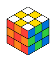
        </center>
      </a>
    </td>
    <td style="background: white;">
      <a href="docs/examples/05.typ">
        <center>
          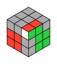
        </center>
      </a>
    </td>
    <td style="background: white;">
      <a href="docs/examples/06.typ">
        <center>
          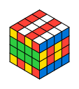
        </center>
      </a>
    </td>
  </tr>
  <tr>
    <td style="background: white;">
      <a href="docs/examples/07.typ">
        <center>
          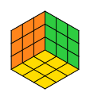
        </center>
      </a>
    </td>
    <td style="background: white;">
      <a href="docs/examples/08.typ">
        <center>
          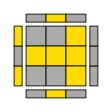
        </center>
      </a>
    </td>
    <td style="background: white;">
      <a href="docs/examples/09.typ">
        <center>
          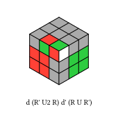
        </center>
      </a>
    </td>
  </tr>
  <tr>
    <td style="background: white;">
      <a href="docs/examples/10.typ">
        <center>
          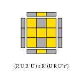
        </center>
      </a>
    </td>
    <td style="background: white;">
      <a href="docs/examples/11.typ">
        <center>
          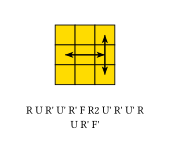
        </center>
      </a>
    </td>
  </tr>
</table>

## Quick Start

To start using magic-cubes, add the following import at the top of your `.typ` file:

```typst
#import "@preview/magic-cubes:0.1.0": *
```

Creating and rendering a solved cube only requires two functions:

```typst
#draw-cube(cube())
```

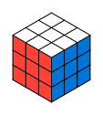

You can apply an algorithm before rendering the cube:

```typst
#draw-cube(
  apply(
    cube(),
    "R U R' U'"
  )
)
```

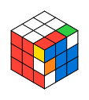

The package supports cubes of arbitrary size:

```typst
#draw-cube(
  cube(size: 5)
)
```

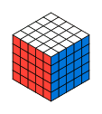

## Changelog

### v0.1.0

- Initial release
