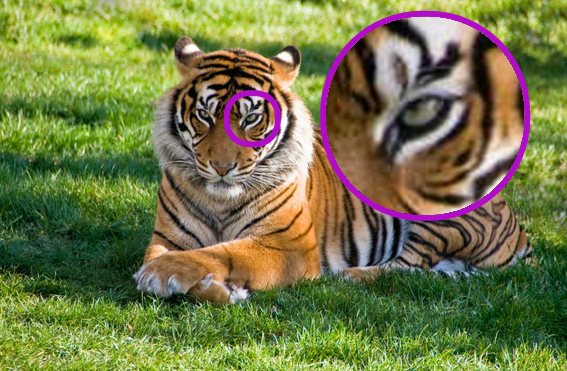
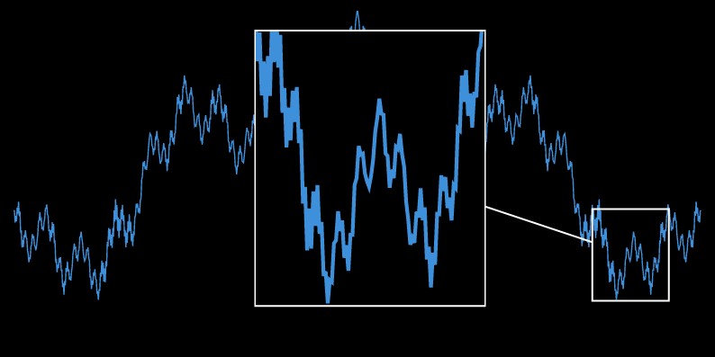

# [magnifying-glass] (Typst package)

[magnifying-glass]: https://codeberg.org/Andrew15-5/magnifying-glass

[magnifying-glass] is a package to magnify a part of any Typst content,
including images. It was emerged from [here](https://forum.typst.app/t/3717/2).

## Usage

```typ
#import "@preview/magnifying-glass:0.1.0": magnify-circle, image, source

#set page(width: auto, height: auto, margin: 0pt)

#let image = image(source("tiger.jpg"), width: 10cm)

#magnify-circle(
  400%,
  image,
  place-pos: (7.5, 4.5),
  pos: (4.45, 4.45),
  diameter: 0.9,
  stroke: 3pt + purple,
  line-style: none,
)
```



```typ
#import "@preview/magnifying-glass:0.1.0": magnify-rect
#import "@preview/lilaq:0.2.0" as lq

#set page(width: auto, height: auto, margin: 0pt)

#let weierstrass(x, k: 8) = {
  range(k).map(k => calc.pow(0.5, k) * calc.cos(calc.pow(5, k) * x)).sum()
}

#let xs = lq.linspace(-0.5, .5, num: 1000)
#let xs-fine = lq.linspace(-0.05, 0, num: 1000)

#show: lq.set-grid(stroke: none)

#let diagram = lq.diagram(
  fill: black,
  width: 14cm,
  height: 7cm,
  ylim: (0, 2),
  margin: (x: 2%),
  yaxis: (ticks: none),
  xaxis: (ticks: none),
  lq.plot(xs, mark: none, xs.map(weierstrass)),
)

#magnify-rect(
  300%,
  diagram,
  place-pos: (5, 1),
  pos: (11.6, 1.1),
  size: (1.5, 1.8),
  stroke: white,
)
```



## API

### `magnify-circle`

```typ
/// Magnify content using circle.
///
/// - scale (ratio): magnification scale
/// - body (content): what to magnify
/// - place-pos (array): position of the magnified area (circle center)
/// - pos (array): position on the content where to magnify (circle center)
/// - diameter (int, float): diameter of the magnified circle
/// - unit (length): unit to use to convert int/float numbers
/// - stroke (stroke): stroke for circles and connection line
/// - normal-style (dictionary): args for `block()` (original area)
/// - magnify-style (dictionary): args for `block()` (magnified area)
/// - line-style (dictionary, none): args for `line()` (connecting line)
#let magnify-circle(
  scale,
  body,
  place-pos: (0, 0),
  pos: (0, 0),
  diameter: 1,
  unit: 1cm,
  stroke: 1pt,
  normal-style: (:),
  magnify-style: (:),
  line-style: (:),
)
```

---

### `magnify-rect`

```typ
/// Magnify content using rectangle.
///
/// - scale (ratio): magnification scale
/// - body (content): what to magnify
/// - place-pos (array): position of the magnified area (bottom-left corner)
/// - pos (array): position on the content where to magnify (bottom-left corner)
/// - size (array): width and height of the magnified rectangle
/// - unit (length): unit to use to convert int/float numbers
/// - stroke (stroke): stroke for circles and connection line
/// - normal-style (dictionary): args for `block()` (original area)
/// - magnify-style (dictionary): args for `block()` (magnified area)
/// - line-style (dictionary, none): args for `line()` (connecting line)
#let magnify-rect(
  scale,
  body,
  place-pos: (0, 0),
  pos: (0, 0),
  size: (1, 1),
  unit: 1cm,
  stroke: 1pt,
  normal-style: (:),
  magnify-style: (:),
  line-style: (:),
)
```

---

### `source`

```typ
/// Alias for `read(file, encoding: none)`.
#let source
```

---

### `image`

```typ
/// Create an image that can be used with the magnify functions.
/// Must be used with `source()` function.
///
/// Note. You can use standard `image` by providing both width and height.
#let image(source, ..args)
```

## License

This Typst package is licensed under AGPL-3.0-only license. You can view the
license in the LICENSE file in the root of the project or at
<https://www.gnu.org/licenses/agpl-3.0.txt>.
