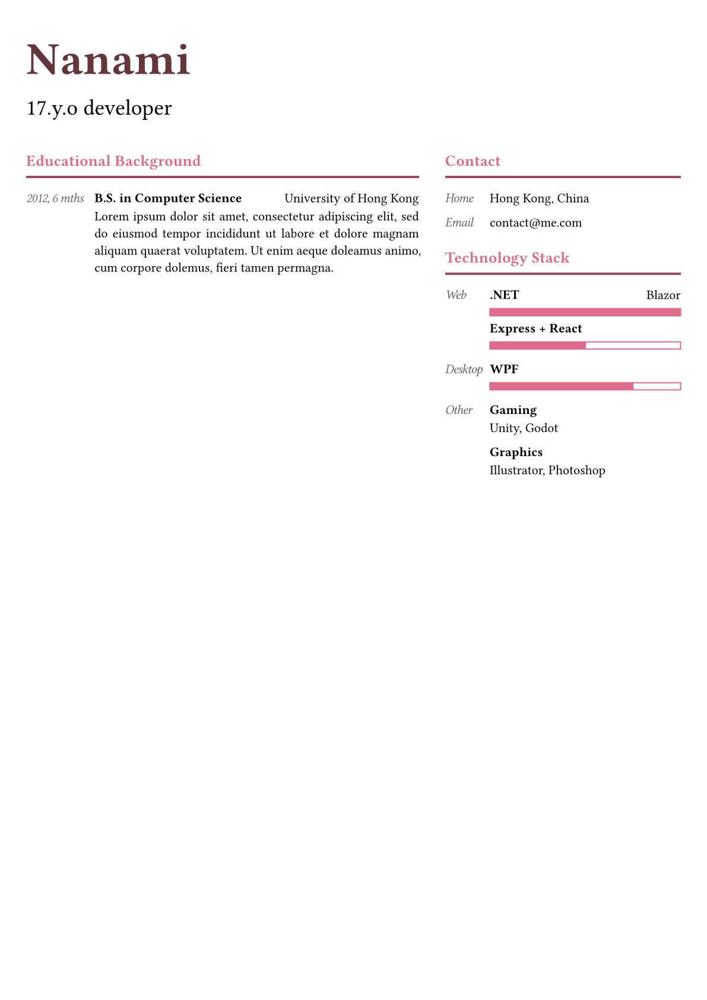

# Mahou-CV

Modified version of `@preview/minimal-cv`

<a href="thumbnail.png">
    
</a>

A Typst CV template that aims for :
- Clean aesthetics
- Composability


## Usage

Import the library :

```typst
#import "@preview/mahou-cv:0.1.0": *
```

Set theme:

```typst
#let theme = (
  color: (
    accent: rgb("#E16B8C"),
    header: ( // must set `accent` and `body` color together
      accent: rgb("#64363C"),
      body: black,
    ),
  ),
)

// default theme
#let default = (
  margin: 22pt,
  font: "libertinus serif",
  color: (
    accent: blue,
    body: black,
    header: none, // inherit
    main: none, // inherit
    aside: none, // inherit
  ),
  main-width: 5fr,
  aside-width: 3fr,
)

#set-theme(theme)
```

Compose CV:

```typst
// see template for more example usage
#let main = section("Educational Background")[
  #label("2012, 6 mths")[
    #item("B.S. in Computer Science", caption: "University of Hong Kong")[#lorem(32)]]
]

#let aside = []

#cv(
  "Your Name",
  "your bio",
  main,
  aside,
)
```
