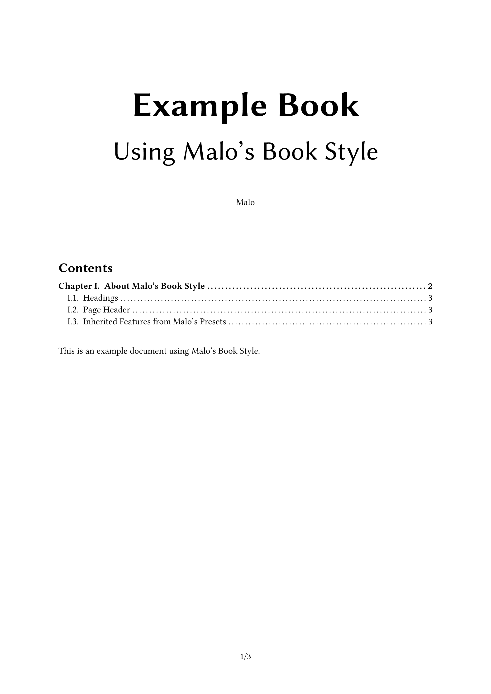
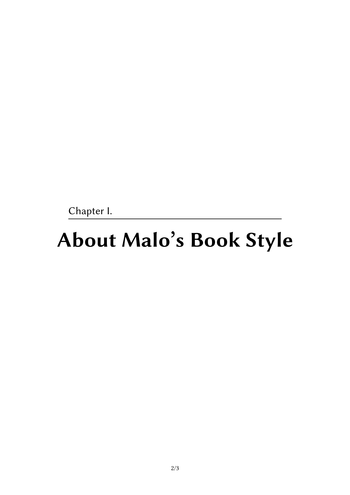
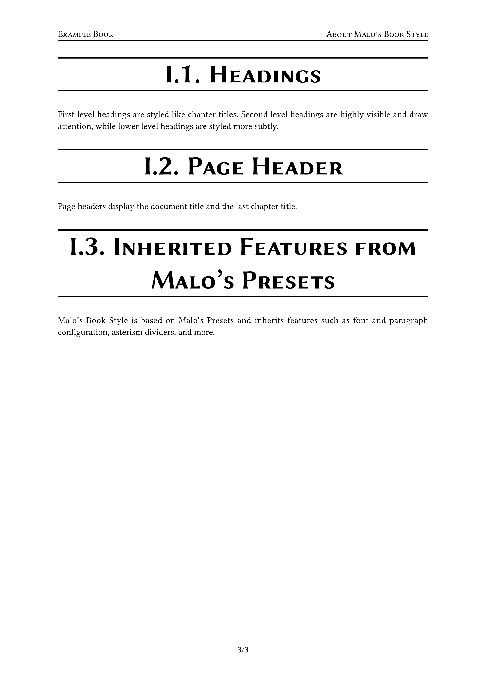

# Malo's Book Style

Malo's Book Style is a book template based on [Malo's Presets](https://typst.app/universe/package/malos-presets).

## Example Document

Below are the pages of an example document created using Malo's Book Style.





## Usage

After importing the appropriate version of the package, you can use Malo's Book Style as follows to reproduce the above example.

```typ
#import "@preview/malos-book-style:1.0.0": book

#set text(lang: "en")

#set document(
  title: [Example Book],
  author: "Malo",
)

#show: book.with(
  subtitle: [Using Malo's Book Style],
)


#outline()

This is an example document using Malo's Book Style.


= About Malo's Book Style

== Headings

First level headings are styled like chapter titles. Second level headings are highly visible and draw attention, while lower level headings are styled more subtly.

== Page Header

Page headers display the document title and the last chapter title.

== Inherited Features from Malo's Presets

Malo's Book Style is based on #link("https://typst.app/universe/package/malos-presets")[Malo's Presets] and inherits features such as font and paragraph configuration, asterism dividers, and more.
```
