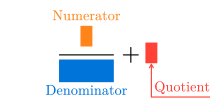
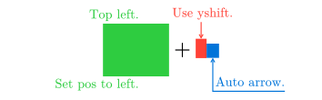
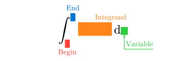

# Mannot
A package for highlighting and annotating in math blocks in [Typst](https://typst.app/).

A full documentation is [here](docs/doc.pdf).

## Example
```typst
$
mark(1, tag: #<num>) / mark(x + 1, tag: #<den>, color: #blue)
+ mark(2, tag: #<quo>, color: #red)

#annot(<num>, pos: top)[Numerator]
#annot(<den>)[Denominator]
#annot(<quo>, pos: right, yshift: 1em)[Quotient]
$
```



## Usage
Import and initialize the package `mannot` on the top of your document.
```typst
#import "@preview/mannot:0.1.0": *
#show: mannot-init
```

To highlight a part of a math block, use the `mark` function:
```typst
$
mark(x)
$
```


You can also specify a color for the highlighted part:
```typst
$ // Need # before color names.
mark(3, color: #red) mark(x, color: #blue)
+ mark(integral x dif x, color: #green)
$
```


To add an annotation to a highlighted part, use the `annot` function.
You need to specify the tag of the marked content:
```typst
$
mark(x, tag: #<x>)  // Need # before tags.
#annot(<x>)[Annotation]
$
```


You can customize the position of the annotation and the vertical distance from the marked content:
```typst
$
mark(integral x dif x, tag: #<i>, color: #green)
+ mark(3, tag: #<3>, color: #red) mark(x, tag: #<x>, color: #blue)

#annot(<i>, pos: left)[Set pos to left.]
#annot(<i>, pos: top + left)[Top left.]
#annot(<3>, pos: top, yshift: 1.2em)[Use yshift.]
#annot(<x>, pos: right, yshift: 1.2em)[Auto arrow.]
$
```


For convenience, you can define custom mark functions:
```typst
#let rmark = mark.with(color: red)
#let gmark = mark.with(color: green)
#let bmark = mark.with(color: blue)

$
integral_rmark(0, tag: #<i0>)^bmark(1, tag: #<i1>)
mark(x^2 + 1, tag: #<i2>) dif gmark(x, tag: #<i3>)

#annot(<i0>)[Begin]
#annot(<i1>, pos: top)[End]
#annot(<i2>, pos: top + right)[Integrand]
#annot(<i3>, pos: right, yshift: .6em)[Variable]
$
```

