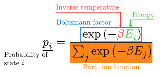
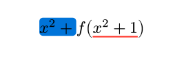
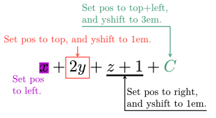

# Mannot
<a href="https://typst.app/universe/package/mannot">
    
</a>

A package for marking and annotating in math blocks in [Typst](https://typst.app/).

A full documentation is [here](docs/doc.pdf).

## Example
```typst
$
  markul(p_i, tag: #<p>)
  = markrect(
    exp(- marktc(beta, tag: #<beta>) marktc(E_i, tag: #<E>, color: #green)),
    tag: #<Boltzmann>, color: #blue,
  ) / mark(sum_j exp(- beta E_j), tag: #<Z>)

  #annot(<p>, pos: left)[Probability of \ state $i$]
  #annot(<beta>, pos: top + left, yshift: 2em)[Inverse temperature]
  #annot(<E>, pos: top + right, yshift: 1em)[Energy]
  #annot(<Boltzmann>, pos: top + left)[Boltzmann factor]
  #annot(<Z>)[Partition function]
$
```



## Usage
Import the package `mannot` on the top of your document:
```typst
#import "@preview/mannot:0.2.3": *
```

To define the target of an annotation within a math block,
use the following marking functions:
- `mark`: marks the content with highlighting;
- `markrect`: marks the content with a rectangular box;
- `markul`: marks the content with an underline;
- `marktc`: marks the content and changes the text color.
```typst
$
  mark(x, tag: #<t1>) + markrect(2y, tag: #<t2>)
  + markul(z+1, tag: #<t3>) + marktc(C, tag: #<t4>)
$
```


You can customize the marking color and other styles:
```typst
$
  mark(x, tag: #<t1>, color: #purple)
  + markrect(2y, tag: #<t2>, color: #red, padding: #.2em)
  + markul(z+1, tag: #<t3>, stroke: #.1em)
  + marktc(C, tag: #<t4>, color: #olive)
$
```


You can also use marking functions solely for styling parts of a math block,
without tags:
```typst
$
  mark(x^2 +, color: #blue, radius: #20%)
  f(markul(x^2 + 1, color: #red, stroke: #.1em))
$
```


Once you have marked content with a tag,
you can annotate it using the `annot` function within the same math block:
```typst
$
  mark(x, tag: #<t1>, color: #purple)
  + markrect(2y, tag: #<t2>, color: #red, padding: #.2em)
  + markul(z+1, tag: #<t3>, stroke: #.1em)
  + marktc(C, tag: #<t4>, color: #olive)

  #annot(<t1>)[annotation]
  #annot(<t4>)[another annotation]
$
```


You can customize the position of the annotation and its vertical distance from the marked content,
using the `pos` and `yshift` parameters of the `annot` function:
```typst
#v(3em)
$
  mark(x, tag: #<t1>, color: #purple)
  + markrect(2y, tag: #<t2>, color: #red, padding: #.2em)
  + markul(z+1, tag: #<t3>, stroke: #.1em)
  + marktc(C, tag: #<t4>, color: #olive)

  #annot(<t1>, pos: left)[Set pos \ to left.]
  #annot(<t2>, pos: top, yshift: 1em)[Set pos to top, and yshift to 1em.]
  #annot(<t3>, pos: right, yshift: 1em)[Set pos to right,\ and yshift to 1em.]
  #annot(<t4>, pos: top + left, yshift: 3em)[Set pos to top+left,\ and yshift to 3em.]
$
#v(2em)
```



## Changelogs
* v0.2.3:
  - Support RTL documents.
  - Replace deprecated `path` functions with `curve`.
* v0.2.2:
  - Improve performance (remove counters).
* v0.2.1:
  - Fix underlay/overlay layout in marking functions when setting other math fonts.
* v0.2.0:
  - Remove the `mannot-init` function.
  - Support placing underlay under the math content when marking.
  - Add marking functions: `markrect`, `markul`, `marktc`.
* v0.1.0: First release.
