# Mannot
<a href="https://typst.app/universe/package/mannot">
    
</a>

A [Typst](https://typst.app/) package for marking and annotating elements within math blocks.

For comprehensive documentation, please refer to [manual](docs/doc.pdf).


## Features
* Visually marks content within math blocks without affecting the layout.
* Enables subsequent annotation of marked content.
* Supports annotations using CeTZ canvas for advanced graphical annotations.


## Examples
### Marking and Annotating Math Content
```typst
#set page(width: auto, height: auto, margin: (left: 4cm, top: 2cm, rest: 1cm), fill: white)
#set text(24pt)

$
  markul(p_i, tag: #<p>) = markrect(
    exp(- mark(beta, tag: #<beta>, color: #red) mark(E_i, tag: #<E>, color: #green)),
    tag: #<Boltzmann>, color: #blue,
  ) / markhl(sum_j exp(- beta E_j), tag: #<Z>)

  #annot(<p>, pos: bottom + left)[Probability of \ state $i$]
  #annot(<beta>, pos: top + left, dy: -1.5em, leader-connect: "elbow")[Inverse temperature]
  #annot(<E>, pos: top + right, dy: -1em)[Energy]
  #annot(<Boltzmann>, pos: top + left)[Boltzmann factor]
  #annot(<Z>)[Partition function]
$
```
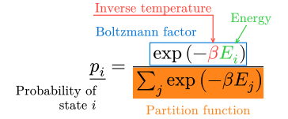

### Annotations using CeTZ
```typst
#import "@preview/cetz:0.3.4"

#set page(width: auto, height: auto, margin: (y: 2cm, bottom: 1cm), fill: white)
#set text(24pt)

#let rmark = mark.with(color: red)
#let bmark = mark.with(color: blue)
#let pmark = mark.with(color: purple)

$
  ( rmark(a x, tag: #<ax>) + bmark(b, tag: #<b>) )
  ( rmark(c x, tag: #<cx>) + bmark(d, tag: #<d>) )
  = rmark(a c x^2) + pmark((a d + b c) x) bmark(b d)
$

#annot-cetz(
  (<ax>, <b>, <cx>, <d>),
  cetz,
  {
    import cetz.draw: *
    set-style(mark: (end: "straight"))
    bezier-through("ax.south", (rel: (x: 1, y: -.5)), "cx.south", stroke: red)
    bezier-through("ax.south", (rel: (x: 1, y: -1)), "d.south", stroke: purple)
    bezier-through("b.north", (rel: (x: .6, y: .5)), "cx.north", stroke: purple)
    bezier-through("b.north", (rel: (x: .6, y: 1)), "d.north", stroke: blue)
  },
)
```
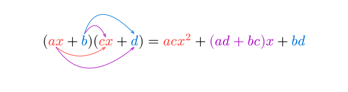

### Customized Markings and Annotations
```typst
#import "@preview/cetz:0.3.4"

#set page(width: auto, height: auto, margin: (x: 4cm, top: 2cm, bottom: 1cm), fill: white)
#set text(24pt)

#let markhl = markhl.with(stroke: 1pt)

$
  markhl(1 mark(., tag: #<sep>) 23, tag: #<mantissa>, color: #red)
  mark(
    mark(times, tag: #<prd>)
    mark(10, tag: #<base>)^mark(4, tag: #<exp>),
    tag: #<pow>,
  )
$

#{
  let annot = annot.with(leader-tip: tiptoe.triangle, leader-toe: none)
  annot(<mantissa>, pos: left, dx: -.5em, dy: -1em, annot-text-props: (size: .9em))[mantissa]

  let annot = annot.with(leader-stroke: .03em, leader-tip: none, leader-toe: none)
  annot(<sep>, pos: bottom + left, dx: -.5em)[decimal \ separator]
  annot(<prd>, pos: top, dx: -1em, dy: -1.2em)[product]
  annot(<base>, pos: top, dy: -1em)[base]
  annot(<exp>, pos: top + right, dx: 1em)[exponent]

  annot-cetz(
    <pow>,
    cetz,
    {
      import cetz.draw: *
      cetz.decorations.flat-brace(
        "pow.south-west",
        "pow.south-east",
        flip: true,
        name: "brace",
        stroke: blue,
      )
      content("brace.south", anchor: "north", text(blue, .9em)[power])
    },
  )
}
```
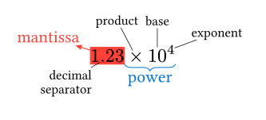


## Usage
Import the package `mannot` on the top of your document:
```typst
#import "@preview/mannot:0.3.0": *
```

### Marking
To decorate content within math blocks, use the following marking functions:
- `mark`: Changes the text color.
- `markhl`: Highlights the content.
- `markrect`: Draws a rectangle around the content.
- `markul`: Underlines the content.
```typst
$
  mark(x, color: #red) + markhl(f(x)) + markrect(e^x) + markul(x + 1)
$
```


You can customize the marking color and other styles:
```typst
$
  mark(x, color: #green)
  + markhl(f(x), color: #purple, stroke: #1pt, radius: #10%)
  + markrect(e^x, color: #red, fill: #blue, outset: #.2em)
  + markul(x + 1, color: #gray, stroke: #2pt)
$
```


### Annotations
If you marked content with a tag,
you can later annotate it using the `annot` function:
```typst
$
  mark(x, tag: #<1>, color: #green)
  + markhl(f(x), tag: #<2>, color: #purple, stroke: #1pt, radius: #10%)
  + markrect(e^x, tag: #<3>, color: #red, fill: #blue, outset: #.2em)
  + markul(x + 1, tag: #<4>, color: #gray, stroke: #2pt)

  #annot(<1>)[Annotation]
  #annot(<3>, pos: top)[Another annotation]
$
```
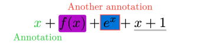

Markings and annotations do not affect the layout,
so you might sometimes need to manually insert spacing before and after the equations to achieve the desired visual appearance:
```typst
Text text text text text:
#v(1em)
$
  mark(x, tag: #<1>, color: #green)
  #annot(<1>, pos: top + right)[Annotation]
  #annot(<1>, dy: 1em)[Annotation]
$
#v(2em)
text text text text text.
```
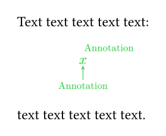

#### Annotation Positioning
The `annot` function offers the following arguments to control annotation placement:
* `pos`: Where to place the annotation relative to the marked content.
  This can be:
  - A single alignment for simple relative positioning.
  - A pair of alignments, where the first defines the anchor point on the marked content,
    and the second defines the anchor point on the annotation.

  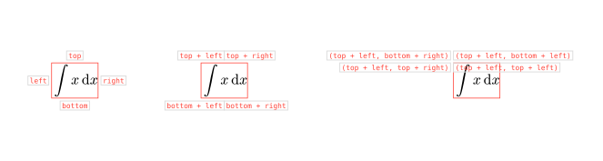

* `dx`, `dy`: the horizontal and vertical displacement of the annotation's anchor
  from the marked content's anchor.

  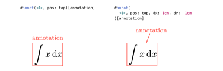

#### Annotation Leader Line
When the annotation is far from the marked content, a leader line is drawn by default.
You can customize its appearance using the following annot arguments:
* `leader`: Whether to draw a leader line. Set to `auto` to enable automatic drawing based on distance.
* `leader-stroke`: How to stroke the leader line e.g. `1pt + red`.
* `leader-tip`, `leader-toe`: Define the end and start markers of the leader line.
  Leader lines are drawn by package [tiptoe](https://typst.app/universe/package/tiptoe/0.3.0).
  You can specify markers or `none`:
  ```typst
  $
    markhl(x, tag: #<1>)

    #annot(
      <1>, pos: bottom + right, dy: 1em,
      leader-tip: tiptoe.circle,
      leader-toe: tiptoe.stealth.with(length: 1000%),
    )[annotaiton]
  $
  ```

  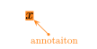

  For more options, see the [tiptoe page](https://typst.app/universe/package/tiptoe/0.3.0).

* `leader-connect`: How the leader line connects to the marked content and the annotation.
  This can be:
  - A pair of alignments defining the connection points on the marked content and the annotation.
  - "elbow" to create an elbow-shaped leader line.

  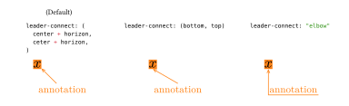


### Multi Annotations
You can also annotate multiple marked elements simultaneously
by passing an array of their tags to the `annot` function.
```typst
$
  mark(x, tag: #<1>, color: #green)
  + markhl(f(x), tag: #<2>, color: #purple, stroke: #1pt, radius: #10%)
  + markrect(e^x, tag: #<3>, color: #red, fill: #blue, outset: #.2em)
  + markul(x + 1, tag: #<4>, color: #gray, stroke: #2pt)

  #annot((<1>, <2>), dy: 1em)[Annotation]
  #annot((<3>, <2>, <4>), pos: top, dy: -1em, leader-connect: "elbow")[Another annotation]
$
```
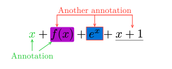

### Annotations using CeTZ
To create annotations using the CeTZ canvas, use the `annot-cetz` function.
This allows you to embed a CeTZ canvas directly onto previously marked content.
Within the CeTZ canvas code block,
you can reference the position and dimensions of the marked content using an anchor with the same name as its tag.
For elements marked with multiple tags, corresponding anchors will be available.
```typst
#import "@preview/cetz:0.3.4"

$
  mark(x, tag: #<x>) + mark(y, tag: #<y>)

  #annot-cetz((<x>, <y>), cetz, {
    import cetz.draw: *
    content((0, -1), [CeTZ], anchor: "north-west", name: "a")
    line("x", "a") // You can refer the marked content.
    line("y", "a")
  })
$
```
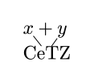


## Tips
### Q. How to override default options?
Use the `with` function to create new functions with modified default arguments.
For example, to always use elbow-shaped leader lines for annotations:
```typst
#let annot = annot.with(leader-connect: "elbow")
```


## Changelog
* v0.3.0:
  - Renamed some markign functions for clarity:
    - `mark` is now `markhl` (for highlight).
    - `marktc` is now `mark` (for text color change).
  - Added direct leader line functionality to the `annot` function.
  - Added support for multi element annotations.
  - Introduced support for annotations using CeTZ canvas.
* v0.2.3:
  - Added support for RTL documents.
  - Replaced deprecated `path` functions with `curve`.
* v0.2.2:
  - Improved performance by removing counters.
* v0.2.1:
  - Fixed layout issues with underlays/overlays in marking functions when custom math fonts are used.
* v0.2.0:
  - Removed the `mannot-init` function.
  - Introduced support for placing underlays beneath math content during marking.
  - Added new marking functions: markrect, markul, marktc.
* v0.1.0: Initial release.
