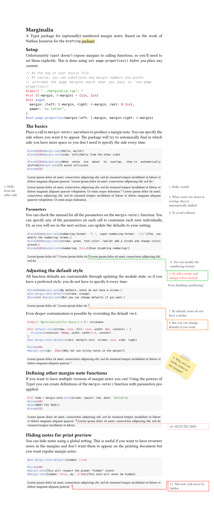

# Marginalia

This Typst package provides functions to add (optionally numbered) margin notes to your documents. It is based on the work of Nathan Jessurun for the `drafting` [package]("https://github.com/ntjess/typst-drafting")

A quick, comprehensive overview is provided by the
[example document](docs/main.pdf). For more details of the functions, you chan check out the [manual](docs/manual.pdf).

