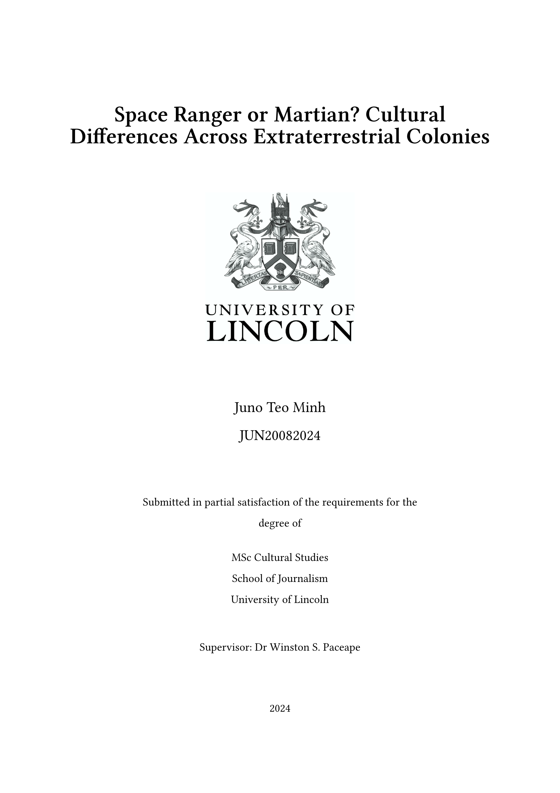
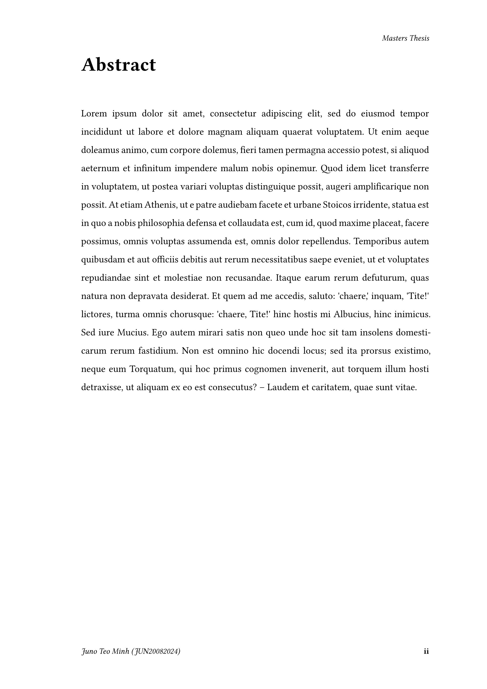
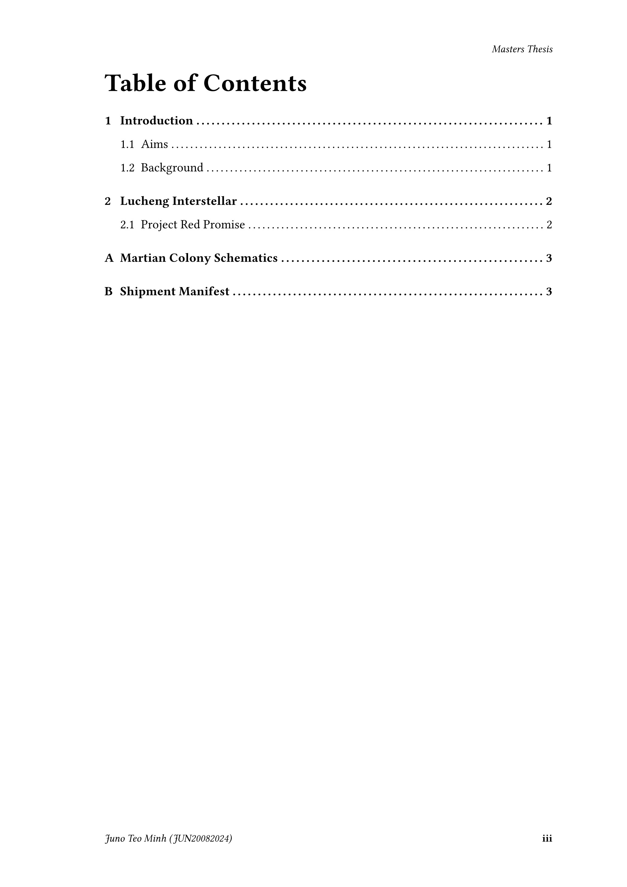

# marina-uol-thesis
Unofficial Typst thesis template for the University of Lincoln.

<p align="center">
    &nbsp;
    &nbsp;
    
</p>

## Example Usage
```typst
#import "@preview/marina-uol-thesis:1.0.0" as thesis

#show: thesis.thesis.with(
  title: "Space Ranger or Martian? Cultural Differences Across Extraterrestrial Colonies",
  name: "Juno Teo Minh",
  studentid: "JUN20082024",
  degree: "MSc",
  programme: "Cultural Studies",
  school: "School of Journalism",
  supervisor: "Dr Winston S. Paceape",
  header-text: "Masters Thesis",
  date: 2024,
  bib: bibliography("references.yml")
)

#thesis.acknowledgements()[
  #lorem(200)
]

#thesis.abstract()[
  #lorem(200)
]

= Introduction
== Aims
Text here...
```

## Configuration
The template can be initalised with the following:
- `title`: Title of the thesis
- `name`: Name of the author
- `studentid`: University ID of the student
- `degree`: Degree being studied for (BSc, MSc etc)
- `programme`: Programme/course being studied (Computer Science, Engineering etc)
- `school`: Name of school the programme is associated with
- `supervisor`: Name of the supervisor of the thesis
- `header-text`: Text to show in the header, repeated on all pages
- `date`: Date of the thesis
- `bib`: A `bibliography()` object
- `bib-style`: A string or path containing a bibliography style or `.csl` file

By default, the template uses a slighly modified version of Harvard citation. Make sure to check which style is appropriate for your course.


## Features
In addition to creating the scaffolding for the thesis, this package also provides some helper functions for your writing needs.

### Acknowledgement Page
Create an acknowledgement page with `thesis.acknowledgements()[]`. This is placed after the title page, but before the abstract.

Example:
```typst
#thesis.acknowledgements()[
  #lorem(200)
]
```

### Abstract Page
Create an abstract with `thesis.abstract()[]`. This is placed after the title page, but before the table of contents.

Example:
```typst
#thesis.abstract()[
  #lorem(200)
]
```

### Appendices
Create one or more appendicies by calling `thesis.appendix()[]`. It's recommended to contain all your entries within one call to ensure that the formatting remains consistent. 

Please do file a bug report if you do use multiple calls and notice formatting errors!

Example:
```typst
#thesis.appendix()[
  = Martian Colony Schematics
  #lorem(100)

  = Shipment Manifest
  #lorem(100)
]
```

### Code
You can create code blocks with captions and labels by calling `thesis.code()`. It accepts the following arguments:
- `code`: `raw` text (code block made with backticks or other)
- `caption`: Caption to place under the code block
- `label-id`: Reference within the document so that you can cite it
- `placement`: Define where to place the code block, identical to `figure`
- `outlined`: Determine whether it shows in the list of listings (`true`/`false`)

Example:
```typst
#thesis.code(
  ```python
  def hello_world() -> str:
    return "Hello World!"
  ```,
  caption: [Simple hello world program in Python],
  label-id: "code:simple_hello_world"
)
```

### Placeholder Images
You can create temporary placeholder images quickly by calling `thesis.placeholder()`.

It will generate a rectangle with a solid colour containing the text "PLACEHOLDER IMAGE". This is so that you can quickly determine the layout and formatting of the thesis even if you don't have access to the images right away. It accepts the following arguments:
- `height`: Height of the rectangle (default: 5cm)
- `width`: Width of the rectangle (default: 100%)
- `colour`: Background colour of the rectangle (default: red)

## Notices
- Please ensure that the formatting and citation style matches the requirements set out by the University!!!
- Contributions welcome :)
- References within the template are to purely fictional characters from Overwatch and made-up programmes that the University does not run. It's just for a little bit of fun :P

## Licenses
The University of Lincoln's crest (found at `template/resources/logo.jpg` in this repository) is allowed for use by staff and students for University work (such as dissertation covers or research presentations) provided that the use is compatible with the University brand guidelines. More information available here https://www.lincoln.ac.uk/abouttheuniversity/pressandmedia/. It is not covered by the MIT license and remains copyright and trademark of the University of Lincoln. Only use it if you have a direct link to the University.