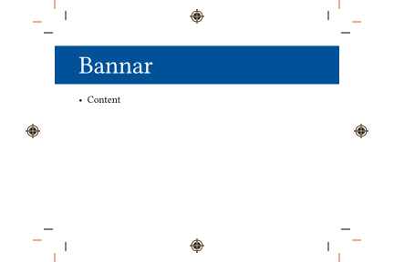

This is a [Typst](https://github.com/typst/typst) package to add cut, bleed, and registration marks to documents.

It's likely that some future version of Typst will obsolete this package.  Until that time, it's nice to have **a** way to achieve this functionality with the current version.


# Demo



...can be generated with:

```typst
#import "@preview/markly:0.3.0"

#let markly-context = markly.setup(
  stock-width:6in,
  stock-height:4in,

  bleed: 12pt,
  content-width: 4in,
  content-height:3in,
)

#show: markly.page-setup.with(markly-context)

// Here the local title template uses markly's to-bleed
#let title(body, inset-y:12pt) = {
  markly.to-bleed(text(white, size:2.5em, body), markly-context)
}

#title[Bannar]

- Content
```


For a more detailed example, see [main.typ](example/main.typ) and [main.pdf](example/main.pdf).

# Notes

Since this is a bit difficult to do there are some limitations to using this package.  Here are a few examples:

* `inside`/`outside` margins don't work on pages
* The `background` field of the `page` can't be used unless there is a wrapper function so that `marks` is called also.


# Usage

## Setup

Use `setup` to create a "context", a dictionary with parameters that is passed to other markly methods.

The *stock* width and height is your *actual* paper size.

| Parameter     | Default Value
| ------------- | --------------
| stock-width   | 8.5in
| stock-height  | 11in

The *content* width and height will be the size of the paper after cutting along the cut marks (black).

| Parameter      | Default Value
| -------------  | --------------
| content-width  | 6in
| content-height | 4in

The *margin* width and height are the amounts between the edge of the cut line and the start of the content.  NOTE: total width consumed by margins equals 2 * margin-width since it's used on both sides of the content.  Same for height.

| Parameter     | Default Value
| ------------- | --------------
| margin-width  | 6in
| margin-height | 4in

Finally, the `bleed` value is the distance between the cut line and bleed line, or the over-print amount that can occur because we have extra paper past the cut line.

| Parameter     | Default Value
| ------------- | --------------
| bleed         | 9pt


```typst
#let markly-context = markly.setup(
  // stock-width:8.5in,
  // stock-height:11in,

  content-width:7in,
  content-height:5in,

  // bleed:9pt,

  // margin-width:.2in,
  // margin-height:.2in,

  // bleed-marks:true,
  // cut-marks:true,
  // registration-marks:true,
)

// Configure the page to draw marks
#show: markly.page-setup.with(markly-context)

content...

```

## Print to Bleed Templates

Use `to-bleed`, `to-bleed-left`, or `to-bleed-right` to paint a background to the bleed marks.

Use `img-to-bleed` to stretch an image horizontally and vertically to the bleed marks.  The position of the "cursor" is not updated (like in the case of a background image) since it uses the `place` function.


# Design

[Cetz](https://github.com/cetz-package/cetz) is used to draw the marks on the page's background.
