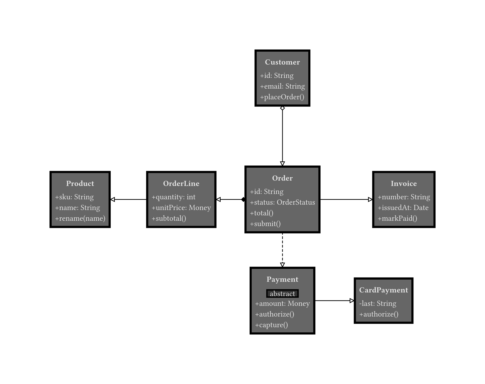
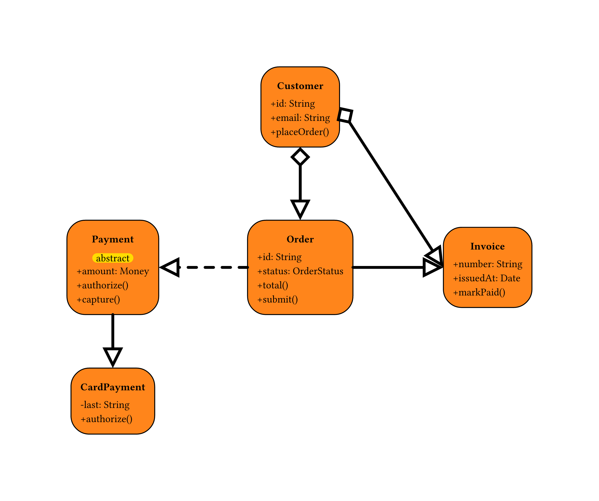

# mastermind

[](https://typst.app)
[](https://gitlab.com/zani.manuel328/mastermind)
[](https://www.gnu.org/licenses/gpl-3.0.html)

# Usage

*Theme inspired by Fairly OddParents pixies:*

<p align="center">
  
</p>
<details>
  <summary>See the source code</summary>
  
```typ
#import "@preview/mastermind:0.1.0": *

#set page(width: auto, height: auto)

#let classes = (
  order: class(
    (0, 0),
    "Order",
    attributes: ("+id: String", "+status: OrderStatus"),
    methods: ("+total()", "+submit()"),
  ),
  order-line: class(
    (-5, 0),
    "OrderLine",
    attributes: ("+quantity: int", "+unitPrice: Money"),
    methods: ("+subtotal()",),
  ),
  product: class(
    (-10, 0),
    "Product",
    attributes: ("+sku: String", "+name: String"),
    methods: ("+rename(name)",),
  ),
  customer: class(
    (0, 6),
    "Customer",
    attributes: ("+id: String", "+email: String"),
    methods: ("+placeOrder()",),
  ),
  payment: class(
    (0, -5),
    "Payment",
    type: "abstract",
    attributes: ("+amount: Money",),
    methods: ("+authorize()", "+capture()"),
  ),
  card-payment: class(
    (5, -5),
    "CardPayment",
    attributes: ("-last: String",),
    methods: ("+authorize()",),
  ),
  invoice: class(
    (6, 0),
    "Invoice",
    attributes: ("+number: String", "+issuedAt: Date"),
    methods: ("+markPaid()",),
  ),
)

#let relationships = (
  composition(classes.order, classes.order-line),
  association(classes.order-line, classes.product),
  aggregation(classes.customer, classes.order),
  dependency(classes.order, classes.payment),
  inheritance(classes.payment, classes.card-payment),
  association(classes.order, classes.invoice),
)

#draw-class-diagram(classes, relationships, themes.pixies)
```
</details>

*You can also build your own custom theme:*

<p align="center">
  
</p>
<details>
  <summary>See the source code</summary>
  
```typ
#import "@preview/mastermind:0.1.0": *

#set page(width: auto, height: auto)

#let custom-theme = theme(
  fill: orange,
  inset: 10pt,
  radius: 20pt,
  type-fill: yellow,
  type-radius: 20pt,
  line-thickness: 3pt,
)

#let classes = (
  order: class(
    (0, 0),
    "Order",
    attributes: ("+id: String", "+status: OrderStatus"),
    methods: ("+total()", "+submit()"),
  ),
  customer: class(
    (0, 6),
    "Customer",
    attributes: ("+id: String", "+email: String"),
    methods: ("+placeOrder()",),
  ),
  payment: class(
    (-5, 0),
    "Payment",
    type: "abstract",
    attributes: ("+amount: Money",),
    methods: ("+authorize()", "+capture()"),
  ),
  card-payment: class(
    (-5, -5),
    "CardPayment",
    attributes: ("-last: String",),
    methods: ("+authorize()",),
  ),
  invoice: class(
    (6, 0),
    "Invoice",
    attributes: ("+number: String", "+issuedAt: Date"),
    methods: ("+markPaid()",),
  ),
)

#let relationships = (
  aggregation(classes.customer, classes.order),
  dependency(classes.order, classes.payment),
  inheritance(classes.payment, classes.card-payment),
  association(classes.order, classes.invoice),
)

#draw-class-diagram(classes, relationships, custom-theme)
```
</details>
