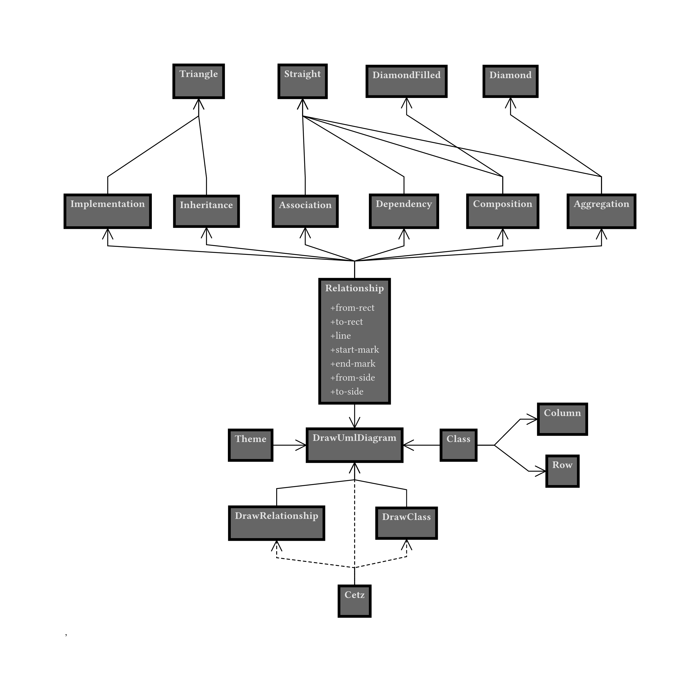
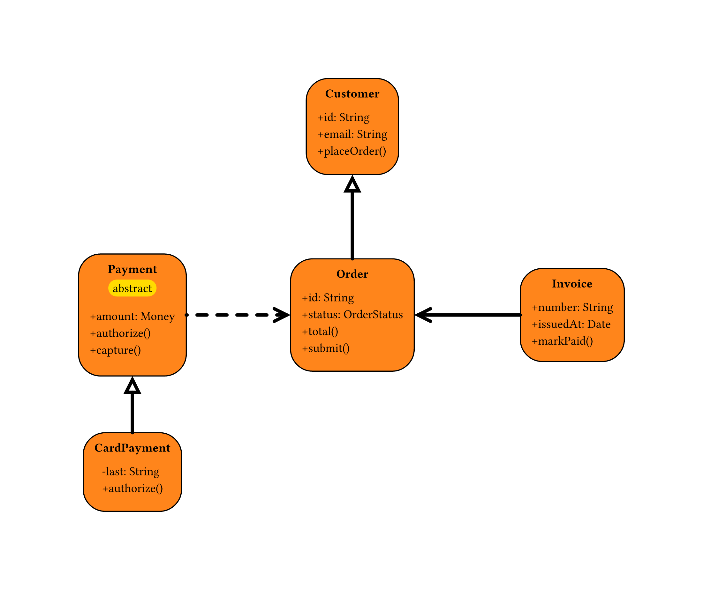

# mastermind

[](https://typst.app)
[](https://gitlab.com/zani.manuel328/mastermind)
[](https://www.gnu.org/licenses/gpl-3.0.html)

# Usage

*Theme inspired by Fairly OddParents pixies:*

<p align="center">
  
</p>
<details>
  <summary>See the source code</summary>
  
```typ
#import "@preview/mastermind:0.2.0": *

#set page(width: auto, height: auto)

#let c = (
  class(
    "Relationship",
    center: (0, -2),
    attributes: (
      "+from-rect",
      "+to-rect",
      "+line",
      "+start-mark",
      "+end-mark",
      "+from-side",
      "+to-side",
    ),
  ),
  ..row(
    (0, 3),
    3.8,
    class(
      "Implementation",
    ),
    class(
      "Inheritance",
    ),
    class(
      "Association",
    ),
    class(
      "Dependency",
    ),
    class(
      "Composition",
    ),
    class(
      "Aggregation",
    ),
  ),
  ..row(
    (0, 8),
    4,
    class(
      "Triangle",
    ),
    class(
      "Straight",
    ),
    class(
      "DiamondFilled",
    ),
    class(
      "Diamond",
    ),
  ),
  ..row(
    (0, -6),
    4,
    class(
      "Theme",
    ),
    class(
      "DrawUmlDiagram",
    ),
    class(
      "Class",
    ),
  ),
  ..column(
    (8, -6),
    2,
    class("Row"),
    class("Column"),
  ),
  ..row(
    (-0.5, -9),
    5,
    class(
      "DrawRelationship",
    ),
    class(
      "DrawClass",
    ),
  ),
  class(
    "Cetz",
    center: (0, -12),
  ),
)

#let r = (
  composition("Association", "Relationship"),
  composition("Aggregation", "Relationship", from-side: "south", to-side: "north"),
  composition("Composition", "Relationship", from-side: "south", to-side: "north"),
  composition("Inheritance", "Relationship", from-side: "south", to-side: "north"),
  composition("Dependency", "Relationship", from-side: "south", to-side: "north"),
  composition("Implementation", "Relationship", from-side: "south", to-side: "north"),
  composition("Triangle", "Inheritance", from-side: "south", to-side: "north"),
  composition("Triangle", "Implementation", from-side: "south", to-side: "north"),
  composition("Straight", "Composition", from-side: "south", to-side: "north"),
  composition("Straight", "Aggregation", from-side: "south", to-side: "north"),
  composition("Straight", "Association"),
  composition("Straight", "Dependency"),
  composition("Diamond", "Aggregation"),
  composition("DiamondFilled", "Composition"),
  association("DrawUmlDiagram", "Theme"),
  association("DrawUmlDiagram", "Relationship", from-side: "north", to-side: "south"),
  association("DrawUmlDiagram", "Class"),
  composition("DrawUmlDiagram", "DrawClass", from-side: "south", to-side: "north"),
  composition("DrawUmlDiagram", "DrawRelationship", from-side: "south", to-side: "north"),
  dependency("DrawClass", "Cetz"),
  dependency("DrawUmlDiagram", "Cetz"),
  dependency("DrawRelationship", "Cetz", from-side: "south", to-side: "north"),
  association("Column", "Class"),
  association("Row", "Class"),
)

#draw-uml-diagram(c, r, themes.pixies),
```
</details>

*You can also build your own custom theme:*

<p align="center">
  
</p>
<details>
  <summary>See the source code</summary>
  
```typ
#import "@local/mastermind:0.2.0": *

#set page(width: auto, height: auto)

#let custom-theme = theme(
  fill: orange,
  inset: 10pt,
  radius: 20pt,
  type-fill: yellow,
  type-radius: 20pt,
  line-thickness: 3pt,
)

#let classes = (
  class(
    "Order",
    center: (0, 0),
    attributes: ("+id: String", "+status: OrderStatus"),
    methods: ("+total()", "+submit()"),
  ),
  class(
    "Customer",
    center: (0, 6),
    attributes: ("+id: String", "+email: String"),
    methods: ("+placeOrder()",),
  ),
  class(
    "Payment",
    center: (-7, 0),
    type: "abstract",
    attributes: ("+amount: Money",),
    methods: ("+authorize()", "+capture()"),
  ),
  class(
    "CardPayment",
    center: (-7, -5),
    attributes: ("-last: String",),
    methods: ("+authorize()",),
  ),
  class(
    "Invoice",
    center: (7, 0),
    attributes: ("+number: String", "+issuedAt: Date"),
    methods: ("+markPaid()",),
  ),
)

#let relationships = (
  aggregation("Customer", "Order"),
  dependency("Order", "Payment"),
  inheritance("Payment", "CardPayment"),
  association("Order", "Invoice"),
)

#draw-uml-diagram(classes, relationships, custom-theme)
```
</details>
