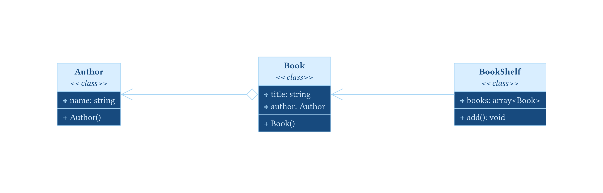
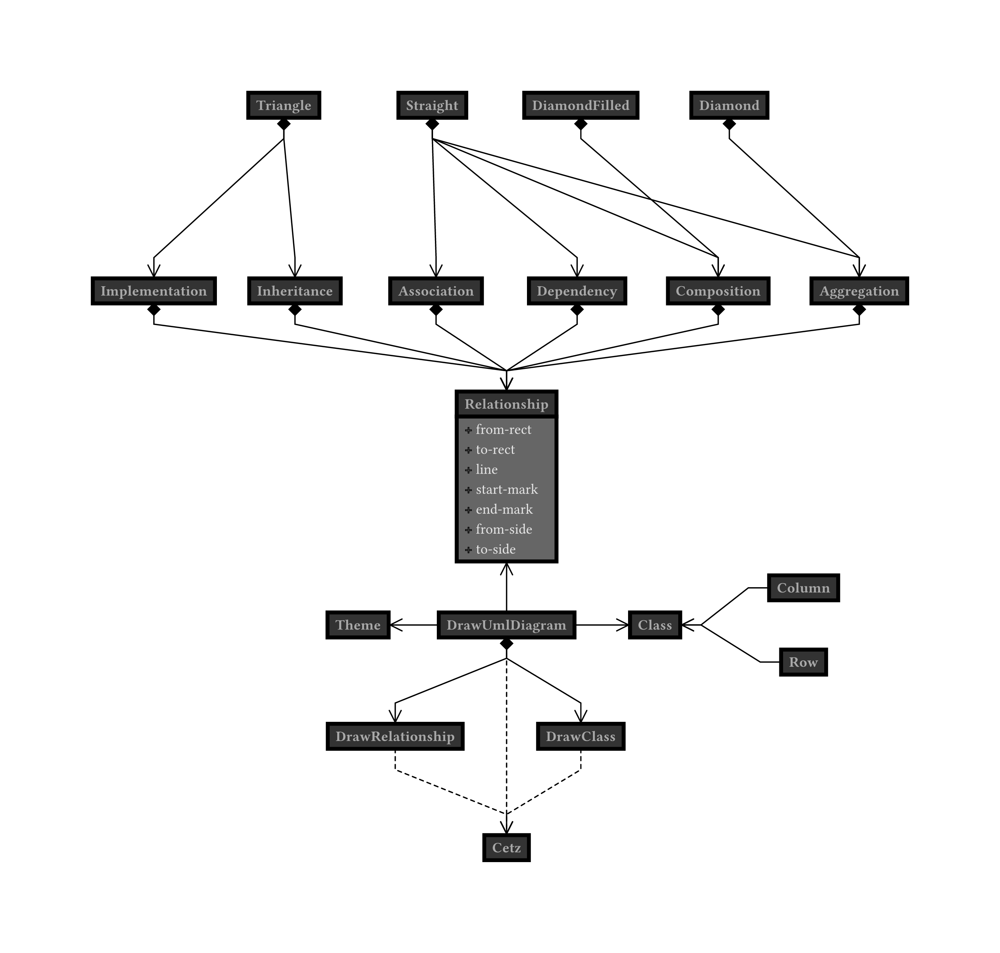
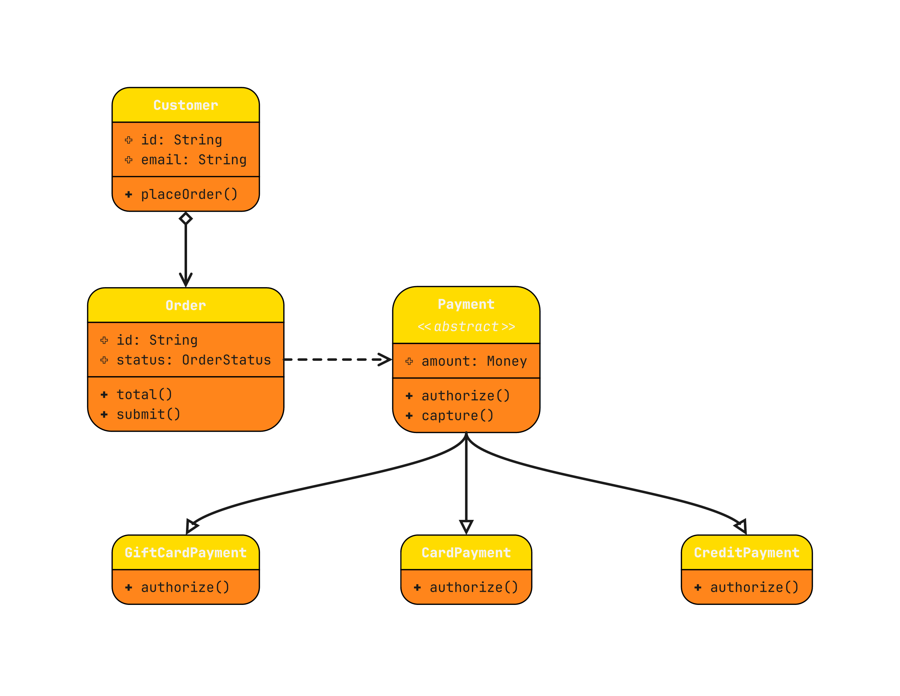

# mastermind

[](https://typst.app)
[](https://gitlab.com/zani.manuel328/mastermind)
[](https://www.gnu.org/licenses/gpl-3.0.html)
[](docs/manual.pdf?raw=true)

Mastermind is a [Typst](https://typst.app/) package, built on [CeTZ](https://github.com/cetz-package/cetz), to draw UML diagrams, both directly within Typst or by parsing source code files.

## Features

- Generate diagrams from source files, supported languages are:
    - Java
    - C#
    - PHP (it can also extract PHP classes from Livewire components!) — [PHP and Livewire example](examples/php-livewire.typ)
- Manual diagrams: Create UML class diagrams directly in your Typst documents, with class names, attributes, and methods.
- Layout: arrange classes in rows or columns and choose where relationships connect to keep diagrams readable. [See an example](examples/architecture.typ).
- Beautiful themes: Pick a built-in visual theme or customize the colors, shapes, and lines to suit your document. [See an example](examples/custom-theme.typ).

See the `/docs` directory for the [manual](/docs/manual.pdf) and the [documentation](/docs/docs.pdf).

## Install

To import the package into your project:

```typ
#import "@preview/mastermind:0.3.0"
```

## Usage

### Generate diagrams

<p align="center">
  
</p>
<details>
  <summary>See the source code</summary>

```php
<?php

class Author {
    public string $name;

    public function __construct(string $name) {
        $this->name = $name;
    }
}
```

```php
<?php

class Book {
    public string $title;
    public Author $author;

    public function __construct(string $title, Author $author) {
        $this->title = $title;
        $this->author = $author;
    }
}
```

```php
<?php

use Livewire\Component;

return new class extends Component {
    /** @var array<Book> */
    public array $books = [];

    public function add(Book $book): void {
        $this->books[] = $book;
    }
};

?>

<section>
    <h2>Book shelf</h2>
    @foreach ($books as $book)
        <p>{{ $book->title }}</p>
    @endforeach
</section>
```
  
```typ
#import "@preview/mastermind:0.3.0": *

#set page(width: auto, height: auto)

#let sources = (
  source(path("php/Author.php"), center: (-9, 0)),
  source(path("php/Book.php"), center: (0, 0)),
  source(path("php/book-shelf.blade.php"), center: (9, 0)),
)

#draw-source-uml-diagram(sources, themes.blueprint, parsers.php)
```
</details>

### Layout

When positioning the classes in the diagram, you can help yourself with:
- row
- column
- group

<p align="center">
  
</p>
<details>
  <summary>See the source code</summary>
  
```typ
#import "@preview/mastermind:0.3.0": *

#set page(width: auto, height: auto)

#set text(font: "JetBrains Mono")

#let custom-theme = theme(
  body-fill: orange,
  inset: 10pt,
  radius: 20pt,
  header-fill: yellow,
  line-thickness: 2pt,
  stroke: 1pt,
  line: "bezier",
)

#let classes = (
  class(
    "Customer",
    center: (0, 0),
    attributes: ("+ id: String", "+ email: String"),
    methods: ("+ placeOrder()",),
  ),
  class(
    "Payment",
    center: (8, -6),
    type: "abstract",
    attributes: ("+ amount: Money",),
    methods: ("+ authorize()", "+ capture()"),
  ),
  class(
    "Order",
    center: (0, -6),
    attributes: ("+ id: String", "+ status: OrderStatus"),
    methods: ("+ total()", "+ submit()"),
  ),
  class(
    "CardPayment",
    center: (8, -12),
    methods: ("+ authorize()",),
  ),
  class(
    "GiftCardPayment",
    center: (0, -12),
    methods: ("+ authorize()",),
  ),
  class(
    "CreditPayment",
    center: (16, -12),
    methods: ("+ authorize()",),
  ),
)

#let relationships = (
  aggregation("Customer", "Order"),
  dependency("Order", "Payment"),
  inheritance("Payment", "CardPayment"),
  inheritance("Payment", "GiftCardPayment", from-side: "south", to-side: "north"),
  inheritance("Payment", "CreditPayment", from-side: "south", to-side: "north"),
)

#draw-uml-diagram(classes, relationships, theme: custom-theme)
```
</details>

### Theming

*You can also build your own custom theme:*

<p align="center">
  
</p>
<details>
  <summary>See the source code</summary>
  
```typ
#import "@preview/mastermind:0.3.0": *

#set page(width: auto, height: auto)

#set text(font: "JetBrains Mono")

#let custom-theme = theme(
  body-fill: orange,
  inset: 10pt,
  radius: 20pt,
  header-fill: yellow,
  line-thickness: 2pt,
  stroke: 1pt,
  line: "bezier",
)

#let classes = (
  class(
    "Customer",
    center: (0, 0),
    attributes: ("+ id: String", "+ email: String"),
    methods: ("+ placeOrder()",),
  ),
  class(
    "Payment",
    center: (8, -6),
    type: "abstract",
    attributes: ("+ amount: Money",),
    methods: ("+ authorize()", "+ capture()"),
  ),
  class(
    "Order",
    center: (0, -6),
    attributes: ("+ id: String", "+ status: OrderStatus"),
    methods: ("+ total()", "+ submit()"),
  ),
  class(
    "CardPayment",
    center: (8, -12),
    methods: ("+ authorize()",),
  ),
  class(
    "GiftCardPayment",
    center: (0, -12),
    methods: ("+ authorize()",),
  ),
  class(
    "CreditPayment",
    center: (16, -12),
    methods: ("+ authorize()",),
  ),
)

#let relationships = (
  aggregation("Customer", "Order"),
  dependency("Order", "Payment"),
  inheritance("Payment", "CardPayment"),
  inheritance("Payment", "GiftCardPayment", from-side: "south", to-side: "north"),
  inheritance("Payment", "CreditPayment", from-side: "south", to-side: "north"),
)

#draw-uml-diagram(classes, relationships, theme: custom-theme)
```
</details>
