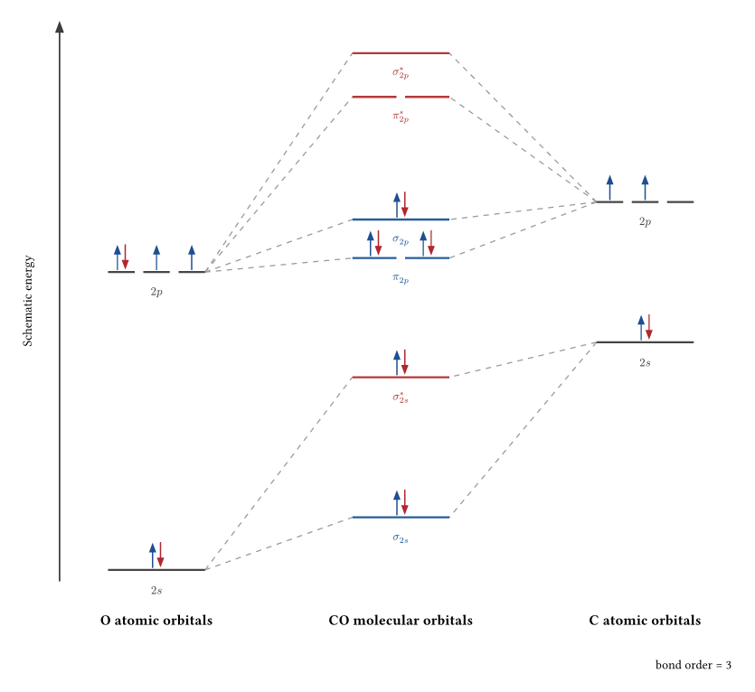
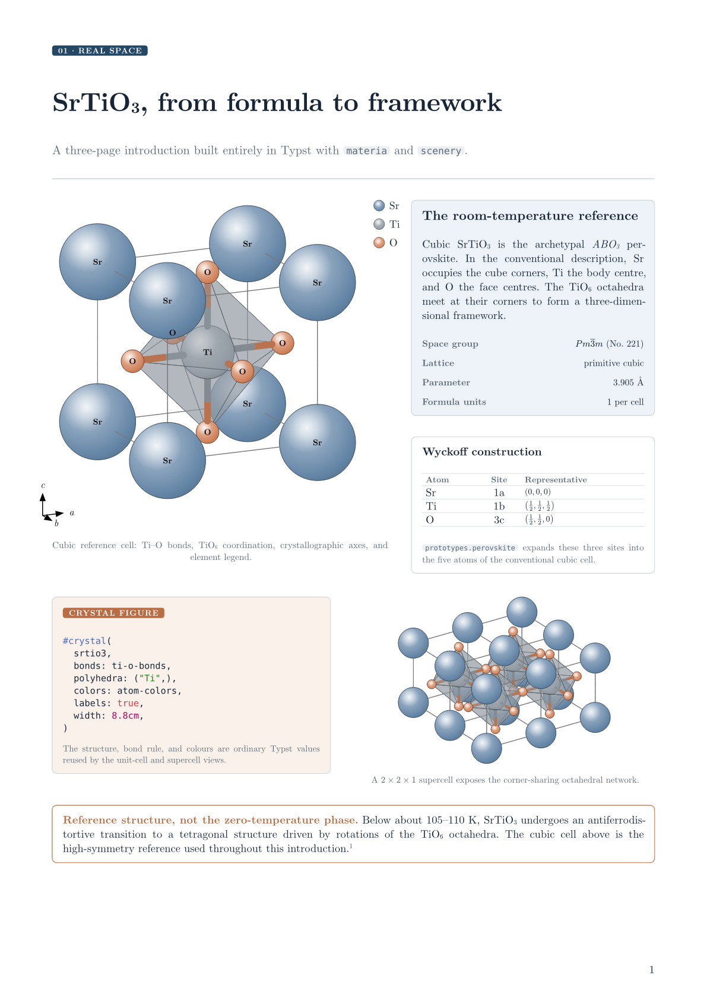

# materia

Materials-science figures for [Typst](https://typst.app): crystal and molecular
structures, Brillouin zones and k-paths, band panels, and declarative molecular-
orbital diagrams. Every figure is assembled from the shared
[`scenery`](https://typst.app/universe/package/scenery) scene model and remains
native vector content.

<table>
<tr>
<td align="center"><br>Real space: SrTiO&#8323; with TiO&#8326; octahedra</td>
<td align="center"><br>Reciprocal space: FCC Brillouin zone</td>
</tr>
<tr>
<td align="center" colspan="2"><br>Electronic structure: declarative, schematic CO molecular-orbital diagram</td>
</tr>
</table>

The complete sources are in [`examples/`](examples/).

## Guided showcase: SrTiO₃

[`srtio3-introduction.typ`](examples/srtio3-introduction.typ) is a three-page,
Typst-native introduction that follows one material across real, reciprocal, and
electronic space. It constructs cubic SrTiO₃ from Wyckoff sites, exposes its
corner-sharing TiO₆ framework, builds the primitive-cubic Brillouin zone and
Γ–X–M–Γ–R–X path, and pairs them with an explicitly schematic band panel. The
final page separates package-computed geometry from tabulated conventions,
user-supplied energies, and literature claims.

<a href="examples/srtio3-introduction.typ"></a>

## Quick start

```typst
#import "@preview/materia:0.1.0": prototypes, crystal, bz-figure

#crystal(prototypes.rocksalt("Na", "Cl", a: 5.64), width: 7cm)

#bz-figure(
  (a: 3.61),
  bravais: "cF",
  highlight: ("Γ", "X", "L"),
  width: 6cm,
)
```

`materia` requires Typst 0.15 or newer. It provides four specialist namespaces
(`core`, `real`, `reciprocal`, and `electronic`) and also re-exports the common
entry points at package root.

| Area | Main root exports |
| --- | --- |
| Structure data | `structure`, `prototypes`, `import-xyz`, `import-poscar`, `import-cif` |
| Real-space figures | `crystal`, `molecule`, `crystal-scene` |
| Reciprocal space | `reciprocal-vectors`, `bz-cell`, `bz-scene`, `bz-figure`, `kpoints`, `kpath`, `band-axis`, `band-panel` |
| Electronic structure | `energy-level`, `orbital-column`, `correlate`, `mo-model`, `bond-order`, `mo-scene`, `mo-diagram` |

## Real-space structures

`structure` accepts one of four forms:

- space group, conventional lattice parameters, and Wyckoff sites;
- layer group, in-plane lattice parameters, and sites (out-of-plane `z` is in Å);
- three explicit lattice vectors plus an expanded fractional basis;
- Cartesian atoms without a lattice for a molecule.

```typst
#import "@preview/materia:0.1.0": structure, crystal

#let rutile = structure(
  spacegroup: 136,
  lattice: (a: 4.594, c: 2.959),
  sites: (
    (element: "Ti", wyckoff: "a"),
    (element: "O", wyckoff: "f", x: 0.305),
  ),
)

#crystal(
  rutile,
  bonds: ((elements: ("Ti", "O"), max: 2.2),),
  polyhedra: ("Ti",),
)
```

The principal `crystal`/`molecule` options are `view`, `supercell`, `mode`,
`bonds`, `bond-color`, `polyhedra`, `radius`, `labels`, `colors`, `legend`,
`axes`, `width`, and `engine`. Render modes are `"ball-and-stick"`,
`"space-filling"` (alias `"cpk"`), and `"licorice"`. A perspective view uses
`(mode: "perspective", distance: 18, azimuth: 25deg, elevation: 15deg)`.

### File input and Typst 0.15 paths

File imports accept either a caller-created `path` value or raw `bytes`.
Construct the path in your document so it keeps your project root while crossing
the package boundary:

```typst
#import "@preview/materia:0.1.0": import-xyz, molecule

#molecule(import-xyz(path("data/water.xyz")))
```

Plain strings are intentionally rejected because a relative string passed into
a package resolves inside the package. The bundled `materia-io` WASM parser
supports plain/extended XYZ, VASP 5 POSCAR/CONTCAR, and a documented pragmatic
CIF subset. CIF files with partial occupancy, multiple data blocks, or neither
symmetry operations nor a recognized space-group identifier fail explicitly.

## Reciprocal space

`bz-scene` and `bz-figure` build the Wigner–Seitz cell of the primitive
reciprocal lattice. When conventional lattice parameters are supplied, pass an
extended Bravais symbol so `materia` can choose the correct primitive cell and
high-symmetry path.

```typst
#import "@preview/materia:0.1.0": bz-figure, band-axis, band-panel

#bz-figure((a: 3.61), bravais: "cF", width: 6cm)

#let axis = band-axis("cF", (a: 3.61), ("Γ", "X", "W", "K", "Γ", "L"))
// `bands` is one energy array per band, sampled at axis.k-dists.
//#band-panel(bands, axis)
```

The k-point tables follow Setyawan–Curtarolo/HPKOT conventions. They are a
geometry and labeling aid, not an electronic-structure solver.

## Molecular-orbital diagrams

The electronic layer is deliberately declarative: you supply columns, energy
levels, degeneracies, occupations, roles, and correlation endpoints. `materia`
validates unique IDs and electron capacities, renders spin arrows, and computes
bond order; it does not infer an MO scheme from a chemical formula.

```typst
#import "@preview/materia:0.1.0": energy-level, orbital-column,
  correlate, mo-model, mo-diagram

#let atoms = orbital-column("atoms", (
  energy-level("a-2s", -20, label: $2s$, occupation: 2),
  energy-level("a-2p", -10, label: $2p$, degeneracy: 3, occupation: 2),
))
#let mos = orbital-column("mos", (
  energy-level("sigma", -16, label: $sigma$, occupation: 2, role: "bonding"),
  energy-level("sigma-star", -4, label: $sigma^*$, role: "antibonding"),
), kind: "molecular")
#let model = mo-model(
  (atoms, mos),
  correlations: (correlate("a-2s", "sigma"),),
)

#mo-diagram(model)
```

See [`examples/co-mo.typ`](examples/co-mo.typ) for the full CO diagram above. Its
energy scale is explicitly schematic; the numeric values control layout rather
than claiming calculated or experimental orbital energies.

## Composable scenes

`crystal-scene`, `bz-scene`, and `mo-scene` return ordinary `scenery` scene
dictionaries (`prims`, `bbox`, and `objects`). They can be transformed, grouped,
or rendered with the same tools as any hand-built scene:

```typst
#import "@preview/materia:0.1.0": prototypes, crystal-scene
#import "@preview/scenery:0.1.0" as scenery

#let scene = crystal-scene(prototypes.diamond("C", a: 3.567))
#scenery.render-scene(scene, scene.camera, width: 6cm)
```

The high-level `crystal` renderer additionally applies material-specific
coverage suppression and furniture (legend and crystallographic axes).

## Scope and limitations

- Space-group structures use standard ITA settings and conventional cells;
  groups with two origin choices use origin choice 2.
- The reciprocal layer expects standardized conventional parameters for its
  tabulated paths; `mC` needs primitive vectors for zone construction.
- Transparent intersecting polyhedra are most robust with `engine: "wasm"`.
- Molecular-orbital energies and correlations are user data, not calculated
  quantum-chemical results.

## Development

Development happens in the [source repository](https://github.com/GiggleLiu/scenery),
which contains the tests and build scripts omitted from the downloadable
package. From a monorepo checkout, `make test` compiles all tests and
pixel-equivalence gates, while `make examples` compiles every example. The Rust
parser tests run with `cargo test -p materia-io`.

## License

MIT. The generated crystallographic tables are derived from PyXtal data and are
cross-checked against pymatgen fixtures; see [`NOTICE`](NOTICE) for provenance.
