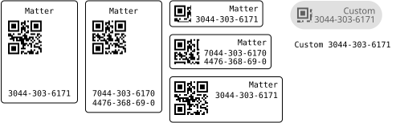

# Materialize

Generate Matter setup codes for smart home devices with ease.



```typ
#import "@preview/materialize:0.1.0": matter-qr-code, matter-qr-code-to-manual-code

// Setup code for a KAJPLATS bulb (Uncertified products don't work with all apps)
#matter-qr-code("MT:M7GA1KSF15MB845M910")

// 21 digit manual code for devices with a non standard commissioning flow
#matter-qr-code("MT:M7GA1G6H15MB845M910")

// horizontal style
#matter-qr-code("MT:M7GA1KSF15MB845M910", style: "horizontal")
#matter-qr-code("MT:M7GA1G6H15MB845M910", style: "horizontal")

// A minimum size can be specified to increase the size of the QR code
#matter-qr-code("MT:M7GA1KSF15MB845M910", style: "horizontal", min-size: 20mm)

// The appearance can be customized
#set text(font: "Noto Sans", size: 11pt)
#matter-qr-code(
  "MT:M7GA1KSF15MB845M910",
  style: "horizontal",
  heading: [Custom],
  spacing: 1mm,
  inset: 3mm,
  stroke: none,
  radius: 50%,
  foreground-color: luma(96),
  background-color: luma(224),
)

// or only the manual code can be generated
Custom #matter-qr-code-to-manual-code("MT:M7GA1KSF15MB845M910")
```

The design is loosely based on the [Matter Setup Code Guidelines (Page 36)](https://csa-iot.org/wp-content/uploads/2022/11/Matter_Brand-Guidelines_v1.6.pdf).  
The QR code parsing and generation of the manual code are based on the [Python implementation](https://github.com/project-chip/connectedhomeip/tree/master/src/setup_payload/python).  
The QR code is generated using [`tiaoma`](https://typst.app/universe/package/tiaoma/).
