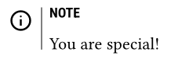

**Materially** is a [Typst](https://typst.app/) package that enables the use of [Google Material Symbols](https://github.com/google/material-design-icons).

# Example

[`demo.typ`](demo.typ) renders to:



# Google Material Symbols

- [Online Search](https://fonts.google.com/icons)
- [Guide](https://developers.google.com/fonts/docs/material_symbols)

# License

A specific version of Google Material Symbols is redistributed with this package in `variablefont` under the Apache-2.0 license.  This is done so that the font matches the codepoints.  Not sure how often they change.

# Installation

The `.ttf` fonts from the [variablefont](https://github.com/google/material-design-icons/tree/master/variablefont) subfolder need to be installed in your OS for this package to work.

# Usage

1. Import the package

    ```typst
    #import "@preview/materially:0.1.0" as materially
    ```

2. Initialize one of three fonts (Outlined, Sharp, or Rounded).

    ```typst
    #let symbol = materially.init() // Default style is "Outlined"
    // #let gms = materially.init(style:"Sharp")
    // #let gms = materially.init(style:"Rounded")
    ```

3. Optionally, set a size and weight (Yes, [variable weight fonts work](https://github.com/typst/typst/issues/185).  Hooray!)

    ```typst
    #set text(weight: 600)
    ```

4. Use the symbol, by name (after finding it in the online search and copying the **Icon Name**)

    ```typst
    #symbol("menu")
    ```

# Design

The `init` methods prevent the codepoints file from having to be reread every time a symbol is used.
