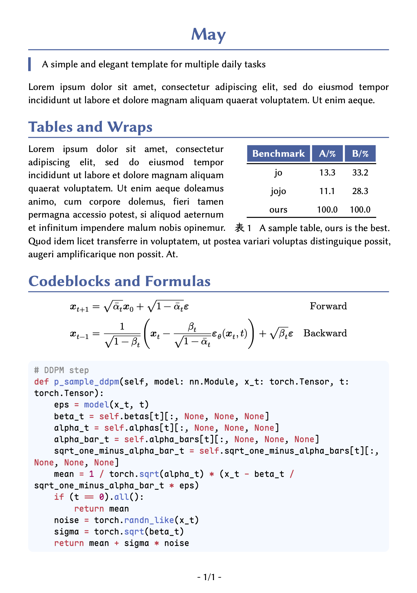

# May

A simple and elegant document template for multiple daily tasks.

## Usage

This is my personal typst template designedfor homework, report or some other documents. You can obtain the same styles of this template by simply adding the follows two lines at the top of your document:

```typst
#import "@preview/may:0.0.1": *
#show: may-sans
// ...
// Your typst documents here
```

Alternatively you can also initialize a project with _may_ by running the following command:

```sh
typst init @preview/may
```

This will create a new folder named `may` in the current path, along with a sample file `main.typ` as the start point.

## Tips

It is recommanded to use this template along with to following fonts.

* [Libertinus](https://github.com/alerque/libertinus) for latin main body.
* [Maple Mono](https://github.com/subframe7536/maple-font) for codeblocks.
* [霞鹜文楷](https://github.com/lxgw/LxgwWenKai) for Chinese characters.

These are all open-sourced fonts of high quality. You can also use other fonts you prefer, by simply adding this line after the `show` command:

```typst
#set text(font: "FontName")
```

You are welcomed to create new PRs to this repository and help improve this template.

## Show Case


