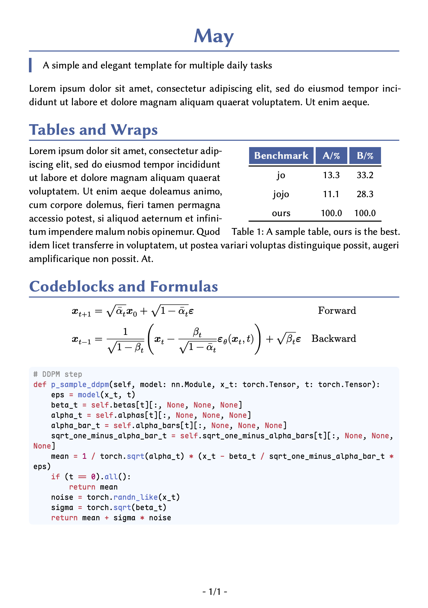
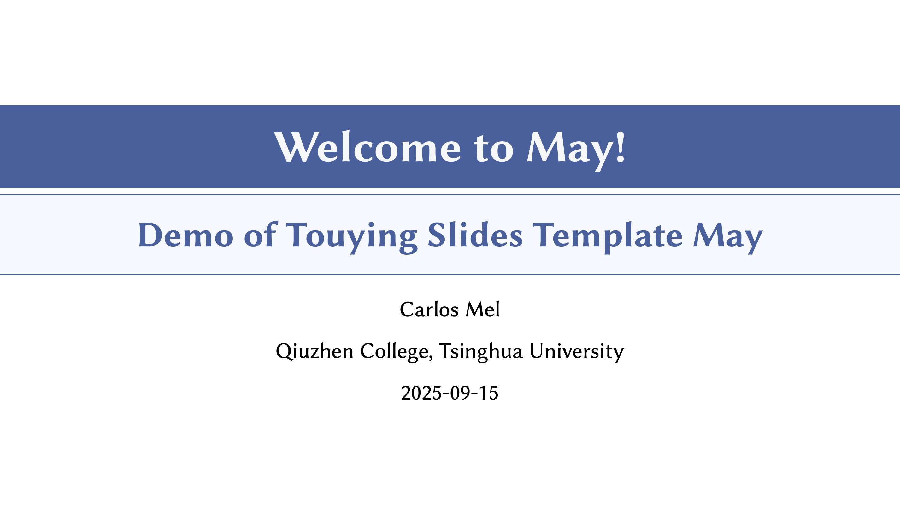
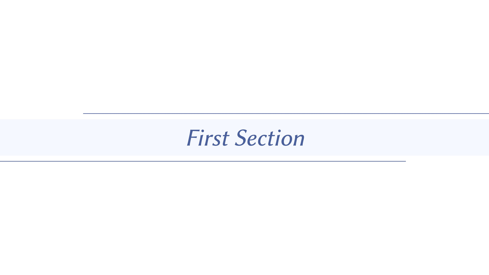
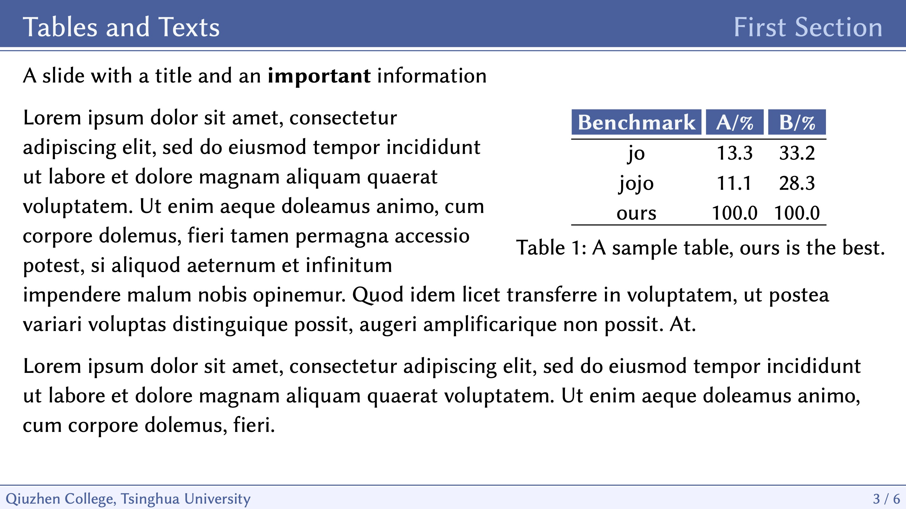
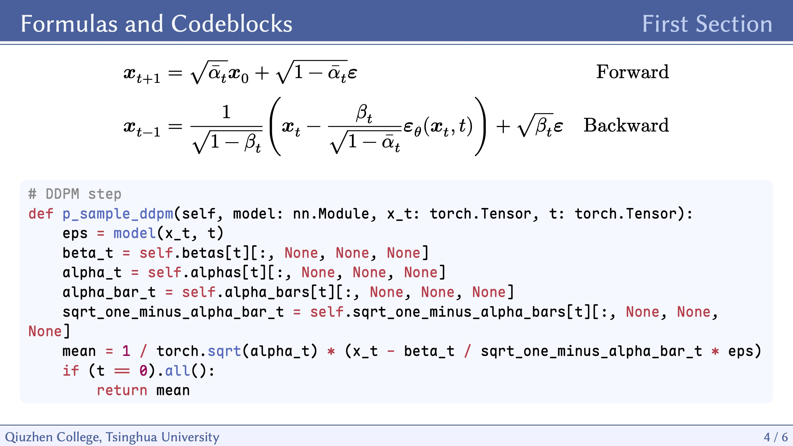

# May

A simple and elegant document template for multiple daily tasks.

## Usage

This is my personal typst template designedfor homework, report or some other documents. You can obtain the same styles of this template by simply adding the follows two lines at the top of your document:

```typst
#import "@preview/may:0.1.0": *
#show: may-sans
// ...
// Your typst documents here
```

Alternatively you can also initialize a project with _may_ by running the following command:

```sh
typst init @preview/may
```

This will create a new folder named `may` in the current path, along with a sample file `main.typ` as the start point.

## Touying Slides Template

We also provide a touying theme that is great for presentations! You can create slides in may theme as simple as adding these lines at the top:

```typst
#import "@preview/may:0.1.0": *

#show: may-pre.with(
  config-info(
    title: [Welcome to May!],
    subtitle: [Demo of Touying Slides Template May],
    author: [Carlos Mel],
    date: datetime.today(),
    institution: [Qiuzhen College, Tsinghua University]
  ),
)
```

You can modify the parameters in `config-info` to anything you prefer, and you can also customize the footer of this template by explicitly passing a footer to `may-pre` function. After the `show` command, `may-pre` will automatically create new sections and slides according to your 1st headers and 2nd headers. There are also some functions to create special slides in this theme, they are `title-slide`, `focus-slide` and `image-slide`. For more concreate usages you can refer to `slides.typ` template generated by `typst init @preview/may` and our showcases.

## Tips

It is recommanded to use this template along with to following fonts.

* [Libertinus](https://github.com/alerque/libertinus) for latin main body.
* [Maple Mono](https://github.com/subframe7536/maple-font) for codeblocks.
* [霞鹜文楷](https://github.com/lxgw/LxgwWenKai) for Chinese characters.

These are all open-sourced fonts of high quality. You can also use other fonts you prefer, by simply adding this line after the `show` command:

```typst
#set text(font: "FontName")
```

You are welcomed to create new PRs to this repository and help improve this template.

## Show Case

**Document Preview**



**Slides Template Preview**







## Dependencies

This template pre-includes these typst packages along with it. they are [physica](https://typst.app/universe/package/physica/), [wrap-it](https://typst.app/universe/package/wrap-it/), [touying](https://typst.app/universe/package/touying/). So you can directly access the functionalities without explicit importing them in you project with may.
