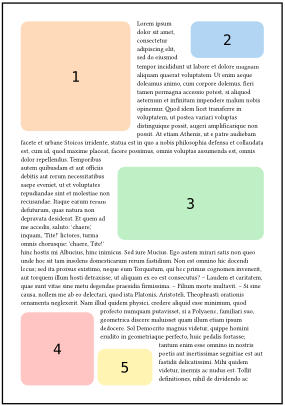
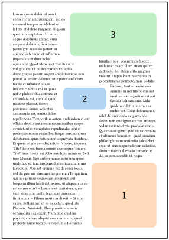
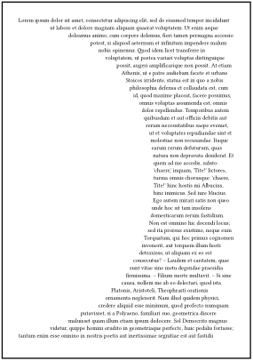

# Meander
_Text threading and image wrap-around for Typst._

`meander` provides a core function `reflow` to segment a page and wrap content around images.

See the [documentation](https://github.com/Vanille-N/meander.typ/releases/download/v0.1.0/main.pdf).

## Quick start

The (contextual) function `meander.reflow` splits content into
- obstacles: all `place`d content at the toplevel (i.e. not inside a subcontainer such as a `box`)
- containers: produced by `meander.container()`, optionally specifying an alignment, `dx`, `dy`, `width`, `height`
- flowing text: everything else

<table>
<tr>
<td>

```typ
#context meander.reflow[
  // Obstacles
  #place(top + left, my-image-1)
  #place(top + right, my-image-2)
  #place(right, my-image-3)
  #place(bottom + left, my-image-4)
  #place(bottom + left, my-image-5, dx: 2cm)

  // Container
  #meander.container()

  // Flowing text
  #lorem(500)
]
```

</td>
<td>



</td>
</tr>
</table>

Use multiple `container`s to produce layouts in columns.

<table>
<tr>
<td>

```typ
#context meander.reflow[
  // Obstacles
  #place(bottom + right, my-image-1)
  #place(center + horizon, my-image-2, dy: -1cm)
  #place(top + right, my-image-3)

  // Containers
  #meander.container(width: 55%)
  #meander.container(right, width: 40%)

  // Flowing text
  #lorem(600)
]
```

</td>
<td>



</td>
</tr>
</table>

More complex text outlines can be achieved by playing with obstacles.

<table>
<tr>
<td>

```typ
#context meander.reflow[
  // Draw a half circle shape with obstacles
  #let vradius = 45%
  #let vcount = 50
  #let hradius = 60%
  #for i in range(vcount) {
    let frac = 2 * (i+0.5) / vcount - 1
    let width = hradius * calc.sqrt(1 - frac - frac)
    place(
      left + horizon,
      dy: (i - vcount / 2) * (2 * vradius / vcount),
    )[
      #box(width: width, height: 2 * vradius / vcount)
    ]
  }

  // Container
  #meander.container()

  // Flowing text
  #lorem(600)
]
```

</td>
<td>



</td>
</tr>
</table>


## Known issues and roadmap

- [X] boxes must not stretch beyond containers
- [ ] fix the numbering pattern in `enum`
- [ ] improve `list.item` and `enum.item` indentation and vertical spacing
- [ ] parameterization of alignment inside boxes
- [ ] proper handling of containers that intersect horizontally
- [ ] hyphenation and justification
- [ ] multi-page handling

