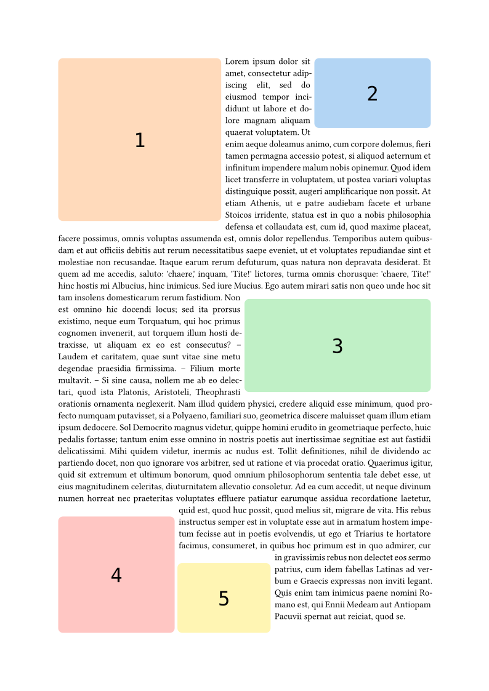
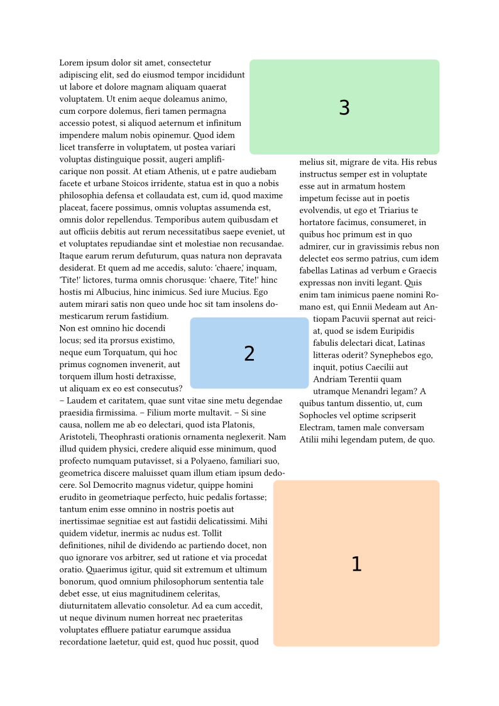
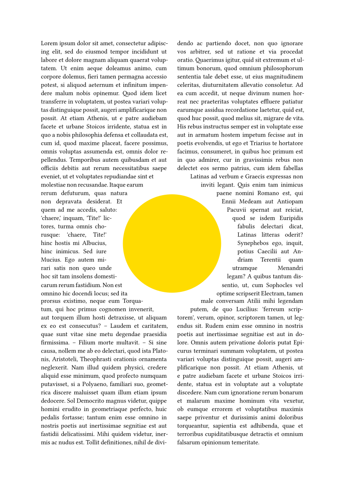

# Meander

`meander` provides a core function `reflow` to segment pages and wrap content around images.

<!-- @scrybe(not version; panic Please specify a version number) -->
<!-- @scrybe(if publish; grep https; grep {{version}}) -->
See the [documentation](https://github.com/Vanille-N/meander.typ/releases/download/v0.2.3/docs.pdf)

## Quick start

The function `meander.reflow` splits the input sequence into
- obstacles: all objects created via the function `placed` (which is like `place`),
- containers: produced by `container`, optionally specifying an alignment and dimensions,
- flowing content: produced by `content`,
- optionally `pagebreak`s so that the layout can cover multiple consecutive pages.

<!-- @scrybe(not publish; jump import; grep local; grep {{version}}) -->
<!-- @scrybe(if publish; jump import; grep preview; grep {{version}}) -->
<!-- @scrybe(jump import; until ```; diff gallery/multi-obstacles.typ) -->
```typ
#let my-img-1 = box(width: 7cm, height: 7cm, fill: orange)
#let my-img-2 = box(width: 5cm, height: 3cm, fill: blue)
#let my-img-3 = box(width: 8cm, height: 4cm, fill: green)
#let my-img-4 = box(width: 5cm, height: 5cm, fill: red)
#let my-img-5 = box(width: 4cm, height: 3cm, fill: yellow)

#import "@preview/meander:0.2.3"

#meander.reflow({
  import meander: *

  // As many obstacles as you want
  placed(top + left, my-img-1)
  placed(top + right, my-img-2)
  placed(horizon + right, my-img-3)
  placed(bottom + left, my-img-4)
  placed(bottom + left, dx: 32%,
         my-img-5)

  // The container wraps around all
  container()
  content[
    #set par(justify: true)
    #lorem(430)
  ]
})
```


-----

Use multiple `container`s to produce layouts in columns.

<!-- @scrybe(not publish; jump import; grep local; grep {{version}}) -->
<!-- @scrybe(if publish; jump import; grep preview; grep {{version}}) -->
<!-- @scrybe(jump import; until ```; diff gallery/two-columns.typ) -->
```typ
#let my-img-1 = box(width: 7cm, height: 7cm, fill: orange)
#let my-img-2 = box(width: 5cm, height: 3cm, fill: blue)
#let my-img-3 = box(width: 8cm, height: 4cm, fill: green)

#import "@preview/meander:0.2.3"

#meander.reflow({
  import meander: *

  placed(bottom + right, my-img-1)
  placed(center + horizon, my-img-2)
  placed(top + right, my-img-3)

  // With two containers we can
  // emulate two columns.

  // The first container takes 60%
  // of the page width.
  container(width: 60%, margin: 5mm)
  // The second container automatically
  // fills the remaining space.
  container()

  content[#lorem(470)]
})
```


------

Meander allows precise control over the boundaries of obstacles, to draw complex paragraph shapes.

<!-- @scrybe(not publish; jump import; grep local; grep {{version}}) -->
<!-- @scrybe(if publish; jump import; grep preview; grep {{version}}) -->
<!-- @scrybe(jump import; until ```; diff gallery/circle-hole.typ) -->
```typ
#import "@preview/meander:0.2.3"

#meander.reflow({
  import meander: *

  placed(
    center + horizon,
    boundary:
      // Override the default margin
      contour.margin(1cm) +
      // Then redraw the shape as a grid
      contour.grid(
        // 25 vertical and horizontal subdivisions.
        // Just pick a number that looks good.
        // A good rule of thumb is to start with obstacles
        // about as high as one line of text.
        div: 25,
        // Equation for a circle of center (0.5, 0.5) and radius 0.5
        (x, y) => calc.pow(2 * x - 1, 2) + calc.pow(2 * y - 1, 2) <= 1
      ),
    // Underlying object
    circle(radius: 3cm, fill: yellow),
  )

  container(width: 48%)
  container(align: right, width: 48%)
  content[
    #set par(justify: true)
    #lorem(570)
  ]
})
```



For a more in-depth introduction, including
- debug mode,
- alternative recontouring techniques,
- styling options,
- multi-page handling and page overflow options,
- tips to get better segmentation,
<!-- @scrybe(if publish; grep https; grep {{version}}) -->
please consult the [documentation](https://github.com/Vanille-N/meander.typ/releases/download/v0.2.3/docs.pdf).

