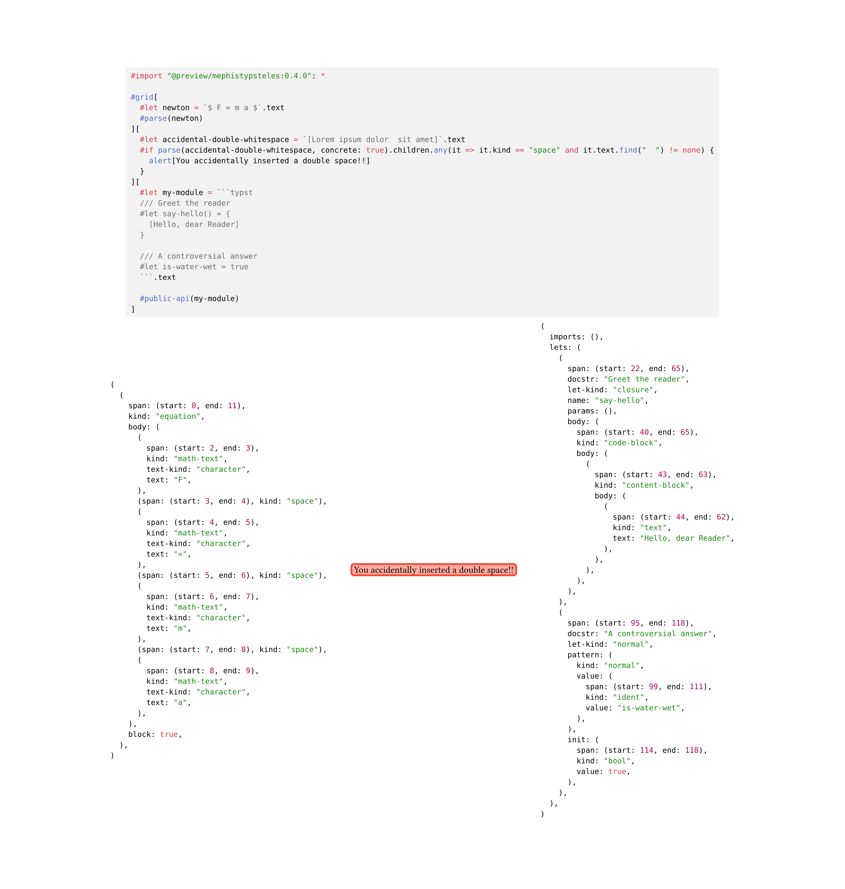

# Mephistypsteles
Typst currently doesn't have reflection natively (using Typst code to look at other Typst code in a structured way).

But, Typst supports plugins compiled to WebAssembly.
And Typst itself is written in Rust, a language that can compile to WebAssembly.

> "So," the devil whispers in your ear, "why not compile a part of Typst itself to a plugin and run it inside Typst?"
> [The _Inception_ soundtrack plays...]

Yes, it is very inefficient. Wasteful, even. But it works, and that is what counts.

## Versioning

There are _two_ Typst versions that are relevant:
1. The version of the Typst code being parsed.
2. The version of Typst that is used to run mephistypsteles.

| Mephistypsteles Version | Parses Typst Version | Runs with Typst Version |
|-------------------------|----------------------|-------------------------|
| 0.4.0                   | 0.14.0               | ≥ 0.12.0                |
| 0.3.0                   | 0.13.0               | ≥ 0.12.0                |
| 0.2.0                   | 0.12.0               | only 0.12.0             |
| 0.1.0                   | 0.12.0               | only 0.12.0             |

## API
This package exposes three functions:
- `parse(str, concrete: bool)`: Produce a representation of Typst syntax (*markup mode*).
	- The output with `concrete: false` (the default) is a representation of the Abstract Syntax Tree (AST).
		It is more structured and thus probably more useful.
	- The output with `concrete: true` is a representation of the Concrete Syntax Tree (CST).
		It is simpler, but also more direct, including e.g. comments.
- `public-api(str)`: Produce a representation of all items publicly defined by the given Typst code (*markup mode*).
- `operator-info(str)`: Get arity, precedence and associativity information for an operator.

## Example


### Output Schemas
The following code block details all possible output values.
Note that
- `parse(str, concrete: true)` returns a `<syntax-node>`,
- `parse(str, concrete: false)` returns an `array[<expr>]`,
- `public-api(str)` returns a `<public-api>`,
- and `operator-info(str)` returns an `<operator-desc>`.

<!-- START OF GENERATED SECTION -->
<details>

```
   <syntax-node> ::= (
                        "kind": str,
                        "span": ("start": int{>=0}, "end": int{>=0}),
                        "text": str,
                        "children": array[<syntax-node>]
                     )

          <expr> ::= (
                        "span": ("start": int{>=0}, "end": int{>=0}),
                        "kind": "array",
                        "items": array[
                            ("kind": "pos", "value": <expr>)
                            | ("kind": "spread", "value": <expr>)
                        ]
                     )
                     | ("span": ("start": int{>=0}, "end": int{>=0}), "kind": "auto")
                     | (
                          "span": ("start": int{>=0}, "end": int{>=0}),
                          "kind": "binary",
                          "op": str,
                          "lhs": <expr>,
                          "rhs": <expr>
                       )
                     | ("span": ("start": int{>=0}, "end": int{>=0}), "kind": "bool", "value": bool)
                     | (
                          "span": ("start": int{>=0}, "end": int{>=0}),
                          "kind": "closure",
                          "name": str | none,
                          "params": array[
                              ("kind": "named", "name": str, "value": <expr>)
                              | ("kind": "pos", "pattern": <pattern>)
                              | ("kind": "spread", "sink-ident": str | none)
                          ],
                          "body": <expr>
                       )
                     | (
                          "span": ("start": int{>=0}, "end": int{>=0}),
                          "kind": "code-block",
                          "body": array[<expr>]
                       )
                     | (
                          "span": ("start": int{>=0}, "end": int{>=0}),
                          "kind": "conditional",
                          "condition": <expr>,
                          "if-body": <expr>,
                          "else-body": <expr> | none
                       )
                     | (
                          "span": ("start": int{>=0}, "end": int{>=0}),
                          "kind": "content-block",
                          "body": array[<expr>]
                       )
                     | (
                          "span": ("start": int{>=0}, "end": int{>=0}),
                          "kind": "contextual",
                          "body": <expr>
                       )
                     | (
                          "span": ("start": int{>=0}, "end": int{>=0}),
                          "kind": "destruct-assignment",
                          "pattern": <pattern>,
                          "value": <expr>
                       )
                     | (
                          "span": ("start": int{>=0}, "end": int{>=0}),
                          "kind": "dict",
                          "items": array[
                              ("kind": "keyed", "key": <expr>, "value": <expr>)
                              | ("kind": "named", "name": str, "value": <expr>)
                              | ("kind": "spread", "value": <expr>)
                          ]
                       )
                     | (
                          "span": ("start": int{>=0}, "end": int{>=0}),
                          "kind": "emph",
                          "body": array[<expr>]
                       )
                     | (
                          "span": ("start": int{>=0}, "end": int{>=0}),
                          "kind": "enum-item",
                          "number": int{>=0} | ("this_plus_1e63": int{>=0}) | none,
                          "body": array[<expr>]
                       )
                     | (
                          "span": ("start": int{>=0}, "end": int{>=0}),
                          "kind": "equation",
                          "body": array[<expr>],
                          "block": bool
                       )
                     | (
                          "span": ("start": int{>=0}, "end": int{>=0}),
                          "kind": "escape",
                          "text": str,
                          "char": str
                       )
                     | (
                          "span": ("start": int{>=0}, "end": int{>=0}),
                          "kind": "field-access",
                          "target": <expr>,
                          "field": str
                       )
                     | (
                          "span": ("start": int{>=0}, "end": int{>=0}),
                          "kind": "float",
                          "text": str,
                          "value": float
                       )
                     | (
                          "span": ("start": int{>=0}, "end": int{>=0}),
                          "kind": "for-loop",
                          "pattern": <pattern>,
                          "iterable": <expr>,
                          "body": <expr>
                       )
                     | (
                          "span": ("start": int{>=0}, "end": int{>=0}),
                          "kind": "func-call",
                          "callee": <expr>,
                          "args": <args>
                       )
                     | (
                          "span": ("start": int{>=0}, "end": int{>=0}),
                          "kind": "func-return",
                          "body": <expr> | none
                       )
                     | (
                          "span": ("start": int{>=0}, "end": int{>=0}),
                          "kind": "heading",
                          "body": array[<expr>],
                          "depth": int{>=0}
                       )
                     | ("span": ("start": int{>=0}, "end": int{>=0}), "kind": "ident", "value": str)
                     | (
                          "span": ("start": int{>=0}, "end": int{>=0}),
                          "kind": "int",
                          "text": str,
                          "value": int
                       )
                     | ("span": ("start": int{>=0}, "end": int{>=0}), "kind": "label", "text": str)
                     | (
                          "span": ("start": int{>=0}, "end": int{>=0}),
                          "kind": "let-binding",
                          "let-kind": "closure",
                          "name": str,
                          "init": <expr> | none
                       )
                     | (
                          "span": ("start": int{>=0}, "end": int{>=0}),
                          "kind": "let-binding",
                          "let-kind": "normal",
                          "pattern": <pattern>,
                          "init": <expr> | none
                       )
                     | ("span": ("start": int{>=0}, "end": int{>=0}), "kind": "linebreak")
                     | ("span": ("start": int{>=0}, "end": int{>=0}), "kind": "link", "url": str)
                     | (
                          "span": ("start": int{>=0}, "end": int{>=0}),
                          "kind": "list-item",
                          "body": array[<expr>]
                       )
                     | ("span": ("start": int{>=0}, "end": int{>=0}), "kind": "loop-break")
                     | ("span": ("start": int{>=0}, "end": int{>=0}), "kind": "loop-continue")
                     | (
                          "span": ("start": int{>=0}, "end": int{>=0}),
                          "kind": "math",
                          "children": array[<expr>]
                       )
                     | ("span": ("start": int{>=0}, "end": int{>=0}), "kind": "math-align-point")
                     | (
                          "span": ("start": int{>=0}, "end": int{>=0}),
                          "kind": "math-attach",
                          "base": <expr>,
                          "bottom": <expr> | none,
                          "top": <expr> | none,
                          "primes": int{>=0} | none
                       )
                     | (
                          "span": ("start": int{>=0}, "end": int{>=0}),
                          "kind": "math-delimited",
                          "open": <expr>,
                          "body": array[<expr>],
                          "close": <expr>
                       )
                     | (
                          "span": ("start": int{>=0}, "end": int{>=0}),
                          "kind": "math-frac",
                          "num": <expr>,
                          "denom": <expr>
                       )
                     | (
                          "span": ("start": int{>=0}, "end": int{>=0}),
                          "kind": "math-ident",
                          "value": str
                       )
                     | (
                          "span": ("start": int{>=0}, "end": int{>=0}),
                          "kind": "math-primes",
                          "count": int{>=0}
                       )
                     | (
                          "span": ("start": int{>=0}, "end": int{>=0}),
                          "kind": "math-root",
                          "index": int{>=0} | none,
                          "radicand": <expr>
                       )
                     | (
                          "span": ("start": int{>=0}, "end": int{>=0}),
                          "kind": "math-shorthand",
                          "text": str,
                          "char": str
                       )
                     | (
                          "span": ("start": int{>=0}, "end": int{>=0}),
                          "kind": "math-text",
                          "text-kind": "character",
                          "text": str
                       )
                     | (
                          "span": ("start": int{>=0}, "end": int{>=0}),
                          "kind": "math-text",
                          "text-kind": "number",
                          "text": str
                       )
                     | (
                          "span": ("start": int{>=0}, "end": int{>=0}),
                          "kind": "module-import",
                          "source": <expr>,
                          "imports": (
                             "kind": "items",
                             "items": array[
                                 ("kind": "renamed", "path": array[str], "bound-name": str)
                                 | ("kind": "simple", "path": array[str])
                             ]
                          )
                          | ("kind": "wildcard")
                          | none,
                          "bare-name": str | none,
                          "new-name": str | none
                       )
                     | (
                          "span": ("start": int{>=0}, "end": int{>=0}),
                          "kind": "module-include",
                          "source": <expr>
                       )
                     | ("span": ("start": int{>=0}, "end": int{>=0}), "kind": "none")
                     | (
                          "span": ("start": int{>=0}, "end": int{>=0}),
                          "kind": "numeric",
                          "text": str,
                          "value": int | float,
                          "unit": str
                       )
                     | ("span": ("start": int{>=0}, "end": int{>=0}), "kind": "parbreak")
                     | (
                          "span": ("start": int{>=0}, "end": int{>=0}),
                          "kind": "parenthesized",
                          "inner": <expr>
                       )
                     | (
                          "span": ("start": int{>=0}, "end": int{>=0}),
                          "kind": "raw",
                          "lines": array[str],
                          "lang": str | none,
                          "block": bool
                       )
                     | (
                          "span": ("start": int{>=0}, "end": int{>=0}),
                          "kind": "ref",
                          "target": str,
                          "supplement": array[<expr>] | none
                       )
                     | (
                          "span": ("start": int{>=0}, "end": int{>=0}),
                          "kind": "set-rule",
                          "target": <expr>,
                          "args": <args>,
                          "condition": <expr> | none
                       )
                     | (
                          "span": ("start": int{>=0}, "end": int{>=0}),
                          "kind": "shorthand",
                          "text": str,
                          "char": str
                       )
                     | (
                          "span": ("start": int{>=0}, "end": int{>=0}),
                          "kind": "show-rule",
                          "selector": <expr> | none,
                          "transform": <expr>
                       )
                     | (
                          "span": ("start": int{>=0}, "end": int{>=0}),
                          "kind": "smart-quote",
                          "double": bool
                       )
                     | ("span": ("start": int{>=0}, "end": int{>=0}), "kind": "space")
                     | (
                          "span": ("start": int{>=0}, "end": int{>=0}),
                          "kind": "str",
                          "text": str,
                          "value": str
                       )
                     | (
                          "span": ("start": int{>=0}, "end": int{>=0}),
                          "kind": "strong",
                          "body": array[<expr>]
                       )
                     | (
                          "span": ("start": int{>=0}, "end": int{>=0}),
                          "kind": "term-item",
                          "term": array[<expr>],
                          "description": array[<expr>]
                       )
                     | ("span": ("start": int{>=0}, "end": int{>=0}), "kind": "text", "text": str)
                     | (
                          "span": ("start": int{>=0}, "end": int{>=0}),
                          "kind": "unary",
                          "op": str,
                          "arg": <expr>
                       )
                     | (
                          "span": ("start": int{>=0}, "end": int{>=0}),
                          "kind": "while-loop",
                          "condition": <expr>,
                          "body": <expr>
                       )

       <pattern> ::= (
                        "kind": "destructuring",
                        "items": array[
                            ("kind": "named", "name": str, "pattern": <pattern>)
                            | ("kind": "pattern", "value": <pattern>)
                            | ("kind": "spread", "sink-expr": <expr> | none)
                        ]
                     )
                     | ("kind": "normal", "value": <expr>)
                     | ("kind": "parenthesized", "inner": <expr>)
                     | ("kind": "placeholder")

          <args> ::= (
                        "items": array[
                            ("kind": "named", "name": str, "value": <expr>)
                            | ("kind": "pos", "value": <expr>)
                            | ("kind": "spread", "value": <expr>)
                        ],
                        "trailing-comma": bool
                     )

    <public-api> ::= (
                        "imports": array[
                            (
                               "span": ("start": int{>=0}, "end": int{>=0}),
                               "docstr": str | none,
                               "source": <expr>,
                               "imports": (
                                  "kind": "items",
                                  "items": array[
                                      ("kind": "renamed", "path": array[str], "bound-name": str)
                                      | ("kind": "simple", "path": array[str])
                                  ]
                               )
                               | ("kind": "wildcard")
                               | none,
                               "bare-name": str | none,
                               "new-name": str | none
                            )
                        ],
                        "lets": array[
                            (
                               "span": ("start": int{>=0}, "end": int{>=0}),
                               "docstr": str | none,
                               "let-kind": "closure",
                               "name": str,
                               "params": array[
                                   ("docstr": str | none, "kind": "named", "name": str, "value": <expr>)
                                   | ("docstr": str | none, "kind": "pos", "pattern": <pattern>)
                                   | ("docstr": str | none, "kind": "spread", "sink-ident": str | none)
                               ],
                               "body": <expr>
                            )
                            | (
                                 "span": ("start": int{>=0}, "end": int{>=0}),
                                 "docstr": str | none,
                                 "let-kind": "normal",
                                 "pattern": <pattern>,
                                 "init": <expr> | none
                              )
                        ]
                     )

 <operator-desc> ::= ("kind": "binary", "precedence": int{>=0}, "assoc": "left" | "right")
                     | ("kind": "unary", "precedence": int{>=0})
                     | (
                          "kind": "unary-or-binary",
                          "unary_precedence": int{>=0},
                          "binary_precedence": int{>=0},
                          "binary_assoc": "left" | "right"
                       )
```
</details>
<!-- END OF GENERATED SECTION -->
