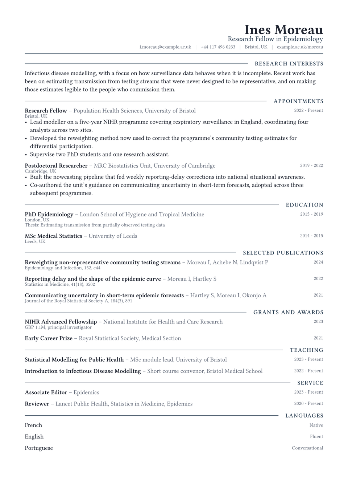

# Meridian CV

The masthead sets flush right. Everything below it sets flush left. That single
asymmetry is the design: the eye lands on the name in the top corner, drops to
the first section label, and then has one straight edge to follow all the way
down. It is a quieter way to give a page a focus than a rule or a filled band.

The rest is conventional, and has to be. A mirrored axis only reads as a
decision when nothing else competes with it.

<div align="center">
  
</div>

## Getting started

**In the Typst app**, open
[the package page](https://typst.app/universe/package/meridian-cv) and choose
*Create project in app*.

**On the command line:**

```sh
typst init @preview/meridian-cv:0.1.0 my-cv
typst compile my-cv/main.typ
```

Meridian is set in **Libertinus Serif**, which ships with Typst, so it compiles
identically everywhere with nothing to install.

## Using it as a package

```typ
#import "@preview/meridian-cv:0.1.0": *

#let accent = "#33475a"

#show: resume.with(
  author: "Ines Moreau",
  font: "Libertinus Serif",
)

#masthead(
  author: "Ines Moreau",
  profession: "Research Fellow in Epidemiology",
  accent-color: accent,
  contact: [i.moreau\@example.ac.uk #h(0.6em) | #h(0.6em) Bristol, UK],
)

#cv-section("Appointments", accent-color: accent)

#meridian-entry(
  title: "Research Fellow",
  subtitle: "Population Health Sciences, University of Bristol",
  dates: "2022 - Present",
  location: "Bristol, UK",
)[
  - Something you did, with the number that makes it land.
]
```

The package exports `resume`, `masthead`, `cv-section`, `meridian-entry` and
`meridian-language`.

`meridian-entry` takes `title`, `subtitle`, `dates`, `location` and `meta`, all
optional, followed by the body. Leave any of them out and the row closes up
rather than leaving a gap, which is what makes it work for publication and grant
lists as well as for jobs: a citation is a title, an author line, a year and a
journal in `meta`, with no body at all.

## Adding a portrait

`masthead` takes an optional `photo`, which fills the empty left side of the
header that the right-aligned stack leaves behind. `photo` takes image bytes, not a path. Typst resolves a bare path string
relative to the file holding the `image()` call, which here is inside the
package, so a string would be looked for in the package directory and not
beside your document. `read` sidesteps that:

```typ
#masthead(
  author: "Ines Moreau",
  photo: read("portrait.jpg", encoding: none),
  photo-size: 2.4cm,
  photo-radius: 50%,
)
```

Set `photo-radius: 0%` for a square crop. With no `photo`, the header renders
the right-aligned stack alone and nothing shifts.

## Customising

| Parameter | Default | Notes |
|---|---|---|
| `accent-color` | `"#33475a"` | The profession line, the section labels and the masthead rule. Pass it to `masthead` and `cv-section`, as the sample does. |
| `font` | `"Libertinus Serif"` | Any installed family. A sans face works, but the mirrored masthead was drawn for a serif. |
| `font-size` | `10.5pt` | The rest of the scale is derived from this. |
| `paper` | `"a4"` | `"us-letter"` also works. |
| `margin` | `1.5cm` | Applied on all four sides. |

## License

The package source is MIT. Everything under `template/`, which is the part you
edit and publish as your own CV, is MIT-0, so nothing has to travel with it.

Maintained by [JobSprout](https://jobsprout.ai), where this design is also
available as a [hosted CV builder](https://jobsprout.ai/resume-templates/meridian).
