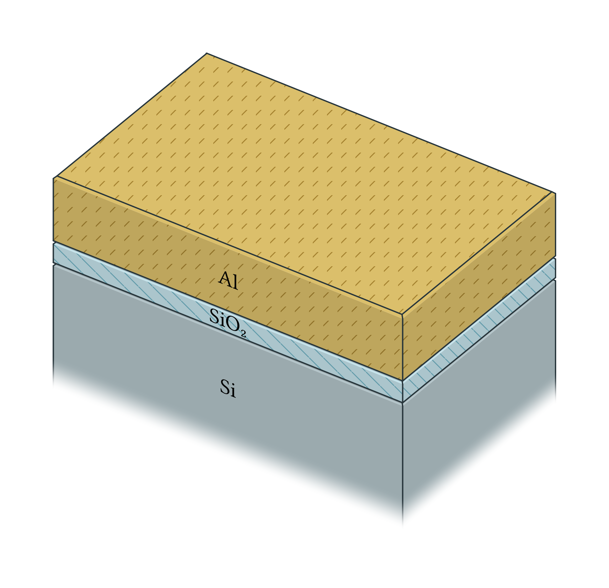
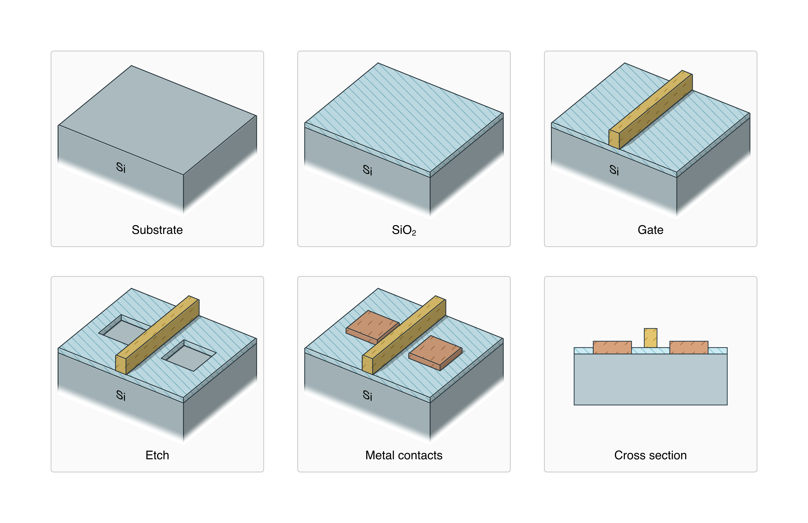

# Mesa

Draw 2D and 3D semiconductor devices and fabrication processes with
[CeTZ](https://github.com/cetz-package/cetz), including patterned geometry
loaded from GDS.

```typ
#import "@preview/mesa:0.4.0" as semi

#set page(width: auto, height: auto, margin: 8mm)

#let sample = {
  import semi: *

  layer(
    "substrate",
    thickness: 30,
    material: "substrate",
    label: [Si],
  )
  layer(
    "oxide",
    thickness: 5,
    material: "dielectric",
    label: [SiO#sub[2]],
  )
  layer(
    "gate",
    thickness: 15,
    material: "metal",
    label: [Al],
  )
}

#semi.layer-stack(
  sample,
  camera: (azimuth: 35deg, elevation: 35deg),
  shading: "fancy",
)
```



GDS layouts can also be used to produce process-flow steps.



## Usage

To use this package you can simply import in your typst document:
```typst
#import "@preview/mesa:0.4.0"

// Your drawing code here
```

It is recommended to start from the various [example](examples) files.
Also see the [usage manual](manual.md) for the complete API reference.

> DISCLAIMER: >80% of Typst code and 100% of Rust code was LLM-written, guided by me at a high level. I'm not fluent in Rust and I couldn't have justified writing this package otherwise. Since this is only a visualization tool, I felt that vibe coding it could be justified. Nonetheless, I have been using it for my own projects and have been happy with the results.

In case of any bugs or missing features, please [open an issue](https://github.com/digiefel/mesa/issues) on GitHub.

## Changelog

### 0.4.0

It is now possible to produce real sloped geometry and conformally deposit
or isotropically etch around it. Etching can undercut or taper sidewalls.
There have been minor changes to the mask, label, and material APIs.

*New features*
- `edge-profile` chamfers or rounds the exposed upper edges of a deposition.
  Later layers and etches follow those slopes. A round profile approximates a
  quarter-circle with `facets` (default `6`).
- `remove` deletes named layers completely, ignoring masks, blockers, and
  depth. You may use it to strip resist layers, for example.
- `etch` accepts `isotropic` for a circular or elliptical lateral etch, or
  `sidewall` for a straight wall angle. Unselected layers stop the etch locally.
  An isotropic etch can wrap around a zero-rate layer without casting an
  anisotropic shadow beneath it.
- `stroke`, `internal-stroke`, and `edge-accent-stroke` can be set per
  material, on the stack, or in the palette.

*API changes*
- The former `bevel` option is now `edge-accent` on the material or stack.
- `mask: none` now covers the complete sample. The previous default,
  `mask: auto`, is no longer accepted.
- Layer style and labels are set on the layer itself: `material` may be a
  dictionary of family, variant, and overrides, and `label` may be a
  dictionary of `draw.content` options. 
- `debug: true` replaces the render with a topology view, or a pieces view
  of a cross-section. `semi.debug.topology` and `semi.debug.section` attach
  a legend.

*Other changes*
- `crease-angle` now defaults to `15deg`.

### 0.3.0

Mesa now supports conformal and planar depositions, arbitrary sidewall coverage,
and selective etching of specified layers only. These operations can be combined
to build more complex vertical devices, trenches, and overhangs.

- `conformal-layer` coats every exposed surface with equal thickness, including
  sidewalls and downward-facing surfaces.
- `layer` can deposit a controlled fraction of its top-surface thickness on
  vertical sidewalls, useful for partially conformal processes.
- `planar-layer` fills topography to a height measured from the substrate,
  suitable for resist and planarization steps.
- `etch` can target named layers. Unselected materials are ignored, allowing
  buried layers to be removed. Depth is now optional: `depth: auto` etches down
  to the substrate. Numeric depths can continue into it and form trenches.
- Transparent materials now work as intended, with proper shadow interactions.
- Improvements to outline stroke and internal/external stroke disambiguation. 
  Coplanar faces of the same material now render as continuous surfaces.
- More performance improvements, around 20× faster in the worst-performing example file.

### 0.2.0

Improved support for larger and more complex GDS layouts.
Paths are now supported, lateral x and y layout dimensions can be
rescaled on import to improve visual presentation clarity, and the renderer
has been improved and optimized to render hundreds of faces within a second.

- GDS `PATH` elements are imported with their widths and end styles. 
  Dense paths may be simplified with `path-tolerance` to optimize document 
  compile times.
- Imported layouts retain their declared physical unit and can be converted to
  nanometres, micrometres, millimetres, or a custom unit. Independent `x` and
  `y` scaling can make large devices legible without changing vertical process
  dimensions, while configurable padding provides room around the layout.
- Fancy shading now projects the actual shape of cast shadows onto receiving
  surfaces. Narrow gates and patterned features can cast "proper" shadows.
  Flat shading does not project shadows, as before.
- Rectangular and patterned layers now share the same rendering path. Lighting,
  bevels, fades, cuts, outlines, and debug views therefore behave consistently
  when both kinds of geometry appear in one sample.
- Complex and finely segmented layouts render more efficiently. `crease-angle`
  was added to visually smooth curves, and rounded stroke caps prevent 
  small gaps where outline segments meet.
- A stack-level `stroke` sets a common exterior-outline style while preserving
  per-layer overrides.
- GDS coordinates now use the file's declared unit by default. A preferred unit
  can be specified and layout coordinates will be converted to it.
- Layouts can be padded to extend the substrate around the mask automatically.

### 0.1.0

Initial release
