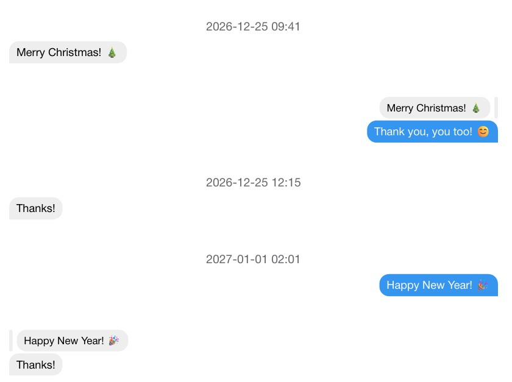

# messēji

A Typst package for typesetting multi-page chat histories, with JSON support.



## Import

```typst
#import "@preview/messeji:0.1.0": messeji, parse-json
```

## Basic Usage

The JSON file has to have the following structure:

```json5
{
  "messages": [
    {
      "date": "2026-12-25T09:41:00",
      "msg": "Merry Christmas! 🎄",
      "from_me": false
    },
    {
      "msg": "Thank you! 😊",
      "ref": "Merry Christmas! 🎄", // Responses to messages have to be duplicated
      "from_me": true
    }
  ]
}
```

Then, you can import the JSON file with `parse-json(path)` and typeset it by calling `messeji`:

```typst
#let parsed-data = parse-json("mychat.json")
#messeji(
  chat-data: parsed-data
)
```

If you don't want to use a JSON file or parse your own filetype, just pass a
list of messages to `messeji`:

```typst
#let my-messages = (
  (
    date: "2024-01-01T12:00:00",
    msg: "This is defined directly in the Typst file.",
    from_me: false,
  ),
  (
    msg: "Nice!",
    from_me: true,
  ),
)
#messeji(
  chat-data: my-messages
)
```

## Known Issues

Currently, there is no support for:

- Image messages
- Custom themes

These issues will likely be fixed in a future release.
