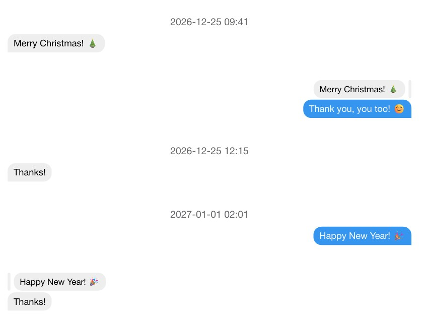

# messēji

_messēji_ is a Typst package for typesetting chat histories in a modern, minimal
design, inspired by popular messengers.



Main features of _messēji_ include:

- Support for quoted messages
- Displaying timestamps between messages
- Simple data model to read from external files (JSON, YAML, ...) if you want to
  typeset very long chat histories

To see how it works, read the short introduction below, or [the messeji user manual](https://github.com/Tanikai/messeji/blob/main/examples/main.pdf) for a more in-depth explanation.

## Import

```typst
#import "@preview/messeji:0.2.0": messeji
```

## Basic Usage

The JSON file just needs to be an array of messages:

```json5
[
  {
    "date": "2026-12-25T09:41:00",
    "msg": "Merry Christmas! 🎄",
    "from_me": false
  },
  {
    "msg": "Thank you! 😊",
    "ref": "Merry Christmas! 🎄", // Responses to messages have to be duplicated
    "from_me": true
  }
]
```

Then, you can import the JSON file with the built-in JSON parser from Typst and
typeset it by calling `messeji`:

```typst
#let parsed-data = json("mychat.json")
#messeji(chat-data: parsed-data)
```

If you don't want to use a JSON file or parse your own filetype, you just have
to pass a list of messages to `messeji`:

```typst
#let my-messages = (
  (
    date: "2024-01-01T12:00:00",
    msg: "This is defined directly in the Typst file.",
    from_me: false,
  ),
  (
    msg: "Nice!",
    from_me: true,
  ),
)
#messeji(chat-data: my-messages)
```

## Theming

You can also customize the appearance of the messages. This is explained in [the messeji user manual](https://github.com/Tanikai/messeji/blob/main/examples/main.pdf).

## Known Issues

Currently, there is no support for:

- Image messages
- Reactions to messages

These issues will likely be fixed in a future release.
