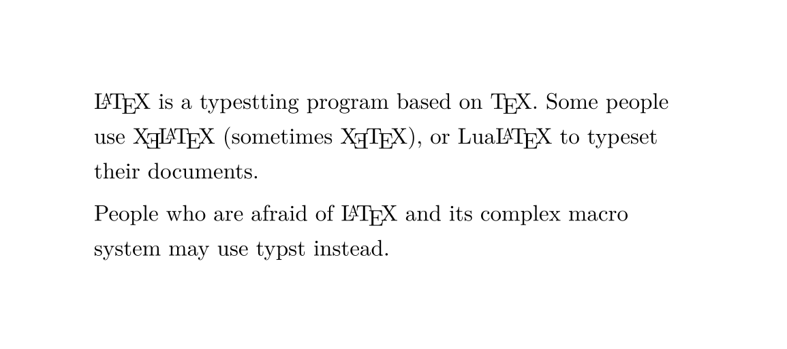

# typst-metalogo

Typeset LaTeX compiler logos in [typst](https://github.com/typst/typst).

## usage

From [./demo.typ](./demo.typ):

```typ
#import "@preview/metalogo:1.0.2": TeX, LaTeX, XeLaTeX, XeTeX, LuaLaTeX

#LaTeX is a typestting program based on #TeX. Some people use #XeLaTeX
(sometimes #XeTeX), or #LuaLaTeX to typeset their documents.

People who are afraid of #LaTeX and its complex macro system may use typst
instead.
```

Output:



