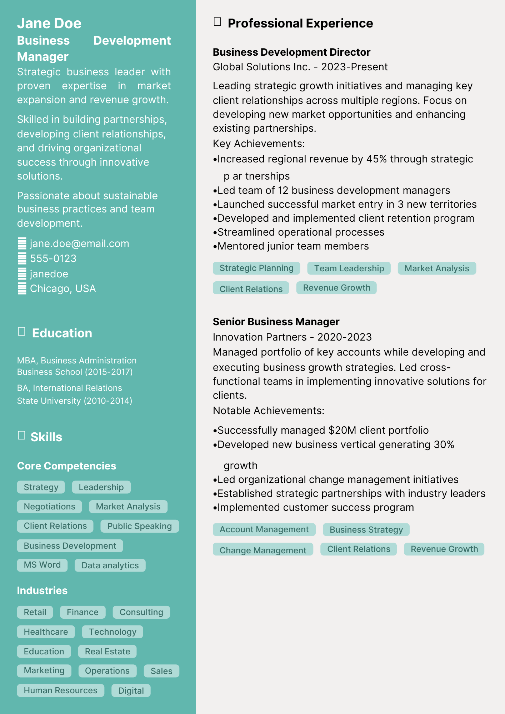

# Metronic Resume Template

A Typst template for a slick and professional looking resume.
Check out the [full example](./template/main.typ) to create your first resume.



## Getting started

Start by importing the template into your Typst project:

```typst
#import "@preview/metronic:1.0.0": *
```

You can now call the `resume-page` function to generate a resume page:

```typst
#import "@preview/metronic:1.0.0": *

#show: resume-page.with(
  sidebar: [
    = Jane Doe

    #medium("Business Development Manager")

    #v(5pt)

    Strategic business leader with proven expertise in market expansion and revenue growth.

    Skilled in building partnerships, developing client relationships, and driving organizational success through innovative solutions.

    Passionate about sustainable business practices and team development.

    #v(5pt)

    #contact(
      phone: "555-0123",
      linkedin: "janedoe",
      email: "jane.doe@email.com",
      location: "Chicago, USA"
    )
  ]
)

// The body of your resume goes here
```

For the body, a `#section` component is available to add sections with icons. eg:

```typst
#section(icon: "briefcase", "Professional Experience")[
  === Business Development Director
  Global Solutions Inc. - 2023-Present

  Leading strategic growth initiatives and managing key client relationships across multiple regions.
  Focus on developing new market opportunities and enhancing existing partnerships.
]
```

## Fonts

This template uses FontAwesome icons. For icons to work properly, please include the ttf files into your project directory.

You can download them here: [FontAwesome](https://fontawesome.com/v6/download)

## Multi-page resume

This template supports multi-page resumes. To achieve this, you simply need to make multiple calls to the `resume-page` function.

For this to work, you will need to avoid using the `#show` directive (which wraps the entire body of the document).

Here's an example of a multi-page resume:

```typst
#import "@preview/metronic:1.0.0": *

#resume-page(
  sidebar: [
    == Sidebar content
  ]
])[
  == First Page Content
]

// We render the second page without a sidebar
#resume-page()[
  == Second Page Content
]

#resume-page()[
  == Third Page Content
]
```

## Theming

The template supports selection of 2 main colors:

- `accent-color`
- `background-color`

You can set that by calling the `#theme` function at the top of your document:

Note: text color is automatically detected based on those colors.

```typst
#import "@preview/metronic:1.0.0": *

#theme(
  accent-color: rgb("61B7AE"),
  background-color: rgb("F2F0EF"),
)

#show: resume-page.with(
  sidebar: [
    // content
  ]
)

// content
```

## Usefule components

### `#section`

The `#section` component is used to add sections with icons. It takes 2 arguments:

- `icon`: the icon to display
- `title`: the title of the section

```typst
#section(icon: "briefcase", "Professional Experience")[
  === Business Development Director
  Global Solutions Inc. - 2023-Present

  Leading strategic growth initiatives and managing key client relationships across multiple regions.
  Focus on developing new market opportunities and enhancing existing partnerships.
]
```

### `#contact`

The `#contact` component is used to display contact information. It takes 5 optional arguments:

- `phone`: the phone number
- `linkedin`: the linkedin username
- `email`: the email address
- `location`: the location
- `github`: the github username

```typst
#contact(
  phone: "555-0123",
  linkedin: "janedoe",
  email: "jane.doe@email.com",
  location: "Chicago, USA"
)
```

### `#tags`

The `#tags` component is used to display a list of tags. We use these for listing skills.

```typst
  #tags(
    "Strategic Planning",
    "Team Leadership",
    "Market Analysis",
    "Client Relations",
    "Revenue Growth"
  )
```
