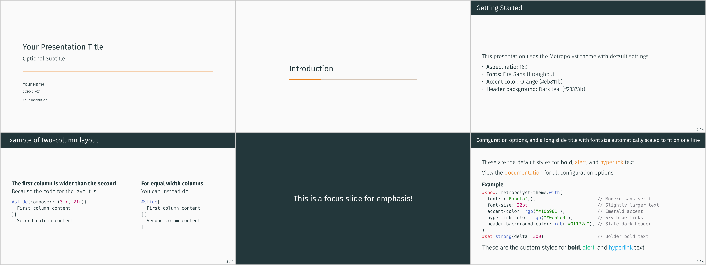

# Metropolyst Theme

A highly configurable variant of the [Metropolis theme](https://touying-typ.github.io/docs/themes/metropolis/) for [Touying](https://github.com/touying-typ/touying) presentations in Typst. This theme allows for many font and color options, while still maintaing compatibility with the original [Metropolis beamer theme](https://github.com/matze/mtheme).



## Installation

### From Typst Universe (Recommended)

Use the package directly in your document:

```typst
#import "@preview/metropolyst:0.1.0": metropolyst-theme, brands
```

### Using the Template

Initialize a new project with the template:

```bash
typst init @preview/metropolyst:0.1.0
```

## Slide Types

Metropolyst provides four slide types:

### Title Slide

```typst
#title-slide()
// or with extra information:
#title-slide(extra: [Conference Name 2025])
```

Creates the opening slide with title, subtitle, author, date, institution, and optional logo. Configure the content using `config-info()`.

### Content Slide

```typst
#slide[
  = Slide Title
  Your content here...
]
```

Standard slide with header showing the slide title, footer with slide counter, and your content.

### Section Slide

```typst
== Section Name
```

Automatically creates a section divider slide when you use a level-2 heading. Shows the section name with a progress bar.

### Focus Slide

```typst
#focus-slide[
  *Key Message*
]
```

High-contrast slide with dark background and light text. Use for important messages or transitions.

---

## Configuration Reference

All options are passed to `metropolyst-theme.with(...)`.

### Layout and Structure

| Parameter | Default | Description |
|-----------|---------|-------------|
| `aspect-ratio` | `"16-9"` | Slide aspect ratio (`"16-9"` or `"4-3"`) |
| `align` | `horizon` | Vertical content alignment (`horizon`, `top`, `bottom`) |
| `footer-progress` | `false` | Show progress bar at bottom of slides |
| `header` | *current heading* | Header left content (content or `self => content`) |
| `header-right` | *logo* | Header right content |
| `footer` | `none` | Footer left content |
| `footer-right` | *slide counter* | Footer right content |

### Font Options

Fonts cascade: set `font` to change all fonts, or override specific elements. All `*-font` options default to `auto` (inherit from `font`).

```typst
#show: metropolyst-theme.with(
  font: ("Libertinus Serif",),  // Base font
  header-font: ("Fira Sans",),  // Override for headers
)
```

| Parameter | Default | Description |
|-----------|---------|-------------|
| `font` | `("Fira Sans",)` | Base font family (inherited by all `*-font` options) |
| `header-font` | `auto` | Slide header font |
| `header-size` | `1.2em` | Slide header size |
| `header-weight` | `"regular"` | Slide header weight |
| `footer-font` | `auto` | Footer font |
| `footer-size` | `0.6em` | Footer size |
| `footer-weight` | `"regular"` | Footer weight |
| `title-font` | `auto` | Title slide title font |
| `title-size` | `1.4em` | Title slide title size |
| `title-weight` | `"regular"` | Title slide title weight |
| `subtitle-size` | `1.0em` | Subtitle size |
| `subtitle-weight` | `"light"` | Subtitle weight |
| `author-size` | `0.8em` | Author size |
| `author-weight` | `"light"` | Author weight |
| `date-size` | `0.8em` | Date size |
| `date-weight` | `"light"` | Date weight |
| `institution-size` | `0.8em` | Institution size |
| `institution-weight` | `"light"` | Institution weight |
| `extra-size` | `0.8em` | Extra text size (`#title-slide(extra: [...])`) |
| `extra-weight` | `"light"` | Extra text weight |
| `logo-size` | `2em` | Logo size |
| `section-font` | `auto` | Section slide font |
| `section-size` | `1.4em` | Section slide size |
| `section-weight` | `"regular"` | Section slide weight |
| `focus-font` | `auto` | Focus slide font |
| `focus-size` | `1.4em` | Focus slide size |
| `focus-weight` | `"regular"` | Focus slide weight |

### Color Options

Colors cascade: `accent-color` affects links, separators, and progress bars when they're set to `auto`. Background colors have independent defaults.

```typst
#show: metropolyst-theme.with(
  accent-color: rgb("#e63946"),        // Affects links, separators, progress bars
  hyperlink-color: rgb("#0077b6"),     // Override just links
)
```

| Parameter | Default | Inherits | Description |
|-----------|---------|----------|-------------|
| `accent-color` | `rgb("#eb811b")` | — | Primary accent for `#alert[...]` text |
| `hyperlink-color` | `auto` | `accent-color` | Link color |
| `line-separator-color` | `auto` | `accent-color` | Title slide separator line |
| `progress-bar-color` | `auto` | `accent-color` | Progress bar foreground |
| `progress-bar-background` | `rgb("#d6c6b7")` | — | Progress bar background |
| `header-background-color` | `rgb("#23373b")` | — | Slide header background |
| `focus-background-color` | `auto` | `header-background-color` | Focus slide background |
| `main-background-color` | `rgb("#fafafa")` | — | Slide, title, and section background |
| `main-text-color` | `rgb("#23373b")` | — | Body text, title, and section text |
| `header-text-color` | `auto` | `main-background-color` | Slide header text |
| `focus-text-color` | `auto` | `main-background-color` | Focus slide text |
| `footer-text-color` | `auto` | `main-text-color` | Slide footer text |

---

## Brands

Brands are preset configurations that apply organizational styling with a single setting. Use the spread operator (`..`) to apply a brand:

```typst
#import "@preview/metropolyst:0.1.0": metropolyst-theme, brands

#show: metropolyst-theme.with(..brands.EPI)
```

### Built-in Brands

| Brand | Description |
|-------|-------------|
| `EPI` | Economic Policy Institute branding (Roboto font, red accent `#C01F41`, dark blue header `#063957`, no page counter) |

### Combining Brands with Overrides

You can apply a brand and then override specific settings:

```typst
#show: metropolyst-theme.with(
  ..brands.EPI,
  footer-progress: true,  // Add progress bar to EPI brand
)
```

### Defining Your Own Brands

Create custom brands as dictionaries in your own file:

```typst
// my-brands.typ
#let brands = (
  "my-company": (
    accent-color: rgb("#ff0000"),
    header-background-color: rgb("#333333"),
    font: ("Roboto",),
  ),
)
```

Then import and use:

```typst
#import "@preview/metropolyst:0.1.0": metropolyst-theme
#import "my-brands.typ": brands

#show: metropolyst-theme.with(..brands.my-company)
```

Or define inline:

```typst
#let my-brand = (
  accent-color: rgb("#0066cc"),
  footer-right: none,
)

#show: metropolyst-theme.with(..my-brand)
```

---

## Quick Start

```typst
#import "@preview/metropolyst:0.1.0": metropolyst-theme, brands

#show: metropolyst-theme.with(
  config-info(
    title: [Your Title],
    subtitle: [Your Subtitle],
    author: [Your Name],
    date: datetime.today(),
    institution: [Your Institution],
  ),
)

#set text(font: "Fira Sans", weight: "light", size: 20pt)
#set strong(delta: 100)

#title-slide()

== Section Title

#slide[
  = Slide Title
  Your content here...
]
```

---

## Presentation Info

Set presentation metadata using `config-info()`:

```typst
#show: metropolyst-theme.with(
  config-info(
    title: [Presentation Title],
    subtitle: [Optional Subtitle],
    author: [Author Name],
    date: datetime.today(),
    institution: [Organization],
    logo: emoji.rocket,  // or an image
  ),
)
```

---

## Font Installation

For best results, install the Fira Sans font family:

**Linux:**
```bash
# Ubuntu/Debian
sudo apt install fonts-fira-sans

# Or download from GitHub
wget https://github.com/mozilla/Fira/archive/refs/heads/master.zip
unzip master.zip
sudo cp Fira-master/ttf/*.ttf /usr/share/fonts/truetype/
fc-cache -fv
```

**macOS:**
```bash
brew install --cask font-fira-sans
```

**Windows:**
Download from [Google Fonts](https://fonts.google.com/specimen/Fira+Sans) and install.

---

## Examples

- [example-default.typ](https://github.com/benzipperer/metropolyst/blob/v0.1.0/examples/example-default.typ) ([PDF](https://github.com/benzipperer/metropolyst/blob/v0.1.0/examples/example-default.pdf)) - Minimal example using default settings
- [example-custom.typ](https://github.com/benzipperer/metropolyst/blob/v0.1.0/examples/example-custom.typ) ([PDF](https://github.com/benzipperer/metropolyst/blob/v0.1.0/examples/example-custom.pdf)) - Comprehensive example demonstrating all configuration options
- [example-epi.typ](https://github.com/benzipperer/metropolyst/blob/v0.1.0/examples/example-epi.typ) ([PDF](https://github.com/benzipperer/metropolyst/blob/v0.1.0/examples/example-epi.pdf)) - Example using the built-in EPI brand preset

---

## Credits

- Tries to copy [Matthias Vogelgesang's Beamer Metropolis theme](https://github.com/matze/mtheme)
- Based on the [Touying Metropolis theme](https://touying-typ.github.io/docs/themes/metropolis/) by @Enivex
- Built for the [Touying](https://github.com/touying-typ/touying) presentation framework

## License

MIT License. See [LICENSE](LICENSE) for details.
