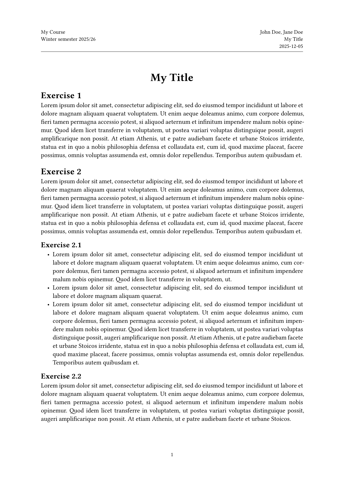

# minicise

minicise provides a minimal exercise sheet template with a simple header and title. It is based on [grape-suite](https://github.com/piepert/grape-suite/)'s exercise sheet template.

## Usage

```typst
#import "@preview/minicise:0.1.0": sheet

#show: sheet.with(
  title: "My Title",
  course: "My Course",
  author: "John Doe, Jane Doe",
  date: "2025-12-05",
  semester: "Winter semester 2025/26"
)

= Exercise 1

...
```

The code above produces something like the following:



## Documentation

The following variables can be used to change the information displayed in the header:

| variable           | usage                                                                                                            |
|--------------------|------------------------------------------------------------------------------------------------------------------|
| `title`            | default: `none`. A title, appears in large text at the document's beginning.                                     |
| `document-title`   | default: `none`. The document's title, displayed in the header. If `none`, the value of `title` is used instead. |
| `course`           | default: `none`. The name of the course, appears in the header.                                                  |
| `semester`         | default: `none`. The current semester, appears in the header.                                                    |
| `author`           | default: `none`. The document's author(s), appears in the header.                                                |
| `date`             | default: `none`. The date, appears in the header.                                                                |
| `show-header-line` | default: `true`. Whether to show a line between the header and the page's content.                               |

