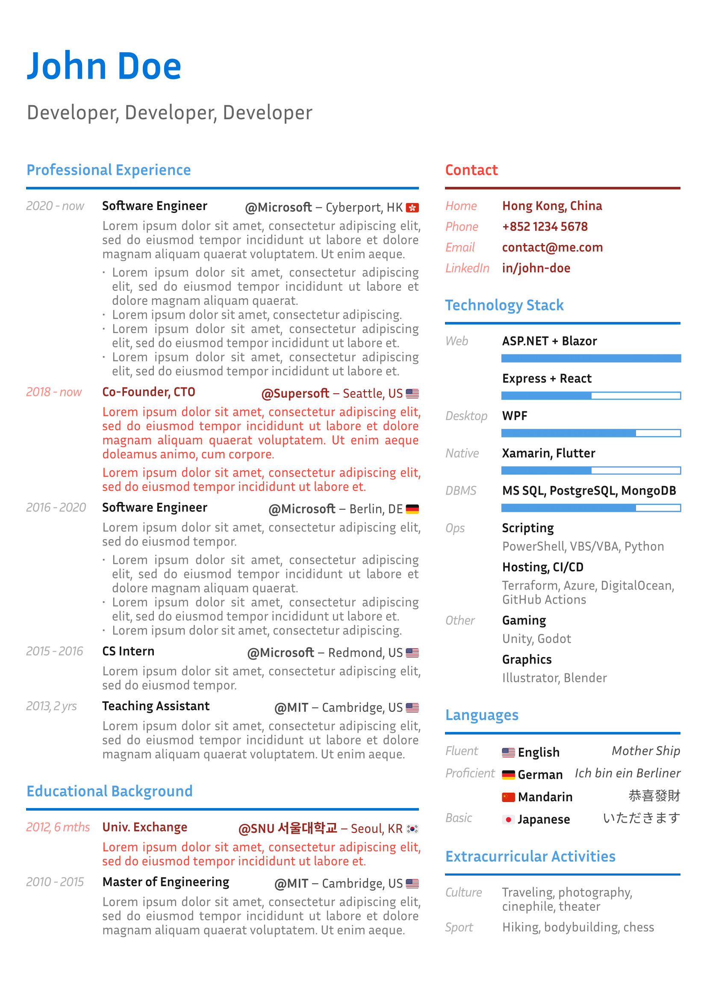

# Minimal-CV

Yet another John Doe CV.

<a href="thumbnail.png">
    
</a>

A Typst CV template that aims for :
- Clean aesthetics
- Easy customizability


## Usage

### From Typst app

Create a new project based on the template [minimal-cv](https://typst.app/universe/package/minimal-cv).

### Locally

The default font is ["Inria Sans"](https://fonts.google.com/specimen/Inria+Sans). Make sure it is installed on your system, or change it in [# Theme](#theme).

Copy the [template](https://raw.githubusercontent.com/lelimacon/typst-minimal-cv/main/template/cv.typ) to your Typst project.

### From a blank project

Import the library :

```typst
#import "@preview/minimal-cv:0.1.0": *
```

Show the root `cv` function :

```typst
#show: cv.with(
  theme: (),
  title: "YOUR NAME",
  subtitle: "YOUR POSITION",
  aside: [
    ASIDE CONTENT
  ]

MAIN CONTENT
```

Several content functions are available.

**Section**

```typst
#section(
  theme: (),
  "TITLE_CONTENT",
  "BODY_CONTENT",
)
```

**Entry**

```typst
#entry(
  theme: (),
  right: "FLOATING_CONTENT",

  "GUTTER_CONTENT",
  "TITLE_CONTENT",
  "BODY_CONTENT",
)
```

**Progress bar**

```typst
#progress-bar(50%)
```

## Theme

Customize the theme by specifying the `theme` parameter and overriding 1 or more keys.

### Function `cv`

| Key | Type | Default
| --- | ---- | -------
| `margin` | relative | `22pt`
| `font` | relative | `"Inria Sans"`
| `font-size` | relative | `11pt`
| `accent-color` | color | `blue`
| `body-color` | color | `rgb("222")`
| `header-accent-color` | color | inherit
| `header-body-color` | color | inherit
| `main-accent-color` | color | inherit
| `main-body-color` | color | inherit
| `main-width` | relative | `5fr`
| `main-gutter-width` | relative | `64pt`
| `aside-accent-color` | color | inherit
| `aside-body-color` | color | inherit
| `aside-width` | relative | `3fr`
| `aside-gutter-width` | relative | `48pt`

### Function `section`

| Key | Type | Default
| --- | ---- | -------
| `gutter-size` | color | inherit
| `accent-color` | color | inherit
| `body-color` | color | inherit

### Function `entry`

| Key | Type | Default
| --- | ---- | -------
| `gutter-size` | color | inherit
| `accent-color` | color | inherit
| `body-color` | color | inherit
