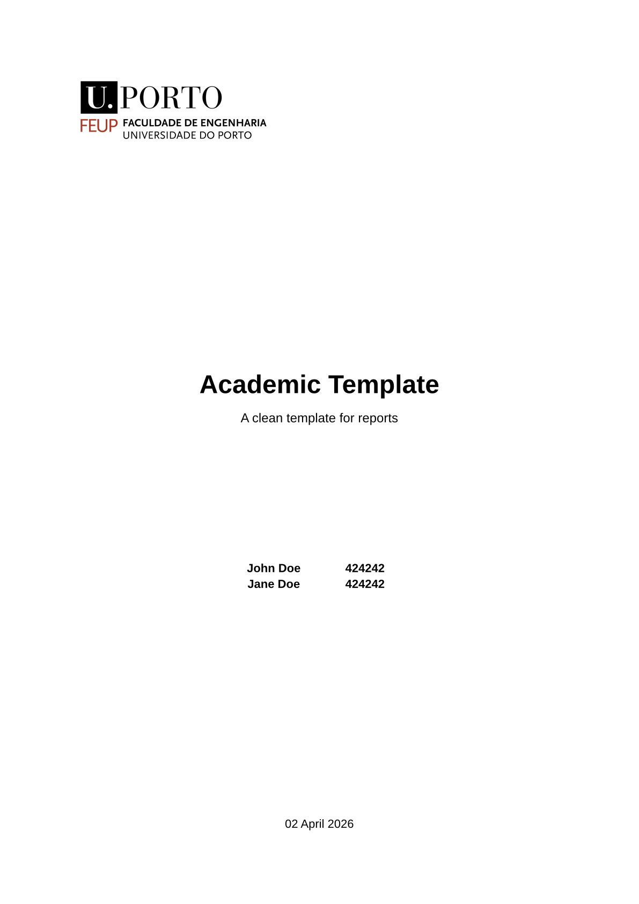
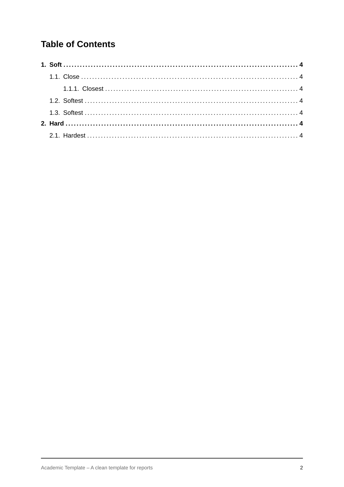
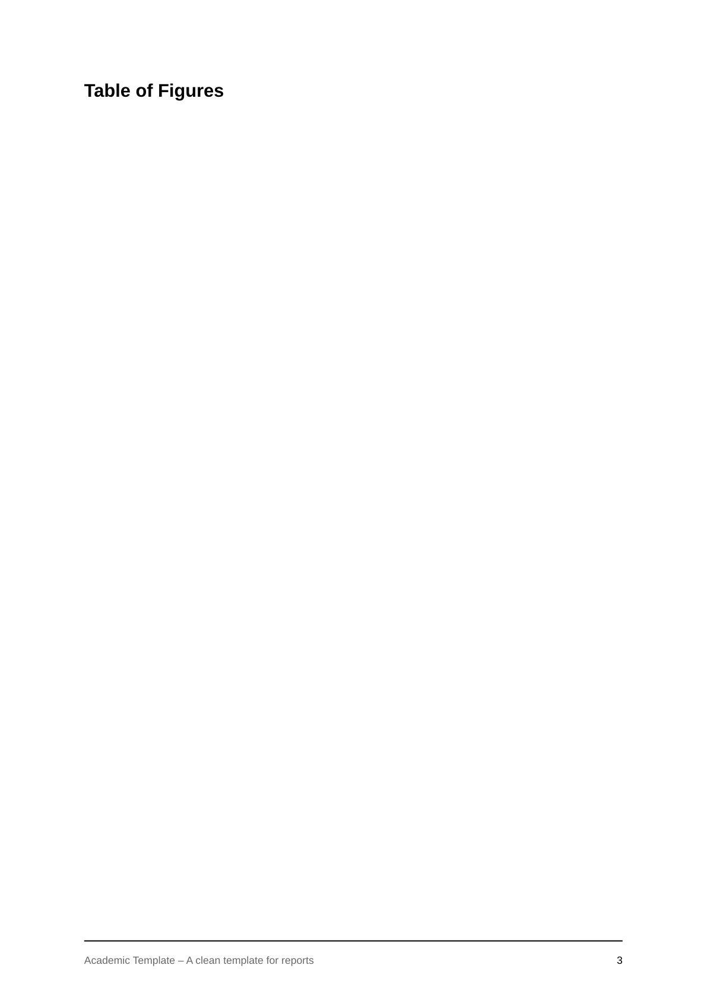
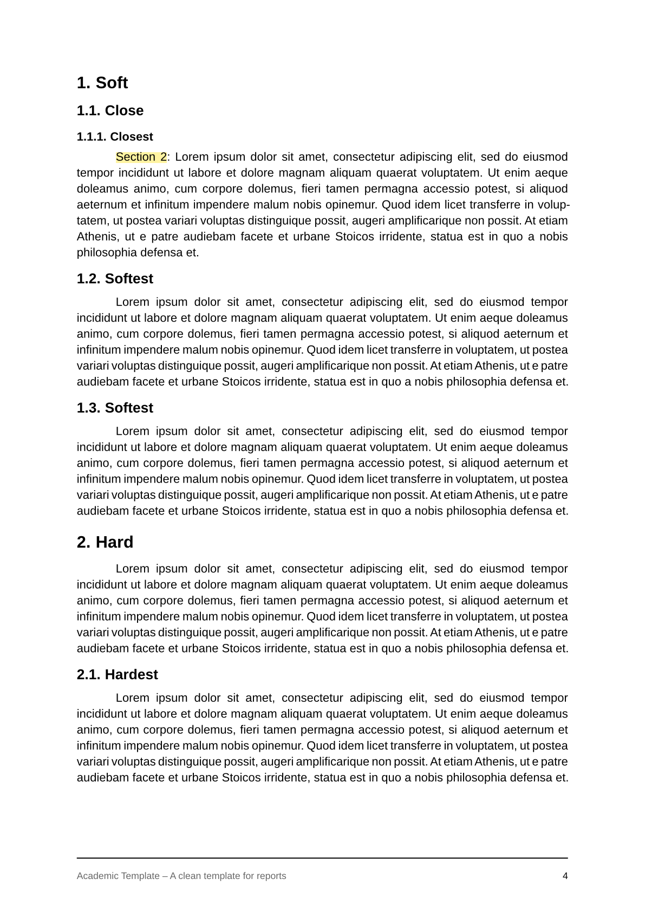

# minimalyst-academic-report

This template is a modified version of [klaro-ifsc-sj](https://github.com/gabrielluizep/klaro-ifsc-sj) by [gabrielluizep](https://github.com/gabrielluizep/)

A *minimalyst* template for clean and organized academic reports.

Feel free to open issues in the repository!

## What does it look like?

| Cover                                 | Table of Contents                         | Table of Figures                         | Content                               |
|---------------------------------------|-------------------------------------------|------------------------------------------|---------------------------------------|
|  |  |  |  |

## Usage

You can use this template in the Typst web app by clicking "Start from template"
on the dashboard and searching for `minimalyst-academic-report`.

Alternatively, you can use the CLI to pull this project using the command
```
typst init @preview/minimalyst-academic-report
```

Typst will create a new directory with all the files needed to get you started and the template will be in its newest version.

## Configuration

This template exports the `report` function with the following named arguments:

- `title`: The report's title as string. This is displayed at the center of the cover page.
- `subtitle`: The report's subtitle as string. This is displayed below the title at the cover page. It is an optional parameter.
- `authors`: The array of pairs *(name, number)* of authors. Each author is displayed on a separate line at the cover page. It is mandatory to have at least 1 author and only *name* is mandatory. The *number* parameter can be useful to show your student number.
- `font`: Font to be used in the report. Since it is an optional parameter, if none is passed it fallsback to *Liberation Sans* or *Libertinus Serif*, depending on [`sans` flag](#param-sans)
- `font-size`: Font size to be used in the report text (headings are not included in this). Default is *11pt*.
- `lang`: Languague in which the document is written. Default is *en*.
- `date`:  The date of the last revision of the report as a string. This is displayed at the bottom of the cover page. It is an optional parameter.
- <a id="param-sans"></a>`sans`: A flag that determines if you want to use a *sans-serif* font or a *serif* font. Only applicable if no preferred font is passed. Default is *true*.
- `cover-image`: An *image()* object to determine the image that will be showcased in the cover. Useful for putting your university logo. You most likely will need to use the *width* parameter to fix the image size. It is an optional parameter.
- `paper`: Paper format to output the document. Default is *a4*.
- `line-spacing`: Determine the space between lines. Default is *1*.
- `table-of-contents`: A Flag to determine whether the author wants a Table of Contents or not. Default is *true*.
- `table-of-figures`: A Flag to determine whether the author wants a Table of Figures or not. Default is *false*.
