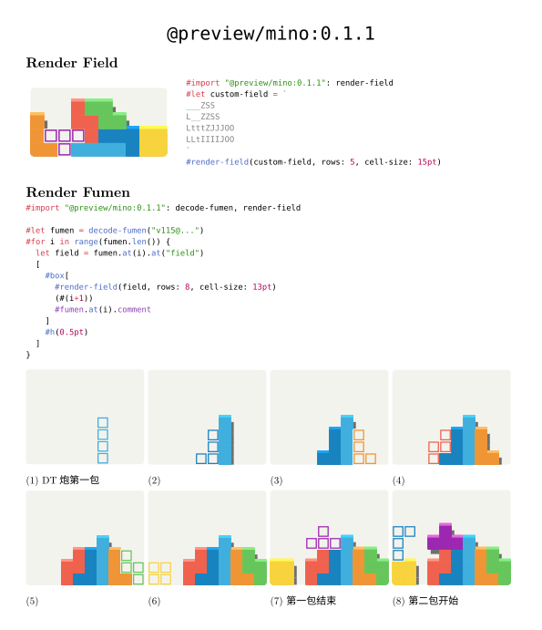

# [Mino](https://github.com/Enter-tainer/mino)

Render tetris [fumen](https://harddrop.com/fumen/) in typst!




````typ
#import "typst-package/lib.typ": decode-fumen, render-field
// Uncomment the following line to use the mino from the official package registry
// #import "@preview/mino:0.1.1": decode-fumen, render-field
#set page(margin: 1.5cm)

#align(center)[
  #text(size: 25pt)[
    DT Cannon
  ]
]

#let fumen = decode-fumen("v115@vhPJHYaAkeEfEXoC+BlvlzByEEfE03k2AlP5ABwfAA?A+rQAAqsBsqBvtBTpBVhQeAlvlzByEEfE03k2AlP5ABwvDf?E33ZBBlfbOBV5AAAOfQeAlvlzByEEfE03+2BlP5ABwvDfEV?5k2AlPJVBjzAAA6WQAAzdBpeB0XBXUBFlQnAlvlzByEEfE0?3+2BlP5ABwvDfEXhWEBUYPNBkkuRA1GCLBUupAAdqQnAlvl?zByEEfE038UBlP5ABwvDfEXhWEBUYPNBkkuRA1GCLBU+rAA?AAPAA")

#for i in range(fumen.len()) {
  let field = fumen.at(i).at("field")
  [
    #box[
      #render-field(field, rows: 8, cell-size: 13pt) 
      (#(i+1))
      #fumen.at(i).comment
    ]
    #h(0.5pt)
  ]
}

````

## Documentation

### `decode-fumen`

Decode a fumen string into a series of pages.

#### Arguments

* `data`: `str` - The fumen string to decode

#### Returns

The pages, of type `Array<{ field: Array<string, 20>, comment: string }>`.

```
(
  (
    field: (
      "....",
      "....",
      ...
    ),
    comment: "..."
  ),
  ...
)
```

### `render-field`

#### Arguments

* `field`: `array` of `str` - The field to render
* `rows`: `number` - The number of rows to render, default to `20`
* `cell-size`: `length` - The size of each cell, default to `10pt`
* `bg-color`: `color` - The background color, default to `#f3f3ed`
* `stroke`: The stroke for the field, default to `none`
* `radius`: The border radius for the field, default to `0.25 * cell-size`
* `shadow`: Whether to show shadow for cells, default to `true`
* `highlight`: Whether to highlight cells, default to `true`
* `color-data`: The color data for the field, default to `default-color-data`: 
* `overdraw`: (default, 5) Draw each cell multiple times to avoid thin lines between cells. See https://github.com/linebender/vello/issues/49
```typst
#let default-color = (
  "Z": rgb("#ef624d"),
  "S": rgb("#66c65c"),
  "L": rgb("#ef9535"),
  "J": rgb("#1983bf"),
  "T": rgb("#9c27b0"),
  "O": rgb("#f7d33e"),
  "I": rgb("#41afde"),
  "X": rgb("#686868")
)
```
* `highlight-color-data`: The highlight color data for the field, default to `default-highlight-color`: 
```typst
#let default-highlight-color = (
  "Z": rgb("#ff9484"),
  "S": rgb("#88ee86"),
  "L": rgb("#ffbf60"),
  "J": rgb("#1ba6f9"),
  "T": rgb("#e56add"),
  "O": rgb("#fff952"),
  "I": rgb("#43d3ff"),
  "X": rgb("#949494")
)
```
* `shadow-color`: The shadow color for the field, default to `#6f6f6f17`

### Credit

The styles and color scheme are inspired by four.lol
