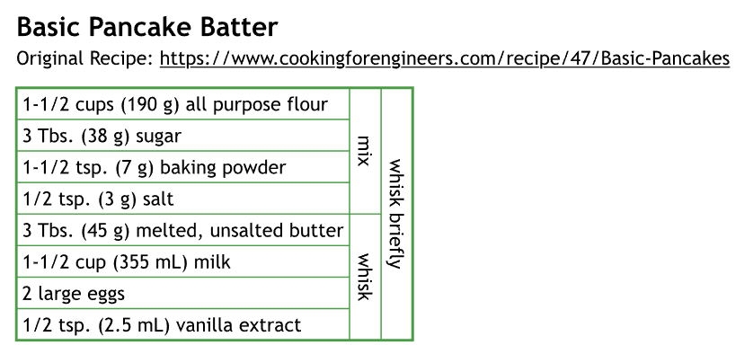

# mise-en-place

[](https://notbyai.fyi/)

A [Typst](https://typst.app/) package for creating cooking recipe diagrams based on the recipes found in [Cooking For Engineers](https://www.cookingforengineers.com/).

See [`example.typ`](./example.typ) for an easy to digest example (and also my favorite recipe).

## Usage

```typ
#import "@preview/mise-en-place:0.1.0": ingredient, recipe, step
```

To create a recipe, declare ingredients using the `ingredient()` function inside `recipe()`. Use the `step(combine: n)` function to combine `n` last ingredients into a single item. The content of the `step()` function will be displayed to the right of the ingredients in a new cell. New columns will be automatically inserted as needed. 

```typ
= Basic Pancake Batter
Original Recipe: https://www.cookingforengineers.com/recipe/47/Basic-Pancakes

#recipe(
  columns: (auto, auto, auto),
  ingredient[1-1/2 cups (190 g) all purpose flour],
  ingredient[3 Tbs. (38 g) sugar],
  ingredient[1-1/2 tsp. (7 g) baking powder],
  ingredient[1/2 tsp. (3 g) salt],
  step(combine: 4, vertical: true)[mix],
  ingredient[3 Tbs. (45 g) melted, unsalted butter],
  ingredient[1-1/2 cup (355 mL) milk],
  ingredient[2 large eggs],
  ingredient[1/2 tsp. (2.5 mL) vanilla extract],
  step(combine: 4, vertical: true)[whisk],
  step(combine: 2, vertical: true)[whisk briefly],
)
```

The code block above produces the following output:



### Documentation

### `recipe()`

| **Argument** | **Type** | **Description** |
|:---:|:---:|---|
| `..args` | - | List of positional arguments that make up the recipe. Each item must be either an `ingredient` or a `step`, else the function will panic. |
| `columns` | `array` | Array of `length` that specifies the width of each column in the recipe table. Defaults to `auto` for first column and `1fr` for all others. |

### `ingredient()`

| **Argument** | **Type** | **Description** |
|:---:|:---:|---|
| `value` | `content` (positional) | Body of the cell in the table. |
| `rowspan` | `int` | The amount of rows that this ingredient will take up. Defaults to `1`. |

### `step()`

| **Argument** | **Type** | **Description** |
|:---:|:---:|---|
| `value` | `content` (positional) | Body of the cell in the table. |
| `combine` | `int` | The amount of ingredients to be combined into a new ingredient on top of the "stack".<br>Will panic if there are not enough ingredients in the "stack" to combine. <br>Ingredient rowspan has no effect on this function and will not be counted multiple times.<br><br>Providing `0` before any ingredients were added to the "stack" will cause the step to span the entire width of the table.<br>This is useful when declaring steps to be done before cooking such as preheating the oven. <br><br>Defaults to `1`. |
| `vertical` | `bool` | Rotates the body of the cell 90 degrees clockwise when `true`. Defaults to `false`. |

### Notes

- This package is silly and not 100% tested, there will be bugs. Please reach out and create an issue if you find any!
- Both feedback and PRs are welcome, but please do not submit AI generated content.