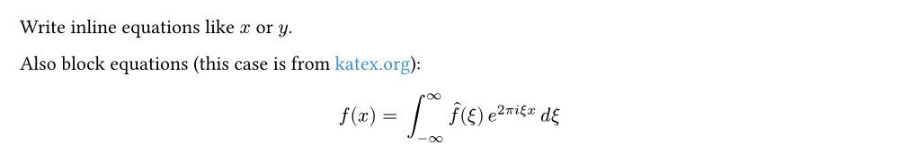

# [MiTeX](https://github.com/OrangeX4/mitex)

**[LaTeX](https://www.latex-project.org/) support for [Typst](https://typst.app/), powered by [Rust](https://www.rust-lang.org/) and [WASM](https://webassembly.org/).**

[MiTeX](https://github.com/OrangeX4/mitex) processes LaTeX code into an abstract syntax tree (AST). Then it transforms the AST into Typst code and evaluates code into Typst content by `eval` function.

MiTeX has been proved to be practical on a large project. It has already correctly converted 32.5k equations from [OI Wiki](https://github.com/OI-wiki/OI-wiki). Compared to [texmath](https://github.com/jgm/texmath), MiTeX has a better display effect and performance in that wiki project. It is also more easy to use, since importing MiTeX to Typst is just one line of code, while texmath is an external program.

In addition, MiTeX is not only **SMALL** but also **FAST**! MiTeX has a size of just about 185 KB, comparing that texmath has a size of 17 MB. A not strict but intuitive comparison is shown below. To convert 32.5k equations from OI Wiki, texmath takes about 109s, while MiTeX WASM takes only 2.28s and MiTeX x86 takes merely 0.085s.

Thanks to [@Myriad-Dreamin](https://github.com/Myriad-Dreamin), he completed the most complex development work: developing the parser for generating AST.

## Usage

- Use `mitex-convert` to convert LaTeX code into Typst code in string.
- Use `mi` to embed an inline LaTeX equation into Typst.
- Use `mitex` to embed a block LaTeX equation into Typst.

Following is a simple example of using MiTeX in Typst:

```typst
#import "@preview/mitex:0.1.0": *

#assert.eq(mitex-convert("\alpha x"), "alpha  x ")

Write inline equations like #mi("x") or #mi[y].

Also block equations (this case is from #text(blue.lighten(20%), link("https://katex.org/")[katex.org])):

#mitex(`
  f(x) = \int_{-\infty}^\infty
    \hat f(\xi)\,e^{2 \pi i \xi x}
    \,d\xi
`)
```



## Implemented Features

- [x] LaTeX equations support.
- [x] Coloring commands (`\color{red} text`, `\textcolor{red}{text}`).
- [x] Support for various environments, such as aligned, matrix, cases.

## Features to Implement

- [ ] User-defined commands (specification), such as `\newcommand{\mysym}{\alpha}` or bind `\newcommand{\myop}[1]{\operatorname{#1}}` to a typst's native function `let myop(it) = op(upright(it))`.
- [ ] "usepackage" support, which means that you can change set of commands by telling MiTeX to use a list of packages.
- [ ] Text mode support, enabling the rendering entire LaTeX documents in Typst!

## Differences between MiTeX and other solutions

MiTeX has different objectives compared to [texmath](https://github.com/jgm/texmath) (a.k.a. [pandoc](https://pandoc.org/)):

- MiTeX focuses on rendering LaTeX content correctly within Typst, leveraging the powerful programming capabilities of WASM and typst to achieve results that are essentially consistent with LaTeX display.
- texmath aims to be general-purpose converters and generate strings that are more human-readable.

For example, MiTeX transforms `\frac{1}{2}_3` into `frac(1, 2)_3`, while texmath converts it into `1 / 2_3`. The latter's display is not entirely correct, whereas the former ensures consistency in display.

Another example is that MiTeX transforms `(\frac{1}{2})` into `\(frac(1, 2)\)` instead of `(frac(1, 2))`, avoiding the use of automatic Left/Right to achieve consistency with LaTeX rendering.

**Certainly, the greatest advantage is that you can directly write LaTeX content in Typst without the need for manual conversion!**

## Submitting Issues

If you find missing commands or bugs of MiTeX, please feel free to submit an issue [here](https://github.com/OrangeX4/mitex/issues).

## Contributing to MiTeX

Currently, MiTeX maintains following three parts of code:

- A TeX parser library written in **Rust**, see [mitex-lexer](https://github.com/OrangeX4/mitex/tree/main/crates/mitex-lexer) and [mitex-parser](https://github.com/OrangeX4/mitex/tree/main/crates/mitex-parser).
- A TeX to Typst converter library written in **Rust**, see [mitex](https://github.com/OrangeX4/mitex/tree/main/crates/mitex).
- A list of TeX packages and comamnds written in **Typst**, which then used by the typst package, see [MiTeX Command Specification](https://github.com/OrangeX4/mitex/tree/main/packages/mitex/specs).

For a translation process, for example, we have:

```
\frac{1}{2}

===[parser]===> AST ===[converter]===>

#eval("$frac(1, 2)$", scope: (frac: (num, den) => $(num)/(den)$))
```

You can use the `#mitex-convert()` function to get the Typst Code generated from LaTeX Code.

### Add missing TeX commands

Even if you don't know Rust at all, you can still add missing TeX commands to MiTeX by modifing [specification files](https://github.com/OrangeX4/mitex/tree/main/packages/mitex/specs), since they are written in typst! You can open an issue to acquire the commands you want to add, or you can edit the files and submit a pull request.

In the future, we will provide the ability to customize TeX commands, which will make it easier for you to use the commands you create for yourself.

### Develop the parser and the converter

See [CONTRIBUTING.md](https://github.com/OrangeX4/mitex/blob/main/CONTRIBUTING.md).
