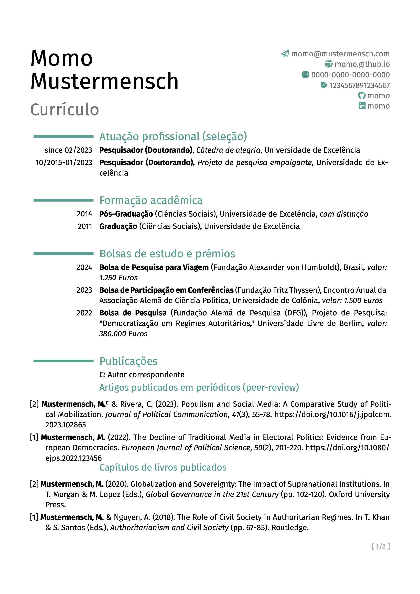
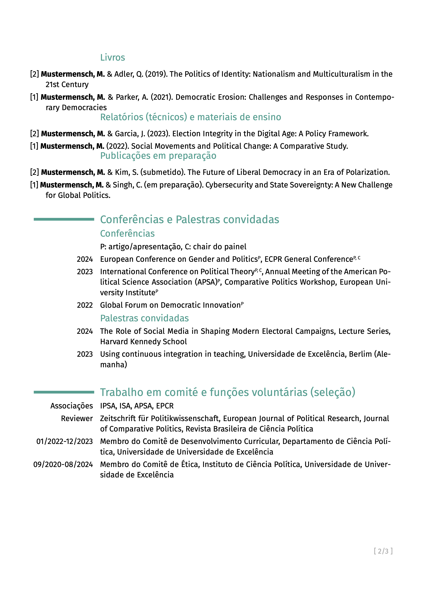
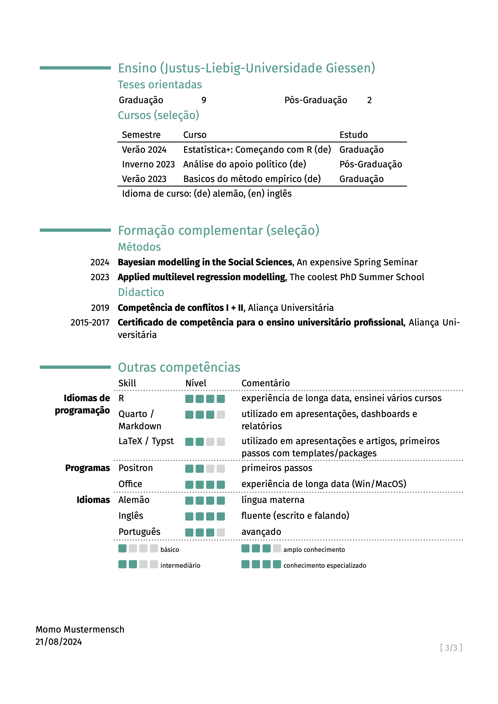

# modern-acad-cv

This template for an academic CV serves the peculiarities of academic CVs. If you are not an academic, this template is not useful. Most of the times in academics, applicants need to show everything they have done. This makes it a bit cumbersome doing it by single entries. In addition, academics might apply to institutions around the globe, making it necessary to send translated CVs or at least translations of some parts (i.e., title of papers in different languages). 

This template serves these special needs in introducting automated sections based on indicated `yaml`-files. Furthermore, it has a simplified multilingual support by setting different headers, title etc. for different languages (by the user in the `yaml`-fields). With this template, it might be more handy to keep your CV easier on track, especially when you need in different languages, since managing a `yaml`-file is easier than checking typesetting files against each other. 

This template is influenced by LaTeX's [moderncv](https://github.com/moderncv/moderncv) and its typst translation [moderner-cv](https://github.com/DeveloperPaul123/modern-cv).

## Fonts

In this template, the use of FontAwesome icons via the [fontawesome typst package](https://typst.app/universe/package/fontawesome) is possible, as well as the icons from Academicons [use-academicons typst package](https://typst.app/universe/package/use-academicons). To use these icons properly, you need to install each fonts on your system. You can download [fontawesome here](https://fontawesome.com/download) and [academicons here](https://jpswalsh.github.io/academicons/). Both typst packages will be load by the template itself.

Furthermore, I included my favorite font [Fira Sans](https://fonts.google.com/specimen/Fira+Sans). You can download it here [here](https://fonts.google.com/specimen/Fira+Sans), or just change the font argument in `modern-acad-cv()`. 

## Usage

The main function to load the construct of the academic CV is `modern-acad-cv()`. After importing the template, you can call it right away. If you don't have [Fira Sans](https://fonts.google.com/specimen/Fira+Sans) installed, choose a different font. Examples are given below.

```typst
#import "@preview/modern-acad-cv:0.1.3": *

#show: modern-acad-cv.with(
  metadata,
  multilingual,
  lang: "en",
  font: ("Fira Sans", "Andale Mono", "Roboto"),
  show-date: true,
  body
)    

// ...
```
In the remainder, I show basic settings and how to use the automated functions with the corresponding `yaml`-file.

### Setting up the main file and the access to the `yaml`-files
A first step in your document is to invoke the template. Second, since this template works with `yaml`-files in the background you need to specify paths to each `yaml`-file you want to use throughout the document. 

The template comes along with the `metadata.yaml`. In the beginning of this yaml-file you set colors. Feel free to change it to your preferred color scheme.
```yaml
colors:
  main_color: "#579D90"
  lightgray_color: "#d5d5d5"
  gray_color: "#737373"
  ...
```

At the beginning of your document, you just set then set the metadata-object:
```typst
#import "@preview/modern-acad-cv:0.1.3": *

#let metadata = yaml("metadata.yaml")
```

Initially, the `metadata.yaml` is located on the same level as the `example.typ`. All other `yaml`-files are saved in the folder `dbs`. Since `typ`-documents search for paths from the root of the document in that the function is called, you have to give the databases for the entry along the `metadata.yaml` within each function call.

### socials
Contact details are important. In this CV template, you have the possibility to use fontawesome icons and academicons. To use socials, you just need to specify in `metadata.yaml`, the wanted entries. 

As you can see below, you set a category, i.e. email or lattes and then you have to define four arguments: `username`, `prefix`, `icon`, and `set`. The `username` will be used for constructing the link and will be shown next to the logo. The `prefix` is needed to build the valid link. The `icon` is the name of the icon in the respective set, which is chosen in `set`. 

```yaml
personal:
  name: ["Mustermensch, Momo"]
  socials:
    email:
      username: momo@mustermensch.com
      prefix: "mailto:"
      icon: paper-plane
      set: fa
    homepage:
      username: momo.github.io
      prefix: https://
      icon: globe
      set: fa
    orcid:
      username: 0000-0000-0000-0000
      prefix: https://orcid.org
      icon: orcid
      set: ai
    lattes:
      username: "1234567891234567"
      prefix: http://lattes.cnpq.br/
      icon: lattes
      set: ai
    ...
```

### Language setting & headers
In order to support changing headers, you need to specify the language and the different content for each header in each language in the `i18n.yaml` in the folder `dbs`. 

The structure of the yaml is simple:
```yaml
lang:
  de:
    subtitle: Short CV
    education: Hochschulbildung
    work: Akademische Berufserfahrung (Auswahl)
    grants: Fördermittel, Stipendien & Preise
    ...
  en:
    subtitle: Short CV
    education: Higher education
    work: Academic work experience (selection)
    grants: Scholarships & awards
    ...
  pt:
    subtitle: Currículo
    education: Formação acadêmica
    work: Atuação profissional (seleção)
    grants: Bolsas de estudo e prémios
    ...
```

For each language, you want to use later, you have to define all the entries. Reminder, don't change the entry names, since the functions won't find it under different names without changing the functions.

First you have to set up a variable that inherits the ISO-language code, save the database into an object (here `multilingual`) and then give the object `multilingual` and `language` to the function `create-headers`:

```typst
// set the language of the document
#let language = "pt"      

// loading multilingual database
#let multilingual = yaml("dbs/i18n.yaml")

// defining variables
#let headerLabs = create-headers(multilingual, lang: language)
```

You create an object `headerLabs` that uses the function `create-headers()` which will define the headers as you provided in the `yaml`. Then by switching the language object, all headers (if used accordingly to the naming in the `yaml`) will change directly.

Throughout the document you then reference the created `headerLabs` object. If you change language, and values are provided, these automatically change. 

```typst
= #headerLabs.at("work")

...

= #headerLabs.at("education")

...

= #headerLabs.at("grants")
```

### Automated functions
All of the following functions share common arguments: `what`, `multilingual`, and `lang`. In `what`, you always declare the database you want to use with the function.

For example, to get work entries, you choose `work`, which you defined beforehand as input from `work.yaml`. In the `multilingual` argument, you just pass the `multilingual` object. In `lang` you pass your `language` object. 

```typst
#let multilingual = yaml("dbs/multilingual.yaml")
#let work = yaml("dbs/work.yaml")
#let language = "pt"

// Function call with objects
#cv-auto-stc(work, multilingual, lang: language)

```

### Sorting publications and referencing your own name or correpsonding
Since `typst` so far does not support multiple bibliographies or subsetting these, this function let you choose specific entries via the `entries` argument or group of entries by the `tag` argument. Furthermore, you can indicate a string in `me` that can be highlighted in every output entry (i.e., your formatted name). So far, this function leads to another function that create APA-style format, if you want to use any other citation style, you need to download the template on [github](https://github.com/bpkleer/modern-acad-cv), introduce your own styling and then add it in the `cv-refs()` function. 

```typst
#let multilingual = yaml("dbs/multilingual.yaml")
#let refs = yaml("dbs/refs/yaml")

// function call of group of peer-reviewed with tag `peer`
#cv-refs(refs, multilingual, tag: "peer", me: [Mustermensch, M.], lang: language)
```

You see in the example pictures that I used this function to built five different subheaders, i.e. for peer reviewed articles (`tag: "peer"`) and chapters in edited books (`tag: "edited"`). You can define the tags how you want, however, they need to put them into `tag: <str>`. 

Sometimes, it is not only necessary to highlight your own name, you might also want to indicate yourself as corresponding author. This can be done through the `refs.yaml` which adhere to [Hayagriva](https://github.com/typst/hayagriva). By adding an argument `corresponding` in the yaml and setting the value to `true`, a small `C` will appear next to your name. 

```yaml
Mustermensch2023:
  type: "article"
  date: 2023
  page-range: 55-78
  title: "Populism and Social Media: A Comparative Study of Political Mobilization"
  tags: "peer"
  author: [ "Mustermensch, Momo", "Rivera, Casey" ]
  corresponding: true
  parent:
    title: "Journal of Political Communication"
    volume: 41
    issue: 3
  serial-number:
    doi: "10.1016/j.jpolcom.2023.102865"
```

For applications abroad, it might be worth to translate at least title of the publications so that other persons easily can see what the paper is about. In every `title` argument, you can therefore provide a dictionary with the language codes and the titles. Keep the original title in `main` and the translations with the corresponding language shortcut (i.e., `"en"` or `"pt"`). The function prints the main and translated title, depending on the provided translation in the `refs.yaml`. Be aware, here you find not `de` in the dictionary, instead you find `main`. The original title needs to be wrapped in `main`. 

```yaml
Mustermensch2023:
  type: "article"
  date: 2023
  page-range: 55-78
  title: 
    main: "Populismus und soziale Medien: Eine vergleichende Studie zur politischen Mobilisierung"
    en: "Populism and Social Media: A Comparative Study of Political Mobilization"
    pt: "Populismo e redes sociais: Um Estudo Comparativo de Mobilização Política"
  tags: "peer"
  author: [ "Mustermensch, Momo", "Rivera, Casey" ]
  corresponding: true
  parent:
    title: "Journal of Political Communication"
    volume: 41
    issue: 3
  serial-number:
    doi: "10.1016/j.jpolcom.2023.102865"
```

### cv-auto-skills()
Instead of just enumerating your skills or your knowledge of specific software, you can build a skill-matrix with this function. In this skill-matrix, you can have sections, i.e. *Computer Languages*, *Programs* and *Languages*. These sections are the highest level in the corresponding `skills.yaml`:

```yaml
computer:
  ...
programs:
  ...
languages:
  ...

```

You can then define in each categories specific skills, i.e. German and Portuguese in `languages`:

```yaml
computer:
  ...
programs:
  ...
languages:
  german:
    ...
  portugues:
   ...

```

For each entry, you have to define `name`, `level` and `description`.

```yaml
languages: 
  ...
  pt: 
    name:
      de: Portugiesisch
      en: Portuguese
      pt: Português
    level: 3
    description:
      de: fortgeschritten
      en: advanced
      pt: avançado
```

As you can see, you can again define language-dependent names in `name` and descriptions in `description`. `level` is a numeric value and indicates how many of the four boxes are filled to indicate you level of proficiency. If you don't have the need for a CV of different languages, you can directly define `name` or `description`.

You have to call the function with three objects `skills`, `multilingual`, and `metadata` and the corresponding `language` of the document:

```typst
#let skills = yaml("dbs/skills.yaml")
#let multilingual = yaml("dbs/multilingual.yaml")
#let metadata = yaml("dbs/metadata.yaml")
#let language = "pt"

#cv-auto-skills(skills, multilingual, metadata, lang: language)
``` 

### Print your info without any formatting
The function `cv-auto` is the base function for printing the provided infos in the specified `yaml` file with no further formatting. The functions `cv-auto-stc` and `cv-auto-stp` do only differ in the point that `cv-auto-stc` both give the title in bold, `cv-auto-stp` puts the subtitle in parentheses and `cv-auto-stc` puts the subtitle after a comma.

The structure of the corresponding `yaml` files is simple: in each entry you can have the following entries: `title`, `subtitle`, `location`, `description` and `left`. `title` is mandatory, `subtitle`, `location`, and `description` are voluntary. In all functions you need to specify `left`, which indicates period of time, or year. For `title`, `subtitle`, `location`, and `description`, you can provide a dictionary for different languages (see below). 

```yaml
master:
  title:
    de: Master of Arts
    en: Master of Arts
    pt: Pós-Graduação
  subtitle:
    de: Sozialwissenschaften
    en: Social Sciences
    pt: Ciências Sociais
  location:
    de: Exzellenz-Universität
    en: University of Excellence
    pt: Universidade de Excelência
  description:
    de: mit Auszeichnung
    en: with distinction
    pt: com distinção
  left: "2014"
```

In your main document, you then easily call the function and transfer the standard arguments `what`, `metadata`, and `lang`. 

```typst

// section of education 
#let education = yaml("dbs/education.yaml")
#let multilingual = yaml("dbs/multilingual.yaml")
#let language = "pt"

#cv-auto-stp(education, multilingual, lang: language) 

// section of work positions
#let work = yaml("dbs/work.yaml")
#let multilingual = yaml("dbs/multilingual.yaml")
#let language = "pt"

#cv-auto-stc(work, multilingual, lang: language)

// section of given talks
#let talks = yaml("dbs/talks.yaml")
#let multilingual = yaml("dbs/multilingual.yaml")
#let language = "pt"

#cv-auto(talks, multilingual, lang: language)
```

### Creating a list instead of single entrie
Sometimes, instead of giving every entry, you want to group by year. Another example for this case could be that you want to summarize your memberships or reviewer duties. 

The function `cv-auto-list` uses just the standard input:

```typst
#let conferences = yaml("dbs/conferences.yaml")
#let multilingual = yaml("dbs/multilingual.yaml")
#let language = "pt"

#cv-auto-list(conferences, multilingual, lang: language)
```

The corresponding `yaml` file is differently organized: The entry point in the file is the corresponding year. In every year, you organize your entries (i.e. conference participations). In each entry in a year, you have the `name` and `action` entry. You can provide a dictionary for the `name`. For `action`, I used `P` and `C`, for *paper/presentation* and *chair*. You can then manually define this upfront the function call for the reader, or you use the `i18n.yaml`, indicate the explanations for each language in `exp-confs` and then it automatically changes with the specific language code.
  
```yaml
"2024":
  conference2:
    name: European Conference on Gender and Politics
    action: P
  conference1:
    name: ECPR General Conference
    action: P, C
```

The action will be added after each conference name in superscripts.

### Creating a table
This case is mostly used for listing your prior teaching experience. The corresponding `teaching.yaml` for this description, is organized as followed:

```yaml
"2024":
  course1:
    summer: T
    name:
      de: "Statistik+: Einstieg in R leicht gemacht"
      en: "Statistics+: Starting with R (de)"
      pt: "Estatística+: Começando com R (de)"
    study:
      de: Bachelor
      en: Bachelor
      pt: Graduação
  ...
```

First you indicate the year `"2024"` and then you organize all courses you gave within that year (i.e. here `course1`). Mandatory are `name` and `study`. For both you can indicate a single value or a dictionary corresponding to your chosen languages. You can provide `summer` if you want to indicate differences for terms. This is `boolean`, the specific word is then given in the `i18n.yaml` under `table-winter` resp. `table-summer`.

The function then uses again just the standard arguments and plots a table with the indicated year, name, and study area. 

```typst
#let teaching = yaml("dbs/teaching.yaml")
#let multilingual = yaml("dbs/multilingual.yaml")
#let language = "pt"

#cv-table-teaching(teaching, multilingual, lang: language)
```

### cv-auto-cats()
In case you want to directly print entries from categories that belong to one `yaml`-file, you can use `cv-auto-cats`. This will print the header for each subcategory and then the belonging entries. 

An example is given in `training.yaml`. In this file, further training is given by categories (i.e., methods and didactics). Within the categories you have here courses and then `title`, `location`, and `left`. `location` and `title` can be dictionaries if you want to translate between different languages. 

```yaml
methods:
  course2:
    title: Bayesian modelling in the Social Sciences
    location: An expensive Spring Seminar
    left: "2024"
  ...
didactics:
  course2:
    title:
      de: Konfliktkompetenz I + II
      en: Conflict competence I + II
      pt: Competência de conflitos I + II
    location: 
      de: Universitätsallianz
      en: University Alliance
      pt: Aliança Universitária
    left: "2019"
```

Call the function as usal:

```typst
#let training = yaml("dbs/training.yaml")
#let multilingual = yaml("dbs/multilingual.yaml")
#let language = "pt"
#let headerLabs = create-headers(multilingual, lang: language)

#cv-auto-cats(training, multilingual, headerLabs, lang: language)
```

### Special cases: long names
If you have a long name that crosses the social media side, just set the argument `split` to `true` within `metadata.yaml`:

```yaml
...
  personal:
    name: ["Mustermensch, Momo"]
    split: true
  ...    
```

## Examples





