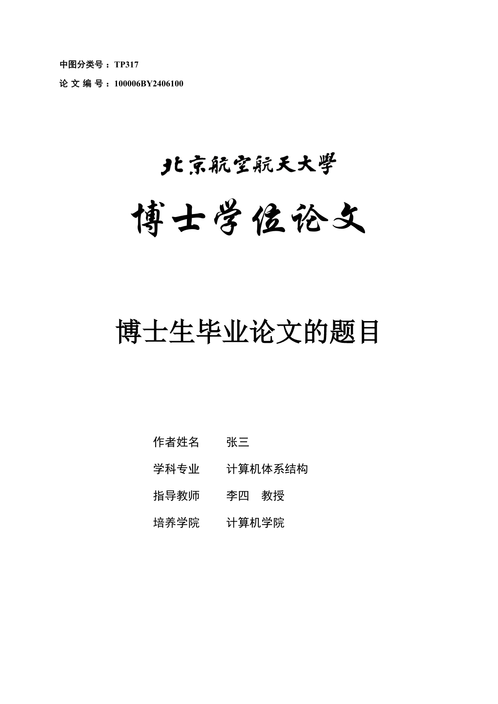

<p align="center">
  <a href="https://www.buaa.edu.cn" rel="noopener noreferrer">
    
  </a>
</p>

<br />

# Modern BUAA Graduate Thesis Template

A **[Typst](https://typst.app)** template for BUAA graduate thesis, capable of quickly and accurately generating BUAA graduate thesis.

- 📦 Out of the box, you only need to focus on writing
- 🔑 100% compliant with BUAA's latest thesis format file, more accurate than Word
- 🔩 Directly includes packages like [lovelace](https://typst.app/universe/package/lovelace), [subpar](https://typst.app/universe/package/subpar) for pseudocode and subfigure editing

> ⚠️ **Warning**: This is not an official template. Although it strictly follows relevant specifications, there is no Word version!! The foolish format checking system seems not to support PDF??

## Quick Start

Check out [thesis.typ](https://github.com/wangjq4214/buaa-thesis/blob/main/template/thesis.typ) and [thesis.pdf](https://github.com/wangjq4214/buaa-thesis/blob/main/example/thesis.pdf) to see the specific code and generated PDF file.

This package only provides one main API for writing your own graduate thesis, greatly simplifying the writing process:

```typ
#import "@preview/modern-buaa-thesis:0.1.0": thesis

#show thesis.with()

= Introduction

= Technical Point 1

= Technical Point 2

= Technical Point 3
```

<p align="center">
  <a href="./example/thesis.pdf" rel="noopener noreferrer">
    
  </a>
</p>

## Roadmap

- [ ] Implement support for master's thesis
- [ ] Implement support for non-engineering thesis
- [ ] Implement support for proposal reports and interim reports (maybe a new package?)

## Changelog

### [0.1.1](https://github.com/wangjq4214/buaa-thesis/tree/0.1.1) (2025-09-28)

#### ✨ Features

- add support fo sub figure

#### 🐛 Bug Fixes

- fix the heading reference error format
- fix the error bib font type

### [0.1.0](https://github.com/wangjq4214/buaa-thesis/tree/0.1.0) (2025-07-08)

#### 🎉 First Version

- release the first version of modern buaa thesis template

#### ✨ Features

- add support for cover pages
- add support for table of contents
- add support for tables of figures and tables
- add support for section headings
- add support for figures and tables
- add support for equation numbering
- add support for body formatting
- add support for reference documents
- add support for appendices such as personal information pages

## License

[MIT](./LICENSE).

## Contributing

- External contributions are welcome, contributors can fork this repository, make modifications and merge
- Code review and package release will be handled by [wangjq4214](https://github.com/wangjq4214)
- If you have questions, you can discuss them in [issues](https://github.com/wangjq4214/buaa-thesis/issues) !!
